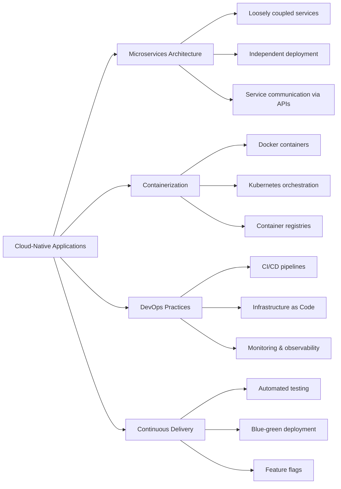

Your spring boot console banner still looks like this! Man you need to change it immediately to your project name. Don't know how to change?

## Changing Console Banner
---
- After generating your spring boot file from [Spring Initializr](https://start.spring.io/) you have to unzip the zip file
- Then open the folder and go the the `/src/main/resources` folder and create a folder `META-INF`.
- Then create a file `banner.txt` into the folder . [NOTE: `META-INF` is not necessary but its a good practice]

After creating folders and files go to [Patorjk Banner generator](https://www.patorjk.com/) site and type your banner text there and you can select any banner style according to your taste of design!

```shell
                                 _           
   ___  _ __ ___   __ _ _ __ ___| |__  _   _ 
  / _ \| '_ ` _ \ / _` | '__/ __| '_ \| | | |
 | (_) | | | | | | (_| | | | (__| | | | |_| |
  \___/|_| |_| |_|\__,_|_|  \___|_| |_|\__, |
                                       |___/ 

${application.title} ${application.version}
Powered by Spring Boot ${spring-boot.version}
```
- It will look something like this.(BTW omarchy is a great linux distro by DHH!)
- I have used some place holders at the end so that it gives us info about the app title , version and spring boot version as well!

- As we are using the path `src/main/resources/META-INF/banner.txt` so we have to add an extra functionality to the IDE (If you are directly using `src/main/resources/banner.txt` then you are already good to go!)


> To make this work, you need to use the spring.banner.location property. If you
want to use your IDE, you need to figure out how to override Spring Boot configuration
properties. If you are using IntelliJ IDEA, choose Edit Configurations ➤ Modify Options,
locate the Override Configuration Properties section, and add spring.banner.location
and classpath:/META-INF/banner.txt

# Nice Now you can show it to other devs and it will blow them away!


