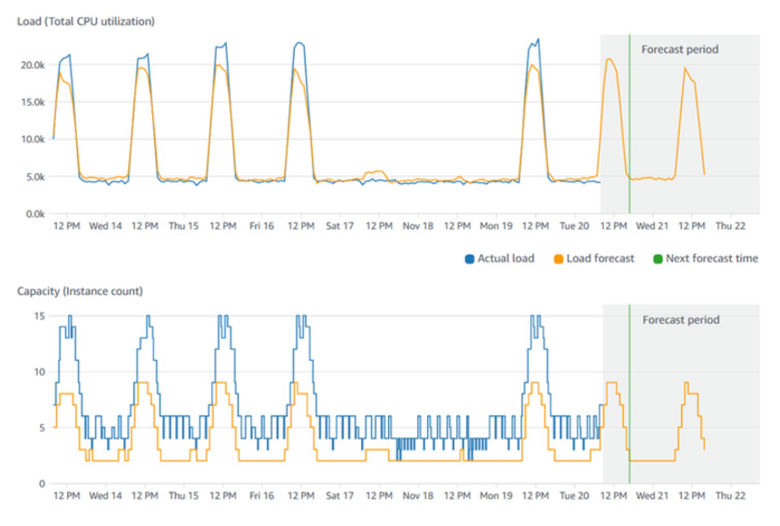

# Basic Overview
Load balancing is one of the most important thing to maintain an application so that in a situation when there is a lot of traffic, the application doesn't crash and the business doesn't get disrupted.

More specifically load balancers are servers that forward internet traffic to multiple servers (EC2 Instances) downstream.

# ELB (Elastic Load Balancer)
An ELB (Elastic Load Balancer) is a managed load balancer . And it is managed , maintained and upgrade by `AWS`.
It costs less to setup your own load balancer but it will be a lot more
effort on your end (maintenance, integrations) 

## Types of ELB
There are 4 types actually!
- Application Load Balancer (ALB)
- Network Load Balancer (NLB)
- Gateway Load Balancer (GWLB)
- Classic Load Balancer (retired in 2023)

# Scalability Vs High Availability 

### Vertical Scaling: Increase instance size (= scale up / down)

* **From:** t3.micro – 1 vCPU, 1 GiB RAM
* **To:** m7i.32xlarge – 128 vCPUs, 512 GiB RAM

### Horizontal Scaling: Increase number of instances (= scale out / in)

* Auto Scaling Group
* Load Balancer

### High Availability: Run instances for the same application across multiple AZs

* Auto Scaling Group (multi-AZ)
* Load Balancer (multi-AZ)

# What’s an Auto Scaling Group?
In real-life, the load on our websites and application can change. In the cloud, we can create and get rid of servers very quickly by using ASG (Auto Scaling Group).

> An Auto Scaling Group automatically adjusts EC2 capacity based on load, maintains minimum–maximum instance counts, registers instances with the load balancer, and replaces unhealthy ones.

## Scaling Strategies

**Manual Scaling:** Update the size of an ASG manually.

**Dynamic Scaling :** automatically adjusts capacity using Simple/Step rules triggered by CloudWatch alarms, Target Tracking to maintain a desired metric, and Scheduled Scaling to anticipate predictable usage patterns.

**Predictive Scaling:** uses machine learning to forecast future traffic and automatically provision the right number of EC2 instances in advance, especially useful for workloads with predictable time-based patterns.

