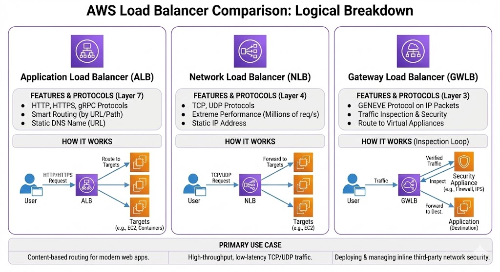

# Basic Overview
Load balancing is one of the most important thing to maintain an application so that in a situation when there is a lot of traffic, the application doesn't crash and the business doesn't get disrupted.

More specifically load balancers are servers that forward internet traffic to multiple servers (EC2 Instances) downstream.

## ELB (Elastic Load Balancer)
An ELB (Elastic Load Balancer) is a managed load balancer . And it is managed , maintained and upgrade by `AWS`.
It costs less to setup your own load balancer but it will be a lot more
effort on your end (maintenance, integrations) 

### Types of ELB
There are 4 types actually!
- Application Load Balancer (ALB)
- Network Load Balancer (NLB)
- Gateway Load Balancer (GWLB)
- Classic Load Balancer (retired in 2023)

