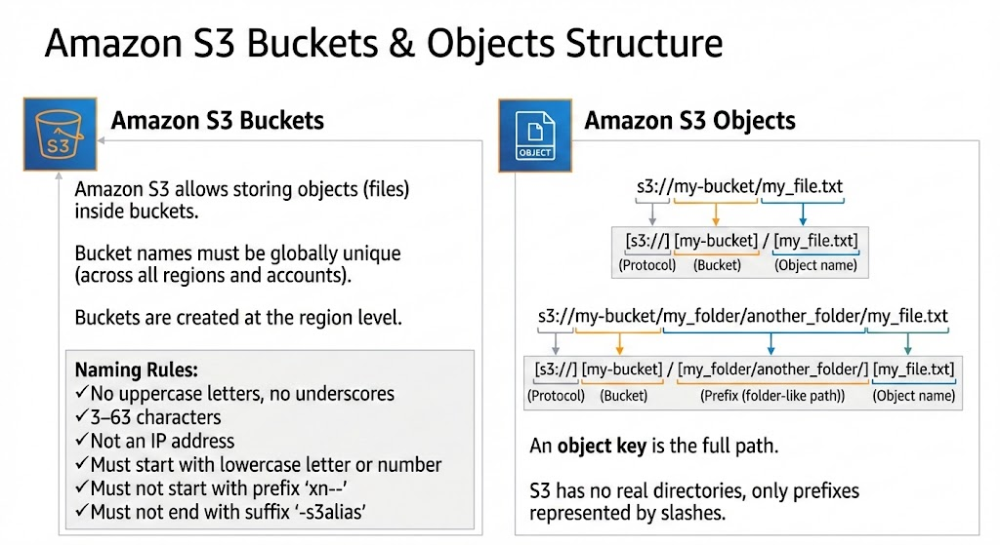
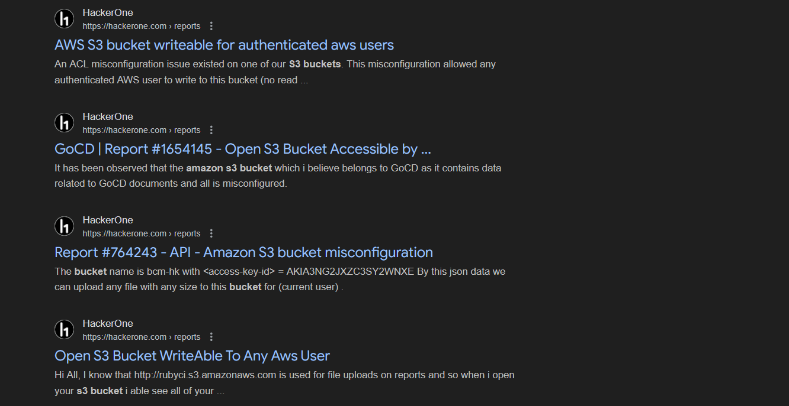
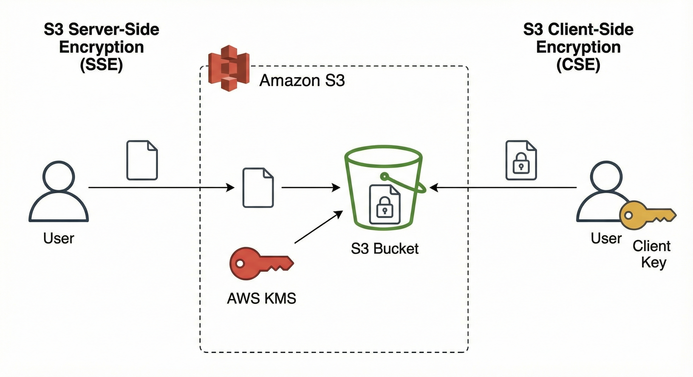
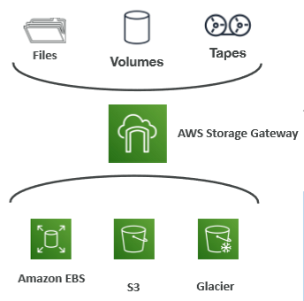

# What is S3?

<figure style="max-width:720px; margin:0 auto; text-align:center;">
  
  <figcaption style="font-size:0.9rem; color:var(--text-muted,#666); margin-top:8px;">
    Amazon S3 
  </figcaption>
</figure>

Do you ever think that when you click a movie in Netflix , and in just two or three seconds the stream begins.The file behind that movie is enormous—gigabytes of HD or 4K video.So how does Netflix deliver it instantly?

Later, you start browsing Airbnb for a weekend trip.
Images appear instantly: bedrooms, kitchens, city views from different hosts. But none of these images are stored on Airbnb servers.

Because the entire library of Netflix originals is stored inside Amazon S3. Every single picture you see was uploaded by a host and stored inside S3.

<figure style="max-width:720px; margin:0 auto; text-align:center;">
  
  <figcaption style="font-size:0.9rem; color:var(--text-muted,#666); margin-top:8px;">
    Amazon S3 — Netflix & Airbnb 
  </figcaption>
</figure>

Amazon S3 is one of the main building blocks of AWS, and it is basically an `infinitely scaling` storage.

## S3 Use Cases
- Backup and Storage 
- Disaster Recovery 
- Archive 
- Hybrid Cloud Storage
- Application Hosting
- Media Hosting
- Data Lakes and Big data Analytics
- Software delivery

> **Examples:** Nasdaq stores 7 years of data into S3 & Sysco runs analytics on its data and gain business insights!

# Amazon S3 Bucket and S3 Objects

<figure style="max-width:720px; margin:0 auto; text-align:center;">
  
  <figcaption style="font-size:0.9rem; color:var(--text-muted,#666); margin-top:8px;">
    Amazon S3 — buckets & objects (rounded, shadowed)
  </figcaption>
</figure>

Buckets are like the directories and objects are like the files in the aws cloud.

**For objects:** Need a key(prefix + object_name)

**Analogy:** You are creating a folder and saving an image there. Same thing you will do in the cloud but for folder there is Buckets and for files there is Objects!

# Amazon S3 Security

**You will find many vulnerabilities related to S3 and everyone of them help due to misconfigurations**

<figure style="max-width:720px; margin:0 auto; text-align:center;">
  
  <figcaption style="font-size:0.9rem; color:var(--text-muted,#666); margin-top:8px;">
    Amazon S3 — Vulnerabilities
  </figcaption>
</figure>

### User-Based

**IAM Policies —** Define *which API calls a specific IAM user, role, or group is allowed to perform*.
These policies are attached to IAM identities and control *who* can do *what* in AWS.

### Resource-Based

1. **Bucket Policies —**
Bucket-level permissions written directly on the S3 bucket.
Used to:

* Allow or deny access to the bucket and its objects
* Enable **cross-account access**
* Control access from specific VPCs, IP ranges, services, etc.

2. **Object Access Control List (Object ACL) —**
More fine-grained, object-level permissions.
Can specify which AWS accounts can read/write a single object.
Can be disabled in most modern setups.

3. **Bucket Access Control List (Bucket ACL) —**
Legacy mechanism for granting other AWS accounts basic access to the bucket.
Not commonly used and can also be disabled.

### Access Logic (Very Important)

An IAM principal can access an S3 object **only if**:

1. **IAM permissions allow it** *OR* the **resource policy (bucket policy / ACL) allows it*.
2. **There is no explicit DENY** anywhere (IAM or resource policy).

An explicit deny always overrides any allow.

### Encryption

Encrypt objects stored in Amazon S3 using encryption keys —
either **SSE-S3**, **SSE-KMS**, **SSE-C**, or **Client-Side Encryption**, depending on the use case.

<figure style="max-width:720px; margin:0 auto; text-align:center;">
  
  <figcaption style="font-size:0.9rem; color:var(--text-muted,#666); margin-top:8px;">
    Amazon S3 — Encryption
  </figcaption>
</figure>

# Amazon S3 Storage Classes

Data in Amazon S3 can be transitioned between storage classes manually or through lifecycle rules. Objects may also be uploaded directly into any storage class.

## Standard

| Feature        | Details                          |
| -------------- | -------------------------------- |
| Availability   | 99.99%                           |
| Retrieval      | Instant                          |
| Retrieval Cost | None (only storage cost applies) |
| Pricing        | Highest among all classes        |
| Suitable For   | Frequently accessed data         |

---

## Infrequent Access (IA)

Designed for data that is not accessed often yet still requires quick retrieval when needed. Transition from Standard to IA is only allowed after the object is 30 days old.

### IA Classes

| Class       | Availability | Notes                                                                                  |
| ----------- | ------------ | -------------------------------------------------------------------------------------- |
| Standard IA | 99.9%        | Lower storage cost than Standard; retrieval cost applies                               |
| One-Zone IA | 99.5%        | Stores data in a single AZ; data is lost if that AZ fails; suited for recreatable data |

---

## Glacier (Archival Storage)

Intended for long-term archival. Objects must be restored before use. Supports transitions from Standard at any time. Retrieval cost applies, and retrieval times vary by tier. Glacier offers default encryption at rest and in transit.

### Glacier Storage Classes

#### Glacier Instant Retrieval

| Feature          | Details                        |
| ---------------- | ------------------------------ |
| Availability     | 99.9%                          |
| Retrieval Time   | Milliseconds                   |
| Minimum Duration | 90 days                        |
| Use Case         | Data accessed once per quarter |

#### Glacier Flexible Retrieval

| Feature          | Details                                                  |
| ---------------- | -------------------------------------------------------- |
| Availability     | 99.99%                                                   |
| Retrieval Tiers  | Expedited (1–5 min), Standard (3–5 hrs), Bulk (5–12 hrs) |
| Notes            | Expedited may fail without provisioned capacity          |
| Minimum Duration | 90 days                                                  |

#### Glacier Deep Archive

| Feature           | Details                                  |
| ----------------- | ---------------------------------------- |
| Availability      | 99.99%                                   |
| Retrieval Options | Standard (12 hrs), Bulk (48 hrs)         |
| Minimum Duration  | 180 days                                 |
| Notes             | Lowest storage cost among all S3 classes |

---

## Intelligent Tiering

| Feature           | Details                                                                  |
| ----------------- | ------------------------------------------------------------------------ |
| Availability      | 99.9%                                                                    |
| Behavior          | Automatically moves objects between access tiers based on usage patterns |
| Fees              | Small monthly monitoring and tiering fee                                 |
| Retrieval Charges | None                                                                     |

## Moving between Storage Classes

<figure style="max-width:720px; margin:0 auto; text-align:center;">
  
  <figcaption style="font-size:0.9rem; color:var(--text-muted,#666); margin-top:8px;">
    Amazon S3 — Storage Transition
  </figcaption>
</figure>

# AWS Storage Gateway
AWS Storage Gateway is a hybrid storage service that connects on-premises environments to AWS Cloud storage. It enables local applications to work with AWS services such as Amazon S3, EBS, and Glacier without changes to existing workflows. Typical use cases include disaster recovery, backup and restore, and tiered storage.

### Gateway Types

File Gateway stores files as objects in S3, Volume Gateway integrates block storage with EBS, and Tape Gateway provides a virtual tape library that archives to S3 and Glacier. The exam does not require deep knowledge of these types.

<figure style="max-width:720px; margin:0 auto; text-align:center;">
  
  <figcaption style="font-size:0.9rem; color:var(--text-muted,#666); margin-top:8px;">
    Amazon S3 — Storage Gateway
  </figcaption>
</figure>
