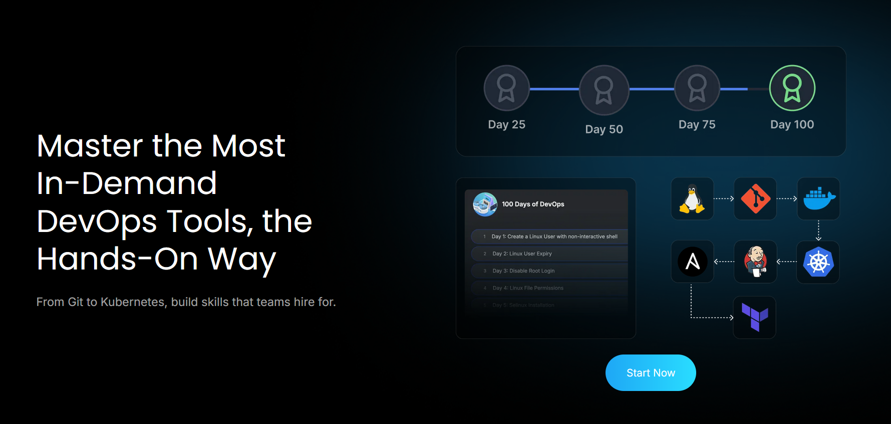

<figure style="max-width:720px; margin:0 auto; text-align:center;">
  
  <figcaption style="font-size:0.9rem; color:var(--text-muted,#666); margin-top:8px;">
    100 Days of DevOps
  </figcaption>
</figure>

## Day 1
---
### Creating non interactive shell and user setup

Create a user with non-interactive shell for your organization on a specific server. This is essential for service accounts and automated processes that don't require interactive login capabilities.


```shell
sudo useradd -s /sbin/nologin kristy
```

## Day 2
---

### Temporary user setup with Expiry 

```shell
sudo useradd -e 2026-12-24 kristy

sudo passwd kristy
```


## Day 3
---

### Secure Root ssh access

```shell
sudo nano /etc/ssh/sshd_config
```

- `PermitRootLogin no` 
- You have to do it for every single host!
## Day 4
---


**In a bid to automate backup processes, the `xFusionCorp Industries` sysadmin team has developed a new bash script named `xfusioncorp.sh`. While the script has been distributed to all necessary servers, it lacks executable permissions on `App Server 1` within the Stratos Datacenter.**

**Your task is to grant executable permissions to the `/tmp/xfusioncorp.sh` script on `App Server 1`. Additionally, ensure that all users have the capability to execute it.**

``` shell
thor@jumphost ~$ ssh tony@stapp01.stratos.xfusioncorp.com
The authenticity of host 'stapp01.stratos.xfusioncorp.com (172.17.0.4)' can't be established.
ED25519 key fingerprint is SHA256:8eDx2ZriNxW9+pNci7Zq6oECY1W13b28pRzv/AA3cxE.
[tony@stapp01 tmp]$ ls -la /tmp
total 36
drwxrwxrwt 1 root root 4096 Dec 12 08:44 .
drwxr-xr-x 1 root root 4096 Dec 12 08:45 ..
drwxrwxrwt 2 root root 4096 Dec 12 08:42 .ICE-unix
drwxrwxrwt 2 root root 4096 Dec 12 08:42 .X11-unix
drwxrwxrwt 2 root root 4096 Dec 12 08:42 .XIM-unix
drwxrwxrwt 2 root root 4096 Dec 12 08:42 .font-unix
drwx------ 3 root root 4096 Dec 12 08:42 systemd-private-1435520e8a0746a589dc0f038604b67c-dbus-broker.service-OQFfiu
drwx------ 3 root root 4096 Dec 12 08:42 systemd-private-1435520e8a0746a589dc0f038604b67c-systemd-logind.service-QuuNiN
-rwxr-xr-x 1 root root   40 Dec 12 08:42 xfusioncorp.sh
[tony@stapp01 tmp]$ ./xfusioncorp.sh 
Welcome To KodeKloud

```

## Day 5
---
Following a security audit, the xFusionCorp Industries security team has opted to enhance application and server security with SELinux. To initiate testing, the following requirements have been established for `App server 2` in the `Stratos Datacenter:`  

1. Install the required `SELinux` packages.
    
2. Permanently disable SELinux for the time being; it will be re-enabled after necessary configuration changes.
    
3. No need to reboot the server, as a scheduled maintenance reboot is already planned for tonight.
    
4. Disregard the current status of SELinux via the command line; the final status after the reboot should be `disabled`.

```shell
[root@stapp02 ~] sudo yum install policycoreutils policycoreutils-python selinux-policy selinux-policy-targeted setroubleshoot-server
[root@stapp02 ~] sudo sed -i 's/^SELINUX=.*/SELINUX=disabled/' /etc/selinux/config
[root@stapp02 ~] vi /etc/selinux/config
[root@stapp02 ~] cat /etc/selinux/config

# This file controls the state of SELinux on the system.
# SELINUX= can take one of these three values:
#     enforcing - SELinux security policy is enforced.
#     permissive - SELinux prints warnings instead of enforcing.
#     disabled - No SELinux policy is loaded.
# See also:
# https://access.redhat.com/documentation/en-us/red_hat_enterprise_linux/9/html/using_selinux/changing-selinux-states-and-modes_using-selinux#changing-selinux-modes-at-boot-time_changing-selinux-states-and-modes
#
# NOTE: Up to RHEL 8 release included, SELINUX=disabled would also
# fully disable SELinux during boot. If you need a system with SELinux
# fully disabled instead of SELinux running with no policy loaded, you
# need to pass selinux=0 to the kernel command line. You can use grubby
# to persistently set the bootloader to boot with selinux=0:
#
#    grubby --update-kernel ALL --args selinux=0
#
# To revert back to SELinux enabled:
#
#    grubby --update-kernel ALL --remove-args selinux
#
SELINUX=disabled
# SELINUXTYPE= can take one of these three values:
#     targeted - Targeted processes are protected,
#     mls - Multi Level Security protection.
SELINUXTYPE=targeted

```

## Day 6
---

The `Nautilus` system admins team has prepared scripts to automate several day-to-day tasks. They want them to be deployed on all app servers in `Stratos DC` on a set schedule. Before that they need to test similar functionality with a sample cron job. Therefore, perform the steps below:  

a. Install `cronie` package on all `Nautilus` app servers and start `crond` service.  
b. Add a cron `*/5 * * * * echo hello > /tmp/cron_text` for `root` user.

- Login into each server using ssh (check [day01](https://github.com/imShakil/100-Days-Of-DevOps-Challenge-KodeKloud/blob/main/days/001.md))
- Install `cronie` package into centos:
```shell
    sudo yum install cronie -y
```

Start crond service

```shell
sudo systemctl enable crond
sudo systemctl start crond
```

Create cron schedule:

```shell
sudo crontab -e
*/5 * * * * echo hello > /tmp/cron_text
```

Verify crontab:

```shell
sudo crontab -l
```

and wait 5 minutes to check cron_text in /tmp/

### Automation Script
```shell
#!/bin/sh

# setup_cron_job.sh
# Script to setup cron job on CentOS for Nautilus app servers

set -e  # Exit on any error

echo "=== Setting up Cron Job on CentOS ==="

# Step 1: Install cronie package
echo "Installing cronie package..."
if ! rpm -q cronie &>/dev/null; then
    sudo yum install cronie -y
    echo "✓ cronie package installed successfully"
else
    echo "✓ cronie package already installed"
fi

# Step 2: Start and enable crond service
echo "Starting and enabling crond service..."
sudo systemctl start crond
sudo systemctl enable crond

# Verify service is running
if systemctl is-active --quiet crond; then
    echo "✓ crond service is running"
else
    echo "✗ Failed to start crond service"
    exit 1
fi

# Step 3: Add cron job for root user
echo "Adding cron job for root user..."

# Define the cron job
CRON_JOB="*/5 * * * * echo hello > /tmp/cron_text"

# Check if cron job already exists
if sudo crontab -l 2>/dev/null | grep -q "echo hello > /tmp/cron_text"; then
    echo "✓ Cron job already exists"
else
    # Add the cron job
    (sudo crontab -l 2>/dev/null || true; echo "$CRON_JOB") | sudo crontab -
    echo "✓ Cron job added successfully"
fi

# Step 4: Verify the setup
echo "Verifying cron job setup..."
echo "Current cron jobs for root user:"
sudo crontab -l

echo ""
echo "=== Setup Complete ==="
echo "The cron job will run every 5 minutes and write 'hello' to /tmp/cron_text"
echo "To monitor: sudo tail -f /var/log/cron"
echo "To check output: cat /tmp/cron_text (after 5+ minutes)"

# Optional: Show service status
echo ""
echo "Crond service status:"
sudo systemctl status crond --no-pager -l
```


## Day 7
---

Linux SSH Authentication

The system admins team of xFusionCorp Industries has set up some scripts on jump host that run on regular intervals and perform operations on all app servers in Stratos Datacenter. To make these scripts work properly we need to make sure the thor user on jump host has password-less SSH access to all app servers through their respective sudo users (i.e tony for app server 1). Based on the requirements, perform the following: Set up a password-less authentication from user thor on jump host to all app servers through their respective sudo users.

### Login to jump host as thor
```shell
ssh thor@jump_host
```

### Generate SSH key (press Enter for all prompts)
```shell
ssh-keygen -t rsa -b 2048
```

### Copy key to respective sudo users on app servers
```shell
ssh-copy-id tony@stapp01
ssh-copy-id steve@stapp02
ssh-copy-id banner@stapp03
```

### Verify password-less access
```shell
ssh tony@stapp01.stratos.xfusioncorp.com
ssh steve@stapp02.stratos.xfusioncorp.com
ssh banner@stapp03.stratos.xfusioncorp.com
```


## Day 8
---
During the weekly meeting, the Nautilus DevOps team discussed about the automation and configuration management solutions that they want to implement. While considering several options, the team has decided to go with Ansible for now due to its simple setup and minimal pre-requisites. The team wanted to start testing using Ansible, so they have decided to use jump host as an Ansible controller to test different kind of tasks on rest of the servers.

Install ansible version 4.7.0 on Jump host using pip3 only. Make sure Ansible binary is available globally on this system, i.e all users on this system are able to run Ansible commands.


### Check pip3 version
```bash
pip3 --version
````

###  Install pip3 (if not already installed)

```bash
sudo yum install -y python3-pip
```

###  Install Ansible 4.7.0 globally using pip3

```bash
sudo pip3 install ansible==4.7.0
```

###  Verify Ansible version

```bash
ansible --version
```

### Check Ansible binary location

```bash
which ansible
```

###  Verify PATH includes Ansible binary directory

```bash
echo $PATH
```

### Run Ansible (basic command check)

```bash
ansible
```

## Day 9
---
There is a critical issue going on with the `Nautilus` application in `Stratos DC`. The production support team identified that the application is unable to connect to the database. After digging into the issue, the team found that mariadb service is down on the database server.  
Look into the issue and fix the same.


### Check OS Information (Verify Environment)

```bash
cat /etc/release
cat /etc/releases
cat /etc/os-release
````

---

###  Check MariaDB Service Status

Confirms whether MariaDB is running, stopped, or failed.

```bash
sudo systemctl status mariadb
sudo systemctl status mariadb.service
```


###  Attempt to Start MariaDB

Initial attempt to bring the database service online.

```bash
sudo systemctl start mariadb
```

---

###  Check MariaDB Error Logs (Root Cause Analysis)

Used when the service fails to start. Shows InnoDB and permission errors.

```bash
sudo tail /var/log/mariadb/mariadb.log
```

---

### Fix MariaDB Data Directory Ownership

MariaDB runs as `mysql` user and must own its data directory.

```bash
sudo chown -R mysql:mysql /var/lib/mysql
```

---

###  Fix Data Directory Permissions

Ensures MariaDB can read/write database files.

```bash
sudo chmod 755 /var/lib/mysql
```

---

###  Create MySQL Socket Directory

MariaDB needs this directory to create its socket file.

```bash
sudo mkdir -p /var/run/mysqld
```

---

###  Set Correct Ownership for Socket Directory

Allows MariaDB to bind to the socket.

```bash
sudo chown mysql:mysql /var/run/mysqld
```

---

### Restart MariaDB After Fix

Applies permission changes and restarts the service.

```bash
sudo systemctl restart mariadb
```

---

### Verify MariaDB Is Running

Final confirmation that the issue is resolved.

```bash
sudo systemctl status mariadb.service
```


## Day 10
---
The production support team of `xFusionCorp Industries` is working on developing some bash scripts to automate different day to day tasks. One is to create a bash script for taking websites backup. They have a static website running on `App Server 3` in `Stratos Datacenter`, and they need to create a bash script named `news_backup.sh` which should accomplish the following tasks. (Also remember to place the script under `/scripts` directory on `App Server 3`).  
  
a. Create a zip archive named `xfusioncorp_news.zip` of `/var/www/html/news` directory.  

b. Save the archive in `/backup/` on `App Server 3`. This is a temporary storage, as backups from this location will be clean on weekly basis. Therefore, we also need to save this backup archive on `Nautilus Backup Server`.  
  
c. Copy the created archive to `Nautilus Backup Server` server in `/backup/` location.  

d. Please make sure script won't ask for password while copying the archive file. Additionally, the respective server user (for example, `tony` in case of `App Server 1`) must be able to run it.  

e. Do not use sudo inside the script.
**Note:**  
The zip package must be installed on given App Server before executing the script. This package is essential for creating the zip archive of the website files. Install it manually outside the script.

Here is a **clean, concise cheat sheet** created from your command history.  
It’s written so you can **revise quickly or paste into notes**.


#### 1. Basic Navigation & Checks

```bash
ls
whoami
cd ..
ls
cd scripts/
ls -la
```


####  2. Generate SSH Key (Passwordless SCP)

```bash
ssh-keygen -t rsa -b 2048
```

SSH keys are stored in:

```bash
cd /home/banner/.ssh/
ls
```


#### 3. Copy SSH Key to Nautilus Backup Server

```bash
ssh-copy-id clint@stbkp01.stratos.xfusioncorp.com
```

Verify passwordless login:

```bash
ssh clint@stbkp01.stratos.xfusioncorp.com
```


####  4. Create Backup Script

Navigate to scripts directory:

```bash
cd ../../../scripts/
ls
```

Create and edit script:

```bash
vi beta_backup.sh
```

Make script executable:

```bash
chmod +x beta_backup.sh
```


####  5. Install Required Package (Outside Script)

```bash
sudo yum install zip
```

`sudo` is **not used inside the script**, only during setup.


## Day 11
---

### Install and Setup Tomcat Server


The Nautilus application development team recently finished the beta version of one of their Java-based applications, which they are planning to deploy on one of the app servers in Stratos DC. After an internal team meeting, they have decided to use the tomcat application server. Based on the requirements mentioned below complete the task:

- Install tomcat server on `App Server 1`.
- Configure it to run on port `3001`.
- There is a `ROOT.war` file on Jump host at location `/tmp`.

Deploy it on this tomcat server and make sure the webpage works directly on base URL i.e `curl http://stapp01:3001`

### 1. Install Tomcat on **App Server 1 (stapp01)**

Login to **App Server 1**:

```bash
ssh tony@stapp01
```

Install Tomcat:

```bash
sudo yum install -y tomcat
```

---

### 2. Configure Tomcat to Run on **Port 3001**

Edit Tomcat server configuration:

```bash
sudo vi /etc/tomcat/server.xml
```

Find the **Connector** section (default port 8080):

```xml
<Connector port="8080" protocol="org.apache.coyote.http11.Http11NioProtocol"
           connectionTimeout="20000"
           redirectPort="8443" />
```

Change **8080 → 3001**:

```xml
<Connector port="3001" protocol="org.apache.coyote.http11.Http11NioProtocol"
           connectionTimeout="20000"
           redirectPort="8443" />
```

Save and exit.

---

### 3. Copy `ROOT.war` from Jump Host to App Server 1

Exit to **Jump Host** (if needed):

```bash
exit
```

Copy the WAR file:

```bash
scp /tmp/ROOT.war tony@stapp01:/tmp/
```

Login back to App Server 1:

```bash
ssh tony@stapp01
```

Move WAR file to Tomcat deployment directory:

```bash
sudo mv /tmp/ROOT.war /usr/share/tomcat/webapps/
```

> **Important:**  
> Deploying as `ROOT.war` ensures the app runs on the **base URL**.

---

### 4. Start and Enable Tomcat

```bash
sudo systemctl start tomcat
sudo systemctl enable tomcat
```

Verify Tomcat is listening on port **3001**:

```bash
sudo netstat -tulnp | grep 3001
```

---

### 5. Verify Application Deployment

Test from **App Server 1**:

```bash
curl http://localhost:3001
```

Or from Jump Host:

```bash
curl http://stapp01:3001
```

 If the webpage content loads, the deployment is **successful**.


## Day 12
---
Our monitoring tool has reported an issue in `Stratos Datacenter`. One of our app servers has an issue, as its Apache service is not reachable on port `3004` (which is the Apache port). The service itself could be down, the firewall could be at fault, or something else could be causing the issue.  


Use tools like `telnet`, `netstat`, etc. to find and fix the issue. Also make sure Apache is reachable from the jump host without compromising any security settings.  
  
Once fixed, you can test the same using command `curl http://stapp01:3004` command from jump host.

`Note:` Please do not try to alter the existing `index.html` code, as it will lead to task failure.


### 1. Verify issue from jump host

```bash
curl http://stapp01:3004
telnet stapp01 3004
```

Purpose:

- Confirms whether the service is reachable externally
    
- Identifies network vs service-level issues
    
- Then `ssh tony@stapp01`
### 2. Check Apache service status

```bash
sudo systemctl status httpd
```

If stopped:

```bash
sudo systemctl start httpd
sudo systemctl enable httpd
```


### 3. Identify what is using port 3004

```bash
sudo netstat -tulnp | grep 3004

Active Internet connections (only servers)
Proto Recv-Q Send-Q Local Address           Foreign Address         State       PID/Program name    
tcp        0      0 127.0.0.11:36025        0.0.0.0:*               LISTEN      -                   
tcp        0      0 127.0.0.1:3004          0.0.0.0:*               LISTEN      430/sendmail: accep 
tcp        0      0 0.0.0.0:22              0.0.0.0:*               LISTEN      298/sshd            
tcp6       0      0 :::22                   :::*                    LISTEN      298/sshd            
udp        0      0 127.0.0.11:56145        0.0.0.0:*                           -                   
```

or

```bash
sudo ss -tulnp | grep 3004
```

Sendmail is running on port 3004


### 4. Resolve port conflict (sendmail case)

```bash
sudo systemctl stop sendmail
sudo systemctl disable sendmail
```

Verify port is free:

```bash
sudo netstat -tulnp | grep 3004
```

### 5. Start Apache after freeing the port

```bash
sudo systemctl start httpd
sudo systemctl enable httpd
```

Verify Apache is listening:

```bash
sudo netstat -tulnp | grep 3004
```

Expected:

```
0.0.0.0:3004 LISTEN httpd
```

### 6. Local validation on app server

```bash
curl http://localhost:3004
```

### 7. Check firewall service availability

```bash
sudo systemctl status firewalld
```

If firewalld is not installed, proceed to iptables checks.

### 8. Inspect iptables rules

```bash
sudo iptables -L -n
```

Key things to check:

- INPUT chain policy
    
- REJECT or DROP rules
    
- Explicit allow rules for required ports
    

### 9. Allow Apache port via iptables (if needed)

```bash
sudo iptables -I INPUT 4 -p tcp --dport 3004 -j ACCEPT
```

This inserts the rule before the final REJECT rule.

### 10. Final external test (pass condition)

From jump host:

```bash
curl http://stapp01:3004
```

## Day 13
---
# IPtables Installation And Configuration

We have one of our websites up and running on our Nautilus infrastructure in Stratos DC. Our security team has raised a concern that right now Apache’s port i.e `5000` is open for all since there is no firewall installed on these hosts. So we have decided to add some security layer for these hosts and after discussions and recommendations we have come up with the following requirements:

1. Install `iptables` and all its dependencies on each app host.
2. Block incoming port `5000` on all apps for everyone except for `LBR` host.
3. Make sure the rules remain, even after system reboot.

You have to jump to every application server and run this bash script there

### Step 1: 

```shell
vi configure_firewall.sh
```

### Bash Script
```shell
#!/bin/bash
LBR_IP="172.16.238.14"
APP_PORT="5000"

sudo yum install -y iptables iptables-services
sudo iptables -F
sudo iptables -A INPUT -p tcp --dport ${APP_PORT} -s ${LBR_IP} -j ACCEPT
sudo iptables -A INPUT -p tcp --dport ${APP_PORT} -j REJECT
sudo service iptables save
sudo iptables -L -n --line-numbers

```

### Step 2:

```sh
chmod +x configure_firewall.sh
```

### Step 3:

```shell
sudo ./configure_firewall.sh
```
## Day 14
---

# Linux Process Troubleshooting

The production support team of xFusionCorp Industries has deployed some of the latest monitoring tools to keep an eye on every service, application, etc. running on the systems. One of the monitoring systems reported about Apache service unavailability on one of the app servers in Stratos DC.

 Identify the faulty app host and fix the issue. Make sure Apache service is up and running on all app hosts. They might not have hosted any code yet on these servers, so you don’t need to worry if Apache isn’t serving any pages. Just make sure the service is up and running. Also, make sure Apache is running on port _**`6100`**_ on all app servers.

###  Check Apache service status

```bash
sudo systemctl status httpd
```

If stopped:

```bash
sudo systemctl start httpd
sudo systemctl enable httpd
```

### Identify what is using port 6100

```bash
sudo netstat -tulnp | grep 6100
```

Example output:

```
Active Internet connections (only servers)
Proto Recv-Q Send-Q Local Address           Foreign Address         State       PID/Program name    
tcp        0      0 127.0.0.1:6100          0.0.0.0:*               LISTEN      430/sendmail: accep 
```

or

```bash
sudo ss -tulnp | grep 6100
```

Sendmail is running on port **6100**.
### Resolve port conflict (sendmail case)

```bash
sudo systemctl stop sendmail
sudo systemctl disable sendmail
```

Verify port is free:

```bash
sudo netstat -tulnp | grep 6100
```

(No output means the port is free.)
### Start Apache after freeing the port

```bash
sudo systemctl start httpd
sudo systemctl enable httpd
```

Verify Apache is listening:

```bash
sudo netstat -tulnp | grep 6100
```

Expected:

```
0.0.0.0:6100 LISTEN httpd
```

### Local validation on app server

```bash
curl http://localhost:6100
```

## Day  15
---

The system admins team of `xFusionCorp Industries` needs to deploy a new application on `App Server 2` in `Stratos Datacenter`. They have some pre-requites to get ready that server for application deployment. Prepare the server as per requirements shared below:  

1. Install and configure `nginx` on `App Server 2`.  
2. On `App Server 2` there is a self signed SSL certificate and key present at location `/tmp/nautilus.crt` and `/tmp/nautilus.key`. Move them to some appropriate location and deploy the same in Nginx.  
3. Create an `index.html` file with content `Welcome!` under Nginx document root.  
4. For final testing try to access the `App Server 2` link (either hostname or IP) from `jump host` using curl command. For example `curl -Ik https://<app-server-ip>/`.


### Install & Enable Nginx

```bash
sudo yum install -y nginx
sudo systemctl start nginx
sudo systemctl enable nginx
systemctl status nginx
```

### Prepare SSL Directory

```bash
sudo mkdir -p /etc/nginx/ssl
```

### Move SSL Certificate & Key

```bash
sudo mv /tmp/nautilus.crt /etc/nginx/ssl/
sudo mv /tmp/nautilus.key /etc/nginx/ssl/
```

### Set Secure Permissions

```bash
sudo chmod 600 /etc/nginx/ssl/nautilus.key
sudo chmod 644 /etc/nginx/ssl/nautilus.crt
```

###  Configure Nginx for HTTPS

```bash
sudo vi /etc/nginx/nginx.conf
```

**Key SSL directives:**

```nginx
ssl_certificate /etc/nginx/ssl/nautilus.crt;
ssl_certificate_key /etc/nginx/ssl/nautilus.key;
```

### Create Application Page

```bash
sudo vi /usr/share/nginx/html/index.html
```

**Content:**

```text
Welcome!
```

(If needed, remove and recreate)

```bash
sudo rm /usr/share/nginx/html/index.html
sudo vi /usr/share/nginx/html/index.html
```

### Validate & Reload Nginx

```bash
sudo nginx -t
sudo systemctl reload nginx
```

### Test HTTPS from Jump Host

#### Check headers (SSL + HTTP/2)

```bash
curl -Ik https://<app-server-ip>/
```

#### Check page content

```bash
curl -k https://<app-server-ip>/
```

**Expected Output:**

```text
Welcome!
```

## Day 16
---

Day by day traffic is increasing on one of the websites managed by the Nautilus production support team. Therefore, the team has observed a degradation in website performance. Following discussions about this issue, the team has decided to deploy this application on a high availability stack i.e on Nautilus infra in Stratos DC. They started the migration last month and it is almost done, as only the LBR server configuration is pending. Configure LBR server as per the information given below:

- Install `nginx` on `LBR` server
- Configure load-balancing with the an http context making use of all App Servers. Ensure that you update only the main `Nginx` configuration file located at `/etc/nginx/nginx.conf`
- Make sure you do not update the apache port that is already defined in the apache configuration on all app servers, also make sure apache server is up and running on all app servers
- Once done, you can access the website using StaticApp button on the top bar


### 1. Verify Apache (`httpd`) Service on App Servers

Login to **each app server** and ensure the Apache service is running and listening on the correct port.

```bash
sudo ss -tlnup
```

#### Sample Output

```text
Netid   State   Recv-Q  Send-Q  Local Address:Port   Peer Address:Port   Process
tcp     LISTEN  0       511     0.0.0.0:3000         0.0.0.0:*           users:(("httpd",pid=1690,fd=3))
tcp     LISTEN  0       128     0.0.0.0:22           0.0.0.0:*           users:(("sshd",pid=1102,fd=3))
```

 **Apache is running on port:** `3000`

---

### 2. Install and Start NGINX on Load Balancer Server

Login to the **LBR server** and install NGINX.

```bash
sudo yum install nginx -y
sudo systemctl enable nginx
sudo systemctl start nginx
```

---

### 3. Configure NGINX Load Balancer

Edit the NGINX configuration file:

```bash
sudo vi /etc/nginx/nginx.conf
```

#### 3.1 Add Upstream Backend Servers

Inside the `http` block (before the `server` block), add:

```nginx
upstream stapp {
    server stapp01:3000;
    server stapp02:3000;
    server stapp03:3000;
}
```

---

#### 3.2 Configure Proxy Pass

Inside the `server { listen 80; }` block:

```nginx
location / {
    proxy_pass http://stapp;
    proxy_set_header Host $host;
    proxy_set_header X-Real-IP $remote_addr;
    proxy_set_header X-Forwarded-For $proxy_add_x_forwarded_for;
    proxy_set_header X-Forwarded-Proto $scheme;

    proxy_http_version 1.1;
    proxy_set_header Upgrade $http_upgrade;
    proxy_set_header Connection "upgrade";

    proxy_connect_timeout 5s;
    proxy_read_timeout 60s;
}
```

---

#### 3.3 Validate and Restart NGINX

```bash
sudo nginx -t
sudo systemctl restart nginx
```

---

### 4. Full NGINX Load Balancer Configuration

```nginx
user nginx;
worker_processes auto;
error_log /var/log/nginx/error.log;
pid /run/nginx.pid;

include /usr/share/nginx/modules/*.conf;

events {
    worker_connections 1024;
}

http {
    log_format main '$remote_addr - $remote_user [$time_local] "$request" '
                    '$status $body_bytes_sent "$http_referer" '
                    '"$http_user_agent" "$http_x_forwarded_for"';

    access_log /var/log/nginx/access.log main;

    sendfile on;
    tcp_nopush on;
    tcp_nodelay on;
    keepalive_timeout 65;
    types_hash_max_size 4096;

    include /etc/nginx/mime.types;
    default_type application/octet-stream;
    include /etc/nginx/conf.d/*.conf;

    upstream stapp {
        server stapp01:3000;
        server stapp02:3000;
        server stapp03:3000;
    }

    server {
        listen 80;
        listen [::]:80;
        server_name _;

        include /etc/nginx/default.d/*.conf;

        error_page 404 /404.html;
        location = /404.html {}

        error_page 500 502 503 504 /50x.html;
        location = /50x.html {}

        location / {
            proxy_pass http://stapp;
            proxy_set_header Host $host;
            proxy_set_header X-Real-IP $remote_addr;
            proxy_set_header X-Forwarded-For $proxy_add_x_forwarded_for;
            proxy_set_header X-Forwarded-Proto $scheme;

            proxy_http_version 1.1;
            proxy_set_header Upgrade $http_upgrade;
            proxy_set_header Connection "upgrade";

            proxy_connect_timeout 5s;
            proxy_read_timeout 60s;
        }
    }
}
```
## Day 17
---

The Nautilus application development team has shared that they are planning to deploy one newly developed application on Nautilus infra in Stratos DC. The application uses PostgreSQL database, so as a pre-requisite we need to set up PostgreSQL database server as per requirements shared below:

PostgreSQL database server is already installed on the Nautilus database server.

- Create a database user `kodekloud_tim` and set its password to `LQfKeWWxWD`.
- Create a database `kodekloud_db2` and grant full permissions to user `kodekloud_tim` on this database.

> Please do not try to restart PostgreSQL server service.

### 1. Verify `psql` Binary Location

```bash
which psql
```

**Output:**

```text
/usr/bin/psql
```

### 2. Switch to PostgreSQL Superuser

Login as the `postgres` user using `sudo`:

```bash
sudo -u postgres psql
```

 **Note:**  
The warning below is normal and can be ignored:

```text
could not change directory to "/home/peter": Permission denied
```

### 3. Create a New PostgreSQL User

```sql
CREATE USER kodekloud_tim
WITH ENCRYPTED PASSWORD 'LQfKeWWxWD';
```

 User created successfully.


### 4. Create a New Database

```sql
CREATE DATABASE kodekloud_db2;
```

 Database created.


### 5. Grant Privileges on Database to User

```sql
GRANT ALL PRIVILEGES
ON DATABASE kodekloud_db2
TO kodekloud_tim;
```

 Permissions granted.

### 6. Verify Users and Databases (Optional)

```sql
\du        -- list users
\l         -- list databases
```

## Day 18
---
xFusionCorp Industries is planning to host a `WordPress` website on their infra in `Stratos Datacenter`. They have already done infrastructure configuration—for example, on the storage server they already have a shared directory `/vaw/www/html` that is mounted on each app host under `/var/www/html` directory. Please perform the following steps to accomplish the task:  

a. Install httpd, php and its dependencies on all app hosts.  
b. Apache should serve on port `5004` within the apps.  
c. Install/Configure `MariaDB server` on DB Server.  
d. Create a database named `kodekloud_db10` and create a database user named `kodekloud_roy` identified as password `B4zNgHA7Ya`. Further make sure this newly created user is able to perform all operation on the database you created.  
e. Finally you should be able to access the website on LBR link, by clicking on the `App` button on the top bar. You should see a message like `App is able to connect to the database using user kodekloud_roy`


### Install Apache & PHP

```bash
sudo yum install -y httpd php php-mysqli
```

### Start & Enable Apache

```bash
sudo systemctl start httpd
sudo systemctl enable httpd
```

#### Verify PHP Installation

```bash
php -v
```

### Change Apache Port to `5004`

```bash
sudo sed -i 's/^Listen .*/Listen 5004/' /etc/httpd/conf/httpd.conf
```

### Restart Apache

```bash
sudo systemctl restart httpd
```

### Verify Apache is Listening on 5004

```bash
sudo ss -tulnp | grep httpd
```

### Optional: Bash Script (App Server Automation)

```bash
#!/bin/bash
set -e

sudo yum install -y httpd php php-mysqli
sudo systemctl start httpd
sudo systemctl enable httpd
sudo sed -i 's/^Listen .*/Listen 5004/' /etc/httpd/conf/httpd.conf
sudo systemctl restart httpd
php -v
sudo ss -tulnp | grep httpd
```

Usage:

```bash
vi setup_apache_5004.sh
chmod +x setup_apache_5004.sh
./setup_apache_5004.sh
```
###  DATABASE SERVER SETUP

**Host:** `stdb01.stratos.xfusioncorp.com`

### SSH to DB Server

```bash
ssh peter@stdb01.stratos.xfusioncorp.com
```

### Install MariaDB Server

```bash
sudo yum install -y mariadb-server
```

###Start & Enable MariaDB

```bash
sudo systemctl start mariadb
sudo systemctl enable mariadb
```

### Secure MariaDB

```bash
sudo mysql_secure_installation
```

> Set root password, remove anonymous users, disallow remote root login, remove test DB.

### Login to MySQL

```bash
mysql -u root -p
```

###  Create Database

```sql
CREATE DATABASE kodekloud_db10;
```
###  Create Database User

```sql
CREATE USER 'kodekloud_roy'@'%' IDENTIFIED BY 'B4zNgHA7Ya';
```

### Grant Privileges

```sql
GRANT ALL PRIVILEGES ON kodekloud_db10.* TO 'kodekloud_roy'@'%';
FLUSH PRIVILEGES;
```

### Verify Grants

```sql
SHOW GRANTS FOR 'kodekloud_roy'@'%';
```

#### Day 13

##### Day 13.1 