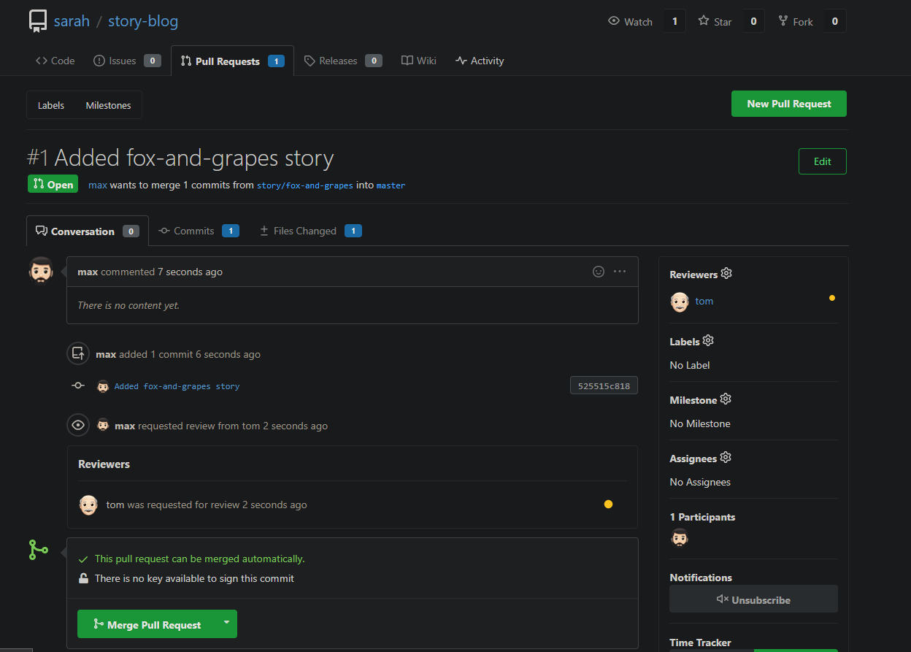
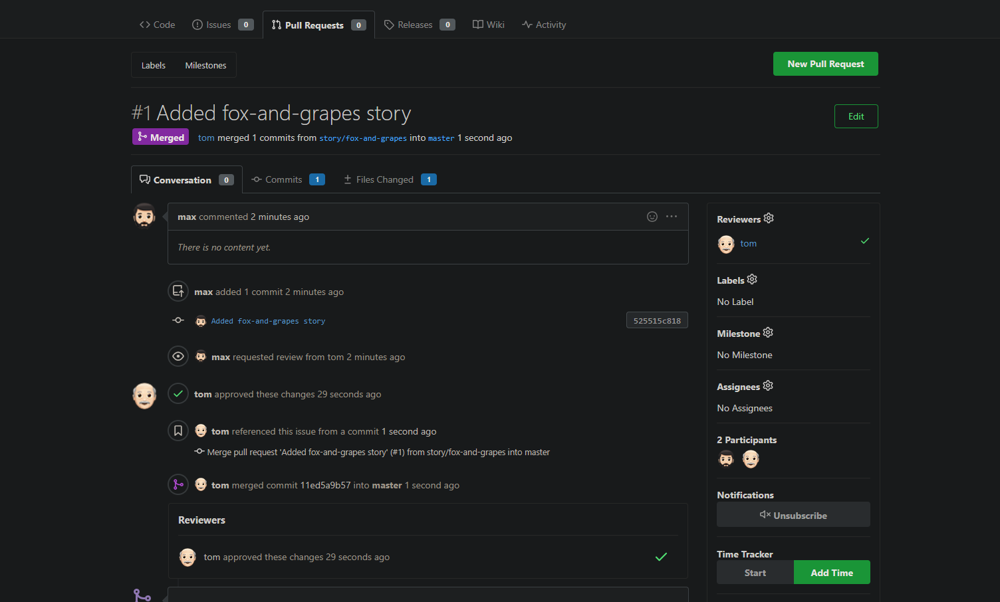
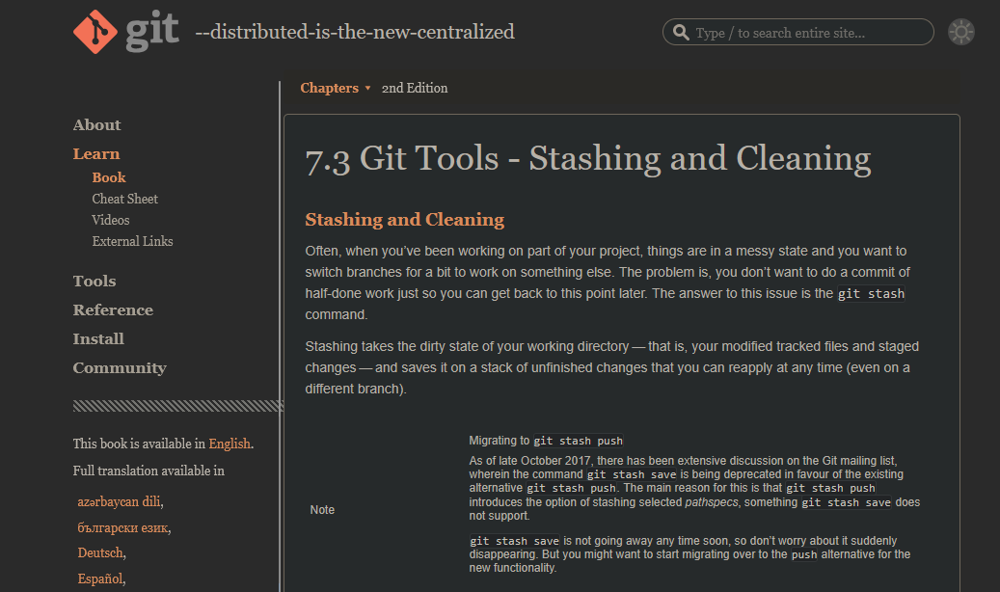
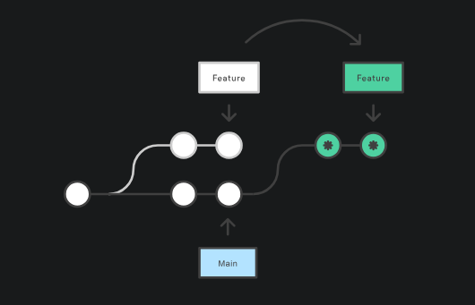
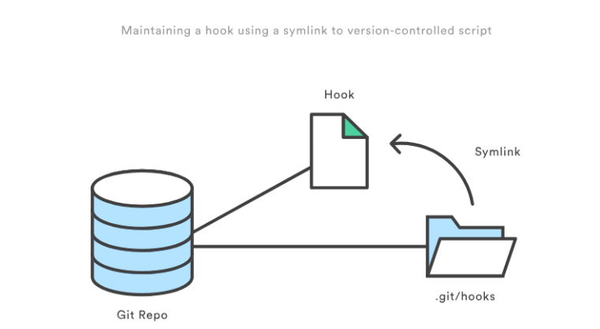
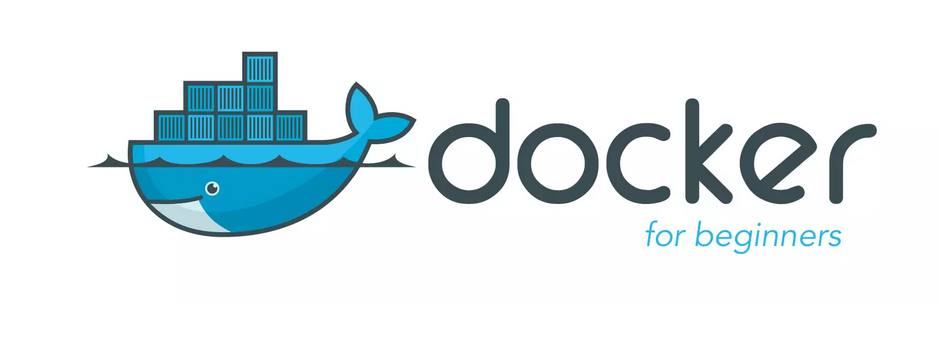

<figure style="max-width:720px; margin:0 auto; text-align:center;">
  
  <figcaption style="font-size:0.9rem; color:var(--text-muted,#666); margin-top:8px;">
    100 Days of DevOps
  </figcaption>
</figure>

## **Day 1 : Linux User Setup with Non-Interactive Shell**
---
### Creating non interactive shell and user setup

Create a user with non-interactive shell for your organization on a specific server. This is essential for service accounts and automated processes that don't require interactive login capabilities.


```shell
sudo useradd -s /sbin/nologin kristy
```

## **Day 2: Temporary User Setup with Expiry**
---

### Temporary user setup with Expiry 

```shell
sudo useradd -e 2026-12-24 kristy

sudo passwd kristy
```


## **Day 3: Secure Root SSH Access**
---

### Secure Root ssh access

```shell
sudo nano /etc/ssh/sshd_config
```

- `PermitRootLogin no` 
- You have to do it for every single host!

## **Day 4:Script Execution Permissions**
---


**In a bid to automate backup processes, the `xFusionCorp Industries` sysadmin team has developed a new bash script named `xfusioncorp.sh`. While the script has been distributed to all necessary servers, it lacks executable permissions on `App Server 1` within the Stratos Datacenter.**

**Your task is to grant executable permissions to the `/tmp/xfusioncorp.sh` script on `App Server 1`. Additionally, ensure that all users have the capability to execute it.**

``` shell
thor@jumphost ~$ ssh tony@stapp01.stratos.xfusioncorp.com
The authenticity of host 'stapp01.stratos.xfusioncorp.com (172.17.0.4)' can't be established.
ED25519 key fingerprint is SHA256:8eDx2ZriNxW9+pNci7Zq6oECY1W13b28pRzv/AA3cxE.
[tony@stapp01 tmp]$ ls -la /tmp
total 36
drwxrwxrwt 1 root root 4096 Dec 12 08:44 .
drwxr-xr-x 1 root root 4096 Dec 12 08:45 ..
drwxrwxrwt 2 root root 4096 Dec 12 08:42 .ICE-unix
drwxrwxrwt 2 root root 4096 Dec 12 08:42 .X11-unix
drwxrwxrwt 2 root root 4096 Dec 12 08:42 .XIM-unix
drwxrwxrwt 2 root root 4096 Dec 12 08:42 .font-unix
drwx------ 3 root root 4096 Dec 12 08:42 systemd-private-1435520e8a0746a589dc0f038604b67c-dbus-broker.service-OQFfiu
drwx------ 3 root root 4096 Dec 12 08:42 systemd-private-1435520e8a0746a589dc0f038604b67c-systemd-logind.service-QuuNiN
-rwxr-xr-x 1 root root   40 Dec 12 08:42 xfusioncorp.sh
[tony@stapp01 tmp]$ ./xfusioncorp.sh 
Welcome To KodeKloud

```

## **Day 5: SElinux Installation and Configuration**
---
Following a security audit, the xFusionCorp Industries security team has opted to enhance application and server security with SELinux. To initiate testing, the following requirements have been established for `App server 2` in the `Stratos Datacenter:`  

1. Install the required `SELinux` packages.
    
2. Permanently disable SELinux for the time being; it will be re-enabled after necessary configuration changes.
    
3. No need to reboot the server, as a scheduled maintenance reboot is already planned for tonight.
    
4. Disregard the current status of SELinux via the command line; the final status after the reboot should be `disabled`.

```shell
[root@stapp02 ~] sudo yum install policycoreutils policycoreutils-python selinux-policy selinux-policy-targeted setroubleshoot-server
[root@stapp02 ~] sudo sed -i 's/^SELINUX=.*/SELINUX=disabled/' /etc/selinux/config
[root@stapp02 ~] vi /etc/selinux/config
[root@stapp02 ~] cat /etc/selinux/config

# This file controls the state of SELinux on the system.
# SELINUX= can take one of these three values:
#     enforcing - SELinux security policy is enforced.
#     permissive - SELinux prints warnings instead of enforcing.
#     disabled - No SELinux policy is loaded.
# See also:
# https://access.redhat.com/documentation/en-us/red_hat_enterprise_linux/9/html/using_selinux/changing-selinux-states-and-modes_using-selinux#changing-selinux-modes-at-boot-time_changing-selinux-states-and-modes
#
# NOTE: Up to RHEL 8 release included, SELINUX=disabled would also
# fully disable SELinux during boot. If you need a system with SELinux
# fully disabled instead of SELinux running with no policy loaded, you
# need to pass selinux=0 to the kernel command line. You can use grubby
# to persistently set the bootloader to boot with selinux=0:
#
#    grubby --update-kernel ALL --args selinux=0
#
# To revert back to SELinux enabled:
#
#    grubby --update-kernel ALL --remove-args selinux
#
SELINUX=disabled
# SELINUXTYPE= can take one of these three values:
#     targeted - Targeted processes are protected,
#     mls - Multi Level Security protection.
SELINUXTYPE=targeted

```

## **Day 6: Create a Cron Job**
---

The `Nautilus` system admins team has prepared scripts to automate several day-to-day tasks. They want them to be deployed on all app servers in `Stratos DC` on a set schedule. Before that they need to test similar functionality with a sample cron job. Therefore, perform the steps below:  

a. Install `cronie` package on all `Nautilus` app servers and start `crond` service.  
b. Add a cron `*/5 * * * * echo hello > /tmp/cron_text` for `root` user.

- Login into each server using ssh (check [day01](https://github.com/imShakil/100-Days-Of-DevOps-Challenge-KodeKloud/blob/main/days/001.md))
- Install `cronie` package into centos:
```shell
    sudo yum install cronie -y
```

Start crond service

```shell
sudo systemctl enable crond
sudo systemctl start crond
```

Create cron schedule:

```shell
sudo crontab -e
*/5 * * * * echo hello > /tmp/cron_text
```

Verify crontab:

```shell
sudo crontab -l
```

and wait 5 minutes to check cron_text in /tmp/

### Automation Script
```shell
#!/bin/sh

# setup_cron_job.sh
# Script to setup cron job on CentOS for Nautilus app servers

set -e  # Exit on any error

echo "=== Setting up Cron Job on CentOS ==="

# Step 1: Install cronie package
echo "Installing cronie package..."
if ! rpm -q cronie &>/dev/null; then
    sudo yum install cronie -y
    echo "✓ cronie package installed successfully"
else
    echo "✓ cronie package already installed"
fi

# Step 2: Start and enable crond service
echo "Starting and enabling crond service..."
sudo systemctl start crond
sudo systemctl enable crond

# Verify service is running
if systemctl is-active --quiet crond; then
    echo "✓ crond service is running"
else
    echo "✗ Failed to start crond service"
    exit 1
fi

# Step 3: Add cron job for root user
echo "Adding cron job for root user..."

# Define the cron job
CRON_JOB="*/5 * * * * echo hello > /tmp/cron_text"

# Check if cron job already exists
if sudo crontab -l 2>/dev/null | grep -q "echo hello > /tmp/cron_text"; then
    echo "✓ Cron job already exists"
else
    # Add the cron job
    (sudo crontab -l 2>/dev/null || true; echo "$CRON_JOB") | sudo crontab -
    echo "✓ Cron job added successfully"
fi

# Step 4: Verify the setup
echo "Verifying cron job setup..."
echo "Current cron jobs for root user:"
sudo crontab -l

echo ""
echo "=== Setup Complete ==="
echo "The cron job will run every 5 minutes and write 'hello' to /tmp/cron_text"
echo "To monitor: sudo tail -f /var/log/cron"
echo "To check output: cat /tmp/cron_text (after 5+ minutes)"

# Optional: Show service status
echo ""
echo "Crond service status:"
sudo systemctl status crond --no-pager -l
```


## **Day 7: Linux SSH Authentication**
---

Linux SSH Authentication

The system admins team of xFusionCorp Industries has set up some scripts on jump host that run on regular intervals and perform operations on all app servers in Stratos Datacenter. To make these scripts work properly we need to make sure the thor user on jump host has password-less SSH access to all app servers through their respective sudo users (i.e tony for app server 1). Based on the requirements, perform the following: Set up a password-less authentication from user thor on jump host to all app servers through their respective sudo users.

### Login to jump host as thor
```shell
ssh thor@jump_host
```

### Generate SSH key (press Enter for all prompts)
```shell
ssh-keygen -t rsa -b 2048
```

### Copy key to respective sudo users on app servers
```shell
ssh-copy-id tony@stapp01
ssh-copy-id steve@stapp02
ssh-copy-id banner@stapp03
```

### Verify password-less access
```shell
ssh tony@stapp01.stratos.xfusioncorp.com
ssh steve@stapp02.stratos.xfusioncorp.com
ssh banner@stapp03.stratos.xfusioncorp.com
```


## **Day 8: Install Ansible**
---
During the weekly meeting, the Nautilus DevOps team discussed about the automation and configuration management solutions that they want to implement. While considering several options, the team has decided to go with Ansible for now due to its simple setup and minimal pre-requisites. The team wanted to start testing using Ansible, so they have decided to use jump host as an Ansible controller to test different kind of tasks on rest of the servers.

Install ansible version 4.7.0 on Jump host using pip3 only. Make sure Ansible binary is available globally on this system, i.e all users on this system are able to run Ansible commands.


### Check pip3 version
```bash
pip3 --version
````

###  Install pip3 (if not already installed)

```bash
sudo yum install -y python3-pip
```

###  Install Ansible 4.7.0 globally using pip3

```bash
sudo pip3 install ansible==4.7.0
```

###  Verify Ansible version

```bash
ansible --version
```

### Check Ansible binary location

```bash
which ansible
```

###  Verify PATH includes Ansible binary directory

```bash
echo $PATH
```

### Run Ansible (basic command check)

```bash
ansible
```

## **Day 9: MariaDB Troubleshooting**
---
There is a critical issue going on with the `Nautilus` application in `Stratos DC`. The production support team identified that the application is unable to connect to the database. After digging into the issue, the team found that mariadb service is down on the database server.  
Look into the issue and fix the same.


### Check OS Information (Verify Environment)

```bash
cat /etc/release
cat /etc/releases
cat /etc/os-release
````

---

###  Check MariaDB Service Status

Confirms whether MariaDB is running, stopped, or failed.

```bash
sudo systemctl status mariadb
sudo systemctl status mariadb.service
```


###  Attempt to Start MariaDB

Initial attempt to bring the database service online.

```bash
sudo systemctl start mariadb
```

---

###  Check MariaDB Error Logs (Root Cause Analysis)

Used when the service fails to start. Shows InnoDB and permission errors.

```bash
sudo tail /var/log/mariadb/mariadb.log
```

---

### Fix MariaDB Data Directory Ownership

MariaDB runs as `mysql` user and must own its data directory.

```bash
sudo chown -R mysql:mysql /var/lib/mysql
```

---

###  Fix Data Directory Permissions

Ensures MariaDB can read/write database files.

```bash
sudo chmod 755 /var/lib/mysql
```

---

###  Create MySQL Socket Directory

MariaDB needs this directory to create its socket file.

```bash
sudo mkdir -p /var/run/mysqld
```

---

###  Set Correct Ownership for Socket Directory

Allows MariaDB to bind to the socket.

```bash
sudo chown mysql:mysql /var/run/mysqld
```

---

### Restart MariaDB After Fix

Applies permission changes and restarts the service.

```bash
sudo systemctl restart mariadb
```

---

### Verify MariaDB Is Running

Final confirmation that the issue is resolved.

```bash
sudo systemctl status mariadb.service
```


## **Day 10: Linux Bash Scripts**
---
The production support team of `xFusionCorp Industries` is working on developing some bash scripts to automate different day to day tasks. One is to create a bash script for taking websites backup. They have a static website running on `App Server 3` in `Stratos Datacenter`, and they need to create a bash script named `news_backup.sh` which should accomplish the following tasks. (Also remember to place the script under `/scripts` directory on `App Server 3`).  
  
a. Create a zip archive named `xfusioncorp_news.zip` of `/var/www/html/news` directory.  

b. Save the archive in `/backup/` on `App Server 3`. This is a temporary storage, as backups from this location will be clean on weekly basis. Therefore, we also need to save this backup archive on `Nautilus Backup Server`.  
  
c. Copy the created archive to `Nautilus Backup Server` server in `/backup/` location.  

d. Please make sure script won't ask for password while copying the archive file. Additionally, the respective server user (for example, `tony` in case of `App Server 1`) must be able to run it.  

e. Do not use sudo inside the script.
**Note:**  
The zip package must be installed on given App Server before executing the script. This package is essential for creating the zip archive of the website files. Install it manually outside the script.

Here is a **clean, concise cheat sheet** created from your command history.  
It’s written so you can **revise quickly or paste into notes**.


#### 1. Basic Navigation & Checks

```bash
ls
whoami
cd ..
ls
cd scripts/
ls -la
```


####  2. Generate SSH Key (Passwordless SCP)

```bash
ssh-keygen -t rsa -b 2048
```

SSH keys are stored in:

```bash
cd /home/banner/.ssh/
ls
```


#### 3. Copy SSH Key to Nautilus Backup Server

```bash
ssh-copy-id clint@stbkp01.stratos.xfusioncorp.com
```

Verify passwordless login:

```bash
ssh clint@stbkp01.stratos.xfusioncorp.com
```


####  4. Create Backup Script

Navigate to scripts directory:

```bash
cd ../../../scripts/
ls
```

Create and edit script:

```bash
vi beta_backup.sh
```

Make script executable:

```bash
chmod +x beta_backup.sh
```


####  5. Install Required Package (Outside Script)

```bash
sudo yum install zip
```

`sudo` is **not used inside the script**, only during setup.


## **Day 11: Install and Configure Tomcat Server**
---

### Install and Setup Tomcat Server


The Nautilus application development team recently finished the beta version of one of their Java-based applications, which they are planning to deploy on one of the app servers in Stratos DC. After an internal team meeting, they have decided to use the tomcat application server. Based on the requirements mentioned below complete the task:

- Install tomcat server on `App Server 1`.
- Configure it to run on port `3001`.
- There is a `ROOT.war` file on Jump host at location `/tmp`.

Deploy it on this tomcat server and make sure the webpage works directly on base URL i.e `curl http://stapp01:3001`

### 1. Install Tomcat on **App Server 1 (stapp01)**

Login to **App Server 1**:

```bash
ssh tony@stapp01
```

Install Tomcat:

```bash
sudo yum install -y tomcat
```

---

### 2. Configure Tomcat to Run on **Port 3001**

Edit Tomcat server configuration:

```bash
sudo vi /etc/tomcat/server.xml
```

Find the **Connector** section (default port 8080):

```xml
<Connector port="8080" protocol="org.apache.coyote.http11.Http11NioProtocol"
           connectionTimeout="20000"
           redirectPort="8443" />
```

Change **8080 → 3001**:

```xml
<Connector port="3001" protocol="org.apache.coyote.http11.Http11NioProtocol"
           connectionTimeout="20000"
           redirectPort="8443" />
```

Save and exit.

---

### 3. Copy `ROOT.war` from Jump Host to App Server 1

Exit to **Jump Host** (if needed):

```bash
exit
```

Copy the WAR file:

```bash
scp /tmp/ROOT.war tony@stapp01:/tmp/
```

Login back to App Server 1:

```bash
ssh tony@stapp01
```

Move WAR file to Tomcat deployment directory:

```bash
sudo mv /tmp/ROOT.war /usr/share/tomcat/webapps/
```

> **Important:**  
> Deploying as `ROOT.war` ensures the app runs on the **base URL**.

---

### 4. Start and Enable Tomcat

```bash
sudo systemctl start tomcat
sudo systemctl enable tomcat
```

Verify Tomcat is listening on port **3001**:

```bash
sudo netstat -tulnp | grep 3001
```

---

### 5. Verify Application Deployment

Test from **App Server 1**:

```bash
curl http://localhost:3001
```

Or from Jump Host:

```bash
curl http://stapp01:3001
```

 If the webpage content loads, the deployment is **successful**.


## **Day 12: Linux Network Services**
---
Our monitoring tool has reported an issue in `Stratos Datacenter`. One of our app servers has an issue, as its Apache service is not reachable on port `3004` (which is the Apache port). The service itself could be down, the firewall could be at fault, or something else could be causing the issue.  


Use tools like `telnet`, `netstat`, etc. to find and fix the issue. Also make sure Apache is reachable from the jump host without compromising any security settings.  
  
Once fixed, you can test the same using command `curl http://stapp01:3004` command from jump host.

`Note:` Please do not try to alter the existing `index.html` code, as it will lead to task failure.


### 1. Verify issue from jump host

```bash
curl http://stapp01:3004
telnet stapp01 3004
```

Purpose:

- Confirms whether the service is reachable externally
    
- Identifies network vs service-level issues
    
- Then `ssh tony@stapp01`
### 2. Check Apache service status

```bash
sudo systemctl status httpd
```

If stopped:

```bash
sudo systemctl start httpd
sudo systemctl enable httpd
```


### 3. Identify what is using port 3004

```bash
sudo netstat -tulnp | grep 3004

Active Internet connections (only servers)
Proto Recv-Q Send-Q Local Address           Foreign Address         State       PID/Program name    
tcp        0      0 127.0.0.11:36025        0.0.0.0:*               LISTEN      -                   
tcp        0      0 127.0.0.1:3004          0.0.0.0:*               LISTEN      430/sendmail: accep 
tcp        0      0 0.0.0.0:22              0.0.0.0:*               LISTEN      298/sshd            
tcp6       0      0 :::22                   :::*                    LISTEN      298/sshd            
udp        0      0 127.0.0.11:56145        0.0.0.0:*                           -                   
```

or

```bash
sudo ss -tulnp | grep 3004
```

Sendmail is running on port 3004


### 4. Resolve port conflict (sendmail case)

```bash
sudo systemctl stop sendmail
sudo systemctl disable sendmail
```

Verify port is free:

```bash
sudo netstat -tulnp | grep 3004
```

### 5. Start Apache after freeing the port

```bash
sudo systemctl start httpd
sudo systemctl enable httpd
```

Verify Apache is listening:

```bash
sudo netstat -tulnp | grep 3004
```

Expected:

```
0.0.0.0:3004 LISTEN httpd
```

### 6. Local validation on app server

```bash
curl http://localhost:3004
```

### 7. Check firewall service availability

```bash
sudo systemctl status firewalld
```

If firewalld is not installed, proceed to iptables checks.

### 8. Inspect iptables rules

```bash
sudo iptables -L -n
```

Key things to check:

- INPUT chain policy
    
- REJECT or DROP rules
    
- Explicit allow rules for required ports
    

### 9. Allow Apache port via iptables (if needed)

```bash
sudo iptables -I INPUT 4 -p tcp --dport 3004 -j ACCEPT
```

This inserts the rule before the final REJECT rule.

### 10. Final external test (pass condition)

From jump host:

```bash
curl http://stapp01:3004
```

## **Day 13: IPtables Installation And Configuration**
---
# IPtables Installation And Configuration

We have one of our websites up and running on our Nautilus infrastructure in Stratos DC. Our security team has raised a concern that right now Apache’s port i.e `5000` is open for all since there is no firewall installed on these hosts. So we have decided to add some security layer for these hosts and after discussions and recommendations we have come up with the following requirements:

1. Install `iptables` and all its dependencies on each app host.
2. Block incoming port `5000` on all apps for everyone except for `LBR` host.
3. Make sure the rules remain, even after system reboot.

You have to jump to every application server and run this bash script there

### Step 1: 

```shell
vi configure_firewall.sh
```

### Bash Script
```shell
#!/bin/bash
LBR_IP="172.16.238.14"
APP_PORT="5000"

sudo yum install -y iptables iptables-services
sudo iptables -F
sudo iptables -A INPUT -p tcp --dport ${APP_PORT} -s ${LBR_IP} -j ACCEPT
sudo iptables -A INPUT -p tcp --dport ${APP_PORT} -j REJECT
sudo service iptables save
sudo iptables -L -n --line-numbers

```

### Step 2:

```sh
chmod +x configure_firewall.sh
```

### Step 3:

```shell
sudo ./configure_firewall.sh
```
## **Day 14: Linux Process Troubleshooting**
---

# Linux Process Troubleshooting

The production support team of xFusionCorp Industries has deployed some of the latest monitoring tools to keep an eye on every service, application, etc. running on the systems. One of the monitoring systems reported about Apache service unavailability on one of the app servers in Stratos DC.

 Identify the faulty app host and fix the issue. Make sure Apache service is up and running on all app hosts. They might not have hosted any code yet on these servers, so you don’t need to worry if Apache isn’t serving any pages. Just make sure the service is up and running. Also, make sure Apache is running on port _**`6100`**_ on all app servers.

###  Check Apache service status

```bash
sudo systemctl status httpd
```

If stopped:

```bash
sudo systemctl start httpd
sudo systemctl enable httpd
```

### Identify what is using port 6100

```bash
sudo netstat -tulnp | grep 6100
```

Example output:

```
Active Internet connections (only servers)
Proto Recv-Q Send-Q Local Address           Foreign Address         State       PID/Program name    
tcp        0      0 127.0.0.1:6100          0.0.0.0:*               LISTEN      430/sendmail: accep 
```

or

```bash
sudo ss -tulnp | grep 6100
```

Sendmail is running on port **6100**.
### Resolve port conflict (sendmail case)

```bash
sudo systemctl stop sendmail
sudo systemctl disable sendmail
```

Verify port is free:

```bash
sudo netstat -tulnp | grep 6100
```

(No output means the port is free.)
### Start Apache after freeing the port

```bash
sudo systemctl start httpd
sudo systemctl enable httpd
```

Verify Apache is listening:

```bash
sudo netstat -tulnp | grep 6100
```

Expected:

```
0.0.0.0:6100 LISTEN httpd
```

### Local validation on app server

```bash
curl http://localhost:6100
```

## **Day 15: Setup SSL for Nginx**
---

The system admins team of `xFusionCorp Industries` needs to deploy a new application on `App Server 2` in `Stratos Datacenter`. They have some pre-requites to get ready that server for application deployment. Prepare the server as per requirements shared below:  

1. Install and configure `nginx` on `App Server 2`.  
2. On `App Server 2` there is a self signed SSL certificate and key present at location `/tmp/nautilus.crt` and `/tmp/nautilus.key`. Move them to some appropriate location and deploy the same in Nginx.  
3. Create an `index.html` file with content `Welcome!` under Nginx document root.  
4. For final testing try to access the `App Server 2` link (either hostname or IP) from `jump host` using curl command. For example `curl -Ik https://<app-server-ip>/`.


### Install & Enable Nginx

```bash
sudo yum install -y nginx
sudo systemctl start nginx
sudo systemctl enable nginx
systemctl status nginx
```

### Prepare SSL Directory

```bash
sudo mkdir -p /etc/nginx/ssl
```

### Move SSL Certificate & Key

```bash
sudo mv /tmp/nautilus.crt /etc/nginx/ssl/
sudo mv /tmp/nautilus.key /etc/nginx/ssl/
```

### Set Secure Permissions

```bash
sudo chmod 600 /etc/nginx/ssl/nautilus.key
sudo chmod 644 /etc/nginx/ssl/nautilus.crt
```

###  Configure Nginx for HTTPS

```bash
sudo vi /etc/nginx/nginx.conf
```

**Key SSL directives:**

```nginx
ssl_certificate /etc/nginx/ssl/nautilus.crt;
ssl_certificate_key /etc/nginx/ssl/nautilus.key;
```

### Create Application Page

```bash
sudo vi /usr/share/nginx/html/index.html
```

**Content:**

```text
Welcome!
```

(If needed, remove and recreate)

```bash
sudo rm /usr/share/nginx/html/index.html
sudo vi /usr/share/nginx/html/index.html
```

### Validate & Reload Nginx

```bash
sudo nginx -t
sudo systemctl reload nginx
```

### Test HTTPS from Jump Host

#### Check headers (SSL + HTTP/2)

```bash
curl -Ik https://<app-server-ip>/
```

#### Check page content

```bash
curl -k https://<app-server-ip>/
```

**Expected Output:**

```text
Welcome!
```

## **Day 16: Install and Configure Nginx as an LBR**
---

Day by day traffic is increasing on one of the websites managed by the Nautilus production support team. Therefore, the team has observed a degradation in website performance. Following discussions about this issue, the team has decided to deploy this application on a high availability stack i.e on Nautilus infra in Stratos DC. They started the migration last month and it is almost done, as only the LBR server configuration is pending. Configure LBR server as per the information given below:

- Install `nginx` on `LBR` server
- Configure load-balancing with the an http context making use of all App Servers. Ensure that you update only the main `Nginx` configuration file located at `/etc/nginx/nginx.conf`
- Make sure you do not update the apache port that is already defined in the apache configuration on all app servers, also make sure apache server is up and running on all app servers
- Once done, you can access the website using StaticApp button on the top bar


### 1. Verify Apache (`httpd`) Service on App Servers

Login to **each app server** and ensure the Apache service is running and listening on the correct port.

```bash
sudo ss -tlnup
```

#### Sample Output

```text
Netid   State   Recv-Q  Send-Q  Local Address:Port   Peer Address:Port   Process
tcp     LISTEN  0       511     0.0.0.0:3000         0.0.0.0:*           users:(("httpd",pid=1690,fd=3))
tcp     LISTEN  0       128     0.0.0.0:22           0.0.0.0:*           users:(("sshd",pid=1102,fd=3))
```

 **Apache is running on port:** `3000`

---

### 2. Install and Start NGINX on Load Balancer Server

Login to the **LBR server** and install NGINX.

```bash
sudo yum install nginx -y
sudo systemctl enable nginx
sudo systemctl start nginx
```

---

### 3. Configure NGINX Load Balancer

Edit the NGINX configuration file:

```bash
sudo vi /etc/nginx/nginx.conf
```

#### 3.1 Add Upstream Backend Servers

Inside the `http` block (before the `server` block), add:

```nginx
upstream stapp {
    server stapp01:3000;
    server stapp02:3000;
    server stapp03:3000;
}
```

---

#### 3.2 Configure Proxy Pass

Inside the `server { listen 80; }` block:

```nginx
location / {
    proxy_pass http://stapp;
    proxy_set_header Host $host;
    proxy_set_header X-Real-IP $remote_addr;
    proxy_set_header X-Forwarded-For $proxy_add_x_forwarded_for;
    proxy_set_header X-Forwarded-Proto $scheme;

    proxy_http_version 1.1;
    proxy_set_header Upgrade $http_upgrade;
    proxy_set_header Connection "upgrade";

    proxy_connect_timeout 5s;
    proxy_read_timeout 60s;
}
```

---

#### 3.3 Validate and Restart NGINX

```bash
sudo nginx -t
sudo systemctl restart nginx
```

---

### 4. Full NGINX Load Balancer Configuration

```nginx
user nginx;
worker_processes auto;
error_log /var/log/nginx/error.log;
pid /run/nginx.pid;

include /usr/share/nginx/modules/*.conf;

events {
    worker_connections 1024;
}

http {
    log_format main '$remote_addr - $remote_user [$time_local] "$request" '
                    '$status $body_bytes_sent "$http_referer" '
                    '"$http_user_agent" "$http_x_forwarded_for"';

    access_log /var/log/nginx/access.log main;

    sendfile on;
    tcp_nopush on;
    tcp_nodelay on;
    keepalive_timeout 65;
    types_hash_max_size 4096;

    include /etc/nginx/mime.types;
    default_type application/octet-stream;
    include /etc/nginx/conf.d/*.conf;

    upstream stapp {
        server stapp01:3000;
        server stapp02:3000;
        server stapp03:3000;
    }

    server {
        listen 80;
        listen [::]:80;
        server_name _;

        include /etc/nginx/default.d/*.conf;

        error_page 404 /404.html;
        location = /404.html {}

        error_page 500 502 503 504 /50x.html;
        location = /50x.html {}

        location / {
            proxy_pass http://stapp;
            proxy_set_header Host $host;
            proxy_set_header X-Real-IP $remote_addr;
            proxy_set_header X-Forwarded-For $proxy_add_x_forwarded_for;
            proxy_set_header X-Forwarded-Proto $scheme;

            proxy_http_version 1.1;
            proxy_set_header Upgrade $http_upgrade;
            proxy_set_header Connection "upgrade";

            proxy_connect_timeout 5s;
            proxy_read_timeout 60s;
        }
    }
}
```
## **Day 17: Install and Configure PostgreSQL**
---

The Nautilus application development team has shared that they are planning to deploy one newly developed application on Nautilus infra in Stratos DC. The application uses PostgreSQL database, so as a pre-requisite we need to set up PostgreSQL database server as per requirements shared below:

PostgreSQL database server is already installed on the Nautilus database server.

- Create a database user `kodekloud_tim` and set its password to `LQfKeWWxWD`.
- Create a database `kodekloud_db2` and grant full permissions to user `kodekloud_tim` on this database.

> Please do not try to restart PostgreSQL server service.

### 1. Verify `psql` Binary Location

```bash
which psql
```

**Output:**

```text
/usr/bin/psql
```

### 2. Switch to PostgreSQL Superuser

Login as the `postgres` user using `sudo`:

```bash
sudo -u postgres psql
```

 **Note:**  
The warning below is normal and can be ignored:

```text
could not change directory to "/home/peter": Permission denied
```

### 3. Create a New PostgreSQL User

```sql
CREATE USER kodekloud_tim
WITH ENCRYPTED PASSWORD 'LQfKeWWxWD';
```

 User created successfully.


### 4. Create a New Database

```sql
CREATE DATABASE kodekloud_db2;
```

 Database created.


### 5. Grant Privileges on Database to User

```sql
GRANT ALL PRIVILEGES
ON DATABASE kodekloud_db2
TO kodekloud_tim;
```

 Permissions granted.

### 6. Verify Users and Databases (Optional)

```sql
\du        -- list users
\l         -- list databases
```

## **Day 18: Configure LAMP server**
---
xFusionCorp Industries is planning to host a `WordPress` website on their infra in `Stratos Datacenter`. They have already done infrastructure configuration—for example, on the storage server they already have a shared directory `/vaw/www/html` that is mounted on each app host under `/var/www/html` directory. Please perform the following steps to accomplish the task:  

a. Install httpd, php and its dependencies on all app hosts.  
b. Apache should serve on port `5004` within the apps.  
c. Install/Configure `MariaDB server` on DB Server.  
d. Create a database named `kodekloud_db10` and create a database user named `kodekloud_roy` identified as password `B4zNgHA7Ya`. Further make sure this newly created user is able to perform all operation on the database you created.  
e. Finally you should be able to access the website on LBR link, by clicking on the `App` button on the top bar. You should see a message like `App is able to connect to the database using user kodekloud_roy`


### Install Apache & PHP

```bash
sudo yum install -y httpd php php-mysqli
```

### Start & Enable Apache

```bash
sudo systemctl start httpd
sudo systemctl enable httpd
```

### Verify PHP Installation

```bash
php -v
```

### Change Apache Port to `5004`

```bash
sudo sed -i 's/^Listen .*/Listen 5004/' /etc/httpd/conf/httpd.conf
```

### Restart Apache

```bash
sudo systemctl restart httpd
```

### Verify Apache is Listening on 5004

```bash
sudo ss -tulnp | grep httpd
```

### Optional: Bash Script (App Server Automation)

```bash
#!/bin/bash
set -e

sudo yum install -y httpd php php-mysqli
sudo systemctl start httpd
sudo systemctl enable httpd
sudo sed -i 's/^Listen .*/Listen 5004/' /etc/httpd/conf/httpd.conf
sudo systemctl restart httpd
php -v
sudo ss -tulnp | grep httpd
```

Usage:

```bash
vi setup_apache_5004.sh
chmod +x setup_apache_5004.sh
./setup_apache_5004.sh
```
###  DATABASE SERVER SETUP

**Host:** `stdb01.stratos.xfusioncorp.com`

### SSH to DB Server

```bash
ssh peter@stdb01.stratos.xfusioncorp.com
```

### Install MariaDB Server

```bash
sudo yum install -y mariadb-server
```

###Start & Enable MariaDB

```bash
sudo systemctl start mariadb
sudo systemctl enable mariadb
```

### Secure MariaDB

```bash
sudo mysql_secure_installation
```

> Set root password, remove anonymous users, disallow remote root login, remove test DB.

### Login to MySQL

```bash
mysql -u root -p
```

###  Create Database

```sql
CREATE DATABASE kodekloud_db10;
```
###  Create Database User

```sql
CREATE USER 'kodekloud_roy'@'%' IDENTIFIED BY 'B4zNgHA7Ya';
```

### Grant Privileges

```sql
GRANT ALL PRIVILEGES ON kodekloud_db10.* TO 'kodekloud_roy'@'%';
FLUSH PRIVILEGES;
```

### Verify Grants

```sql
SHOW GRANTS FOR 'kodekloud_roy'@'%';
```

## **Day 19: Install and Configure Web Application**
---
xFusionCorp Industries is planning to host two static websites on their infra in `Stratos Datacenter`. The development of these websites is still in-progress, but we want to get the servers ready. Please perform the following steps to accomplish the task:  

a. Install `httpd` package and dependencies on `app server 1`.  
b. Apache should serve on port `5000`.  
c. There are two website's backups `/home/thor/news` and `/home/thor/demo` on `jump_host`. Set them up on Apache in a way that `news` should work on the link `http://localhost:5000/news/` and `demo` should work on link `http://localhost:5000/demo/` on the mentioned app server.  
d. Once configured you should be able to access the website using `curl` command on the respective app server, i.e `curl http://localhost:5000/news/` and `curl http://localhost:5000/demo/`
### Install Apache (httpd)

```bash
sudo yum install -y httpd
sudo systemctl enable httpd
sudo systemctl start httpd
```
### Configure Apache to Listen on Port 5000

Edit Apache configuration:

```bash
sudo vi /etc/httpd/conf/httpd.conf
```

Update the listening port:

```apache
Listen 5000
```

Restart Apache:

```bash
sudo systemctl restart httpd
```

### Copy Website Data from Jump Host (thor)

Direct copying to `/var/www/html` is not permitted, so data is first copied to `/tmp`.

```bash
scp -r /home/thor/news tony@stapp01.stratos.xfusioncorp.com:/tmp/
scp -r /home/thor/demo tony@stapp01.stratos.xfusioncorp.com:/tmp/
```

### Move Website Data to Apache Document Root

Login to the app server and move the files using sudo:

```bash
ssh tony@stapp01.stratos.xfusioncorp.com
sudo mv /tmp/news /var/www/html/
sudo mv /tmp/demo /var/www/html/
```

### Set Correct Ownership and Permissions

```bash
sudo chown -R apache:apache /var/www/html/news /var/www/html/demo
sudo chmod -R 755 /var/www/html/news /var/www/html/demo
```

Verify:

```bash
ls -ld /var/www/html/news /var/www/html/demo
```
### Verify Website Access Using curl

```bash
curl http://localhost:5000/news/
curl http://localhost:5000/demo/
```

Here is your **Markdown cheat sheet**, strictly following the **same format and style** you shared 👇
(Headings, steps, code blocks — all aligned)

---

## **Day 20: Configure Nginx + PHP-FPM Using Unix Sock**
The Nautilus application development team is planning to launch a new PHP-based application, which they want to deploy on Nautilus infra in Stratos DC. The development team had a meeting with the production support team and they have shared some requirements regarding the infrastructure. Below are the requirements they shared:

a. Install nginx on app server 1 , configure it to use port 8097 and its document root should be /var/www/html.
b. Install php-fpm version 8.3 on app server 1, it must use the unix socket /var/run/php-fpm/default.sock (create the parent directories if don't exist).
c. Configure php-fpm and nginx to work together.
d. Once configured correctly, you can test the website using curl http://stapp01:8097/index.php command from jump host.

NOTE: We have copied two files, index.php and info.php, under /var/www/html as part of the PHP-based application setup. Please do not modify these files.

### Install NGINX

```bash
sudo yum install -y nginx
sudo systemctl enable nginx
sudo systemctl start nginx
```


### Configure NGINX to Listen on Port 8097

Edit nginx configuration:

```bash
sudo vi /etc/nginx/nginx.conf
```

Add or update the server block inside `http {}`:

```nginx
 server {
        listen       8097;
        listen       [::]:8097;
        server_name  _;
        root         /var/www/html;

        # Load configuration files for the default server block.
        # include /etc/nginx/default.d/*.conf;

        
        location ~ \.php$ {
        try_files $uri =404;
        fastcgi_pass unix:/var/run/php-fpm/default.sock;
        fastcgi_index index.php;
        fastcgi_param SCRIPT_FILENAME $document_root$fastcgi_script_name;
        include fastcgi_params;
        }

        error_page 404 /404.html;
        location = /404.html {
        }

        error_page 500 502 503 504 /50x.html;
        location = /50x.html {
        }
    }
```

Restart nginx:

```bash
sudo systemctl restart nginx
```

### Install PHP-FPM 8.3

Install PHP and PHP-FPM:

```bash
sudo dnf module install php:8.3 -y
```
### Configure PHP-FPM Socket

Create required directory:

```bash
sudo mkdir -p /var/run/php-fpm
```

Edit PHP-FPM pool configuration:

```bash
sudo vi /etc/php-fpm.d/www.conf
```

Update the following values:

```ini
listen = /var/run/php-fpm/default.sock
```

### Set Correct Ownership and Permissions

```bash
sudo chown -R nginx:nginx /var/www/html
```

### Start and Enable Services

```bash
sudo systemctl start php-fpm
sudo systemctl enable php-fpm

sudo systemctl start nginx
sudo systemctl enable nginx
```

Verify service status:

```bash
systemctl status nginx
systemctl status php-fpm
```


### Verify Application Using curl (from Jump Host)

```bash
curl http://stapp01:8097/index.php
```

(Optional test)

```bash
curl http://stapp01:8097/info.php
```

### You can check [How to Configure PHP-FPM with NGINX for Secure PHP Processing](https://www.digitalocean.com/community/tutorials/php-fpm-nginx)


## **Day 21: Set Up Git Repository on Storage Server**

The Nautilus development team has provided requirements to the DevOps team for a new application development project, specifically requesting the establishment of a Git repository. Follow the instructions below to create the Git repository on the `Storage server` in the Stratos DC:  

1. Utilize `yum` to install the `git` package on the `Storage Server`.  
      
2. Create a bare repository named `/opt/media.git` (ensure exact name usage).


```sh
[natasha@ststor01 ~]$ sudo yum install git 

[natasha@ststor01 ~]$ git -h | grep bare
           [--no-optional-locks] [--no-advice] [--bare] [--git-dir=<path>]
[natasha@ststor01 ~]$ git init --bare /opt/media.git
fatal: cannot mkdir /opt/media.git: Permission denied

[natasha@ststor01 ~]$ sudo git init --bare /opt/media.git
hint: Using 'master' as the name for the initial branch. This default branch name
hint: is subject to change. To configure the initial branch name to use in all
hint: of your new repositories, which will suppress this warning, call:
hint:
hint:   git config --global init.defaultBranch <name>
hint:
hint: Names commonly chosen instead of 'master' are 'main', 'trunk' and
hint: 'development'. The just-created branch can be renamed via this command:
hint:
hint:   git branch -m <name>
Initialized empty Git repository in /opt/media.git/
```

## **Day 22: Clone Git Repository on Storage Server**

The DevOps team established a new Git repository last week, which remains unused at present. However, the Nautilus application development team now requires a copy of this repository on the `Storage Server` in the Stratos DC. Follow the provided details to clone the repository:  
  
1. The repository to be cloned is located at `/opt/cluster.git`  

2. Clone this Git repository to the `/usr/src/kodekloudrepos` directory. Perform this task using the natasha user, and ensure that no modifications are made to the repository or existing directories, such as changing permissions or making unauthorized alterations.

```sh
thor@jumphost /opt$ ssh natasha@ststor01.stratos.xfusioncorp.com

[natasha@ststor01 ~]$ ls
[natasha@ststor01 ~]$ ls -ld /usr/src/kodekloudrepos
drwxr-xr-x 2 natasha natasha 4096 Dec 29 15:55 /usr/src/kodekloudrepos
[natasha@ststor01 ~]$ git clone /opt/cluster.git/ /usr/src/kodekloudrepos/cluster
Cloning into '/usr/src/kodekloudrepos/cluster'...
warning: You appear to have cloned an empty repository.
done.
[natasha@ststor01 ~]$ cd /usr/src/kodekloudrepos/cluster
[natasha@ststor01 cluster]$ git status
On branch master

No commits yet

nothing to commit (create/copy files and use "git add" to track)
[natasha@ststor01 cluster]$ 

```
## **Day 23: Fork a Git Repository**

There is a Git server utilized by the Nautilus project teams. Recently, a new developer named Jon joined the team and needs to begin working on a project. To begin, he must fork an existing Git repository. Follow the steps below:  

1. Click on the `Gitea UI` button located on the top bar to access the Gitea page.  
2. Login to `Gitea` server using username `jon` and password `Jon_pass123`.  
3. Once logged in, locate the Git repository named `sarah/story-blog` and `fork` it under the `jon` user. 

`Note:` For tasks requiring web UI changes, screenshots are necessary for review purposes. Additionally, consider utilizing screen recording software such as loom.com to record and share your task completion process.

### Just go to the git repo and fork it to your account

## **Day 24: Git Create Branches**

Nautilus developers are actively working on one of the project repositories, `/usr/src/kodekloudrepos/beta`. Recently, they decided to implement some new features in the application, and they want to maintain those new changes in a separate branch. Below are the requirements that have been shared with the DevOps team:

- On Storage server in Stratos DC create a new branch `xfusioncorp_beta` from master branch in `/usr/src/kodekloudrepos/beta` git repo.

- Please do not try to make any changes in the code.

```sh
cd /usr/src/kodekloudrepos/beta/
ls
git branch
sudo su
git branch
git switch master
git branch xfusioncorp_beta
git branch
```
## **Day 25: Git Merge Branches**

The Nautilus application development team has been working on a project repository `/opt/cluster.git`. This repo is cloned at `/usr/src/kodekloudrepos` on `storage server` in `Stratos DC`. They recently shared the following requirements with DevOps team:  
Create a new branch `nautilus` in `/usr/src/kodekloudrepos/cluster` repo from `master` and copy the `/tmp/index.html` file (present on `storage server` itself) into the repo. Further, `add/commit` this file in the new branch and merge back that branch into `master` branch. Finally, push the changes to the origin for both of the branches.

### Check Existing Branches

```bash
git branch
```
Only the `master` branch exists, and it is currently checked out.

### Create a New Branch

```bash
git branch nautilus
```
A new branch named `nautilus` is created from `master`.

### Switch to the New Branch

```bash
git checkout nautilus
```
You are now working on the `nautilus` branch.

### Copy Required File into Repository

```bash
cp /tmp/index.html .
```
The file is copied into the repository root.

### Verify Files in Repository

```bash
ls
```
`index.html` is now present in the repo.

### Stage Changes

```bash
git add .
```
All changes (including `index.html`) are staged.

### Commit Changes in Nautilus Branch

```bash
git commit -m "adding file"
```
The file is successfully committed to the `nautilus` branch.


### Switch Back to Master Branch

```bash
git checkout master
```
You are now back on `master`.

### Merge Nautilus Branch into Master
```bash
git merge nautilus
```
The `nautilus` branch changes are merged into `master` using a **fast-forward merge**.
### Push Master Branch to Origin

```bash
git push 
```


## **Day 26: Git Manage Remotes**

The xFusionCorp development team added updates to the project that is maintained under `/opt/official.git` repo and cloned under `/usr/src/kodekloudrepos/official`. Recently some changes were made on Git server that is hosted on `Storage server` in `Stratos DC`. The DevOps team added some new Git remotes, so we need to update remote on `/usr/src/kodekloudrepos/official` repository as per details mentioned below:
a. In `/usr/src/kodekloudrepos/official` repo add a new remote `dev_official` and point it to `/opt/xfusioncorp_official.git` repository.
b. There is a file `/tmp/index.html` on same server; copy this file to the repo and add/commit to master branch.  
c. Finally push `master` branch to this new remote origin.

### Check Existing Git Remotes

```bash
git remote -v
```

### Add New Remote Repository

```bash
git remote add dev_official /opt/xfusioncorp_official.git
```
### Verify Remote Was Added

```bash
git remote -v
```

### Copy File Into Repository

```bash
cp /tmp/index.html .
```
### Stage Changes

```bash
git add .
```
### Commit Changes to Master Branch

```bash
git commit -m "adding file"
```
### Check Current Branch

```bash
git branch
```

### Push Master Branch to New Remote

```bash
git push dev_official master
```
### Quick Tip
* Always **explicitly specify the branch** when pushing to a new remote:

```bash
git push <remote-name> <branch-name>
```

## **Day 27: Git Revert Some Changes**

The Nautilus application development team was working on a git repository `/usr/src/kodekloudrepos/apps` present on Storage server in Stratos DC. However, they reported an issue with the recent commits being pushed to this repo. They have asked the DevOps team to revert repo HEAD to last commit. Below are more details about the task:

In `/usr/src/kodekloudrepos/apps` git repository, revert the latest commit ( HEAD ) to the previous commit .
Use `revert apps` message (please use all small letters for commit message) for the new revert commit.

    
### Navigate to Repository

```bash
cd /usr/src/kodekloudrepos/apps
```
### Check Current Commit History

```bash
git log --oneline
```

* Shows commit hash, HEAD, and messages.
  Example output:

```
269aa04 (HEAD -> master) add data.txt file
3d81254 initial commit
```
### Revert the Latest Commit

```bash
git revert HEAD
```

* Creates a **new commit** that undoes the changes of the latest commit.
* Safe for shared repositories since it **preserves history**.

### Change Revert Commit Message

If you want a custom message instead of the default `Revert "..."`:

```bash
git commit --amend -m "revert apps"
```

* Updates the last commit message.
* Example after amend:

```
111d333 (HEAD -> master) revert apps
269aa04 add data.txt file
3d81254 initial commit
```

### Verify Revert

```bash
git log --oneline
```
* Confirms the latest commit is your **revert commit**.

```bash
git status
```
* Ensures working directory is clean.

### Notes / Tips

* **Do NOT use `-m` option** for normal commits; it’s only for **merge commits**.
* Use `git revert` instead of `git reset` if others are working on the repo.
* If there are untracked files, Git will show them under `git status`, but they do **not affect the revert**.

## **Day 28: Git Cherry Pick**

The Nautilus application development team has been working on a project repository `/opt/games.git`. This repo is cloned at `/usr/src/kodekloudrepos` on `storage server` in `Stratos DC`. They recently shared the following requirements with the DevOps team:  

There are two branches in this repository, `master` and `feature`. One of the developers is working on the `feature` branch and their work is still in progress, however they want to merge one of the commits from the `feature` branch to the `master` branch, the message for the commit that needs to be merged into `master` is `Update info.txt`. Accomplish this task for them, also remember to push your changes eventually.

### Repository Location

* Remote repo: `/opt/games.git`
* Local clone: `/usr/src/kodekloudrepos/games`

### Step 1: Navigate to the Repository

```bash
cd /usr/src/kodekloudrepos/games
```
### Step 2: Check Available Branches

```bash
git branch
```
### Step 3: Identify the Required Commit

List commits on the `feature` branch:

```bash
git log feature --oneline
```

Look for the commit message:

```text
Update info.txt
```

Copy the commit hash:

```text
d6a24a9ab99c93bc1420434dd6ea28ae997a0763
```
### Step 4: Switch to Master Branch

```bash
git checkout master
```
### Step 5: Cherry-Pick the Commit

```bash
git cherry-pick d6a24a9ab99c93bc1420434dd6ea28ae997a0763
```

Successful output indicates the commit is applied:

```text
[master <new-hash>] Update info.txt
```


### Step 6: Verify Repository Status

```bash
git status
```

Expected output:

```text
Your branch is ahead of 'origin/master' by 1 commit
nothing to commit, working tree clean
```
### Step 7: Push Changes to Remote

```bash
git push origin master
```

## **Day 29: Manage Git Pull Requests**

`Max` want to push some new changes to one of the repositories but we don't want people to push directly to `master` branch, since that would be the final version of the code. It should always only have content that has been reviewed and approved. We cannot just allow everyone to directly push to the master branch. So, let's do it the right way as discussed below:

  

SSH into `storage server` using user `max`, password `Max_pass123` . There you can find an already cloned repo under `Max` user's home.  
  
Max has written his story about The 🦊 Fox and Grapes 🍇   

Max has already pushed his story to remote git repository hosted on `Gitea` branch `story/fox-and-grapes`  

Check the contents of the cloned repository. Confirm that you can see Sarah's story and history of commits by running `git log` and validate author info, commit message etc.    

Max has pushed his story, but his story is still not in the `master` branch. Let's create a Pull Request(PR) to merge Max's `story/fox-and-grapes` branch into the `master` branch  
  
Click on the `Gitea UI` button on the top bar. You should be able to access the `Gitea` page.  
  
UI login info:

- Username: `max`

- Password: `Max_pass123`

PR title : `Added fox-and-grapes story`

PR pull from branch: `story/fox-and-grapes` (source)

PR merge into branch: `master` (destination)  
  
Before we can add our story to the `master` branch, it has to be reviewed. So, let's ask `tom` to review our PR by assigning him as a reviewer  
  
Add tom as reviewer through the Git Portal UI

- Go to the newly created PR
    
- Click on Reviewers on the right
    
- Add tom as a reviewer to the PR  

Now let's review and approve the PR as user `Tom`  
  
Login to the portal with the user `tom`  

Logout of `Git Portal UI` if logged in as `max`  
  

UI login info:

- Username: `tom`

- Password: `Tom_pass123`

PR title : `Added fox-and-grapes story`

Review and merge it.

Great stuff!! The story has been merged! 👏  
  

`Note:` For these kind of scenarios requiring changes to be done in a web UI, please take screenshots so that you can share it with us for review in case your task is marked incomplete. You may also consider using a screen recording software such as loom.com to record and share your work.


<figure style="max-width:720px; margin:0 auto; text-align:center;">
  
  <figcaption style="font-size:0.9rem; color:var(--text-muted,#666); margin-top:8px;">
    PR
  </figcaption>
</figure>

<figure style="max-width:720px; margin:0 auto; text-align:center;">
  
  <figcaption style="font-size:0.9rem; color:var(--text-muted,#666); margin-top:8px;">
    PR REVIEW & MERGING
  </figcaption>
</figure>


## **Day 30: Git hard reset**

The Nautilus application development team was working on a git repository `/usr/src/kodekloudrepos/official` present on `Storage server` in `Stratos DC`. This was just a test repository and one of the developers just pushed a couple of changes for testing, but now they want to clean this repository along with the commit history/work tree, so they want to point back the `HEAD` and the branch itself to a commit with message `add data.txt file`. Find below more details:  

1. In `/usr/src/kodekloudrepos/official` git repository, reset the git commit history so that there are only two commits in the commit history i.e `initial commit` and `add data.txt file`.  
2. Also make sure to push your changes.


### Navigate to repository directory

```bash
cd /usr/src/kodekloudrepos/official
```

### Check repository status

```bash
git status
```

### View commit history (one line format)

```bash
git log --oneline
```

### Reset branch to specific commit (remove newer commits)

*This is will remove all the commits till a34829d and move the HEAD to a34829d commit*
```bash
git reset --hard a34829d
```

### Verify commit history after reset

```bash
git log --oneline
```

### Force push changes to remote repository

```bash
git push origin master --force
```

## **Day 31: Git Stash**

The Nautilus application development team was working on a git repository `/usr/src/kodekloudrepos/blog` present on `Storage server` in `Stratos DC`. One of the developers stashed some in-progress changes in this repository, but now they want to restore some of the stashed changes. Find below more details to accomplish this task:  
  
Look for the stashed changes under `/usr/src/kodekloudrepos/blog` git repository, and restore the stash with `stash@{1}` identifier. Further, commit and push your changes to the origin.

### Git Stash Theory

<figure style="max-width:720px; margin:0 auto; text-align:center;">
  
  <figcaption style="font-size:0.9rem; color:var(--text-muted,#666); margin-top:8px;">
    Git Stash 
  </figcaption>
</figure>


### Check repository status

```bash
git status
```

### Check current branch

```bash
git branch
```

### View commit history

```bash
git log --oneline
```

### List available stashes

```bash
git stash list
```

**Example output:**

```text
stash@{0}: WIP on master: ba196f3 initial commit
stash@{1}: WIP on master: ba196f3 initial commit
```

### Apply a specific stash (stash@{1})

```bash
git stash apply stash@{1}
```

### Verify restored changes

```bash
git status
```

### Stage all changes

```bash
git add .
```

### Commit restored stash changes

```bash
git commit -m "added welcome.txt from stash@{1}"
```

### Push changes to remote (correct branch)

```bash
git push origin master
```

## **Day 32: Git Rebase**

The Nautilus application development team has been working on a project repository `/opt/beta.git`. This repo is cloned at `/usr/src/kodekloudrepos` on `storage server` in `Stratos DC`. They recently shared the following requirements with DevOps team:  

One of the developers is working on `feature` branch and their work is still in progress, however there are some changes which have been pushed into the `master` branch, the developer now wants to `rebase` the `feature` branch with the `master` branch without loosing any data from the `feature` branch, also they don't want to add any `merge commit` by simply merging the `master` branch into the `feature` branch. Accomplish this task as per requirements mentioned.  
Also remember to push your changes once done.

<figure style="max-width:720px; margin:0 auto; text-align:center;">
  
  <figcaption style="font-size:0.9rem; color:var(--text-muted,#666); margin-top:8px;">
    Git Rebase
  </figcaption>
</figure>

### Check repository status

```bash
git status
```

### View commit history

```bash
git log --oneline
```

### List all branches

```bash
git branch
```

### Switch to master branch

```bash
git checkout master
```

### Fetch latest changes from remote

```bash
git fetch origin
```

### Switch to feature branch

```bash
git checkout feature
```

### Rebase feature branch onto master

```bash
git rebase origin/master
```

### Resolve conflicts (if any)

```bash
git add .
git rebase --continue
```

### Push rebased feature branch to remote (history rewritten)

```bash
git push origin feature --force
```

### View commit graph for verification

```bash
git log --oneline --graph --decorate --all
```

## **Day 33: Resolve Git Merge Conflicts**

Sarah and Max were working on writting some stories which they have pushed to the repository. Max has recently added some new changes and is trying to push them to the repository but he is facing some issues. Below you can find more details:

SSH into `storage server` using user `max` and password `Max_pass123`. Under `/home/max` you will find the `story-blog` repository. Try to push the changes to the origin repo and fix the issues. The `story-index.txt` must have titles for all 4 stories. Additionally, there is a typo in `The Lion and the Mooose` line where `Mooose` should be `Mouse`.  
  
Click on the `Gitea UI` button on the top bar. You should be able to access the `Gitea` page. You can login to `Gitea` server from UI using username `sarah` and password `Sarah_pass123` or username `max` and password `Max_pass123`.  
  
`Note:` For these kind of scenarios requiring changes to be done in a web UI, please take screenshots so that you can share it with us for review in case your task is marked incomplete. You may also consider using a screen recording software such as loom.com to record and share your work.

### 1. Repository Access

* Logged into the storage server as user `max`
* Navigated to: `/home/max/story-blog`

### 2. Pulled Latest Changes

```bash
git pull origin master
```

### 3. Fixed Issues

#### Corrected Typo

Updated the story file:

> The Lion and the **Mooose** → The Lion and the **Mouse**

#### Remove the merge conflicts as well!

### 4. Configured Git Identity

```bash
git config user.name max
git config user.email max@ststor01.stratos.xfusioncorp.com
```

### 5. Committed Changes

```bash
git add .
git commit -m "fix: change spelling moose to mouse"
```

### 6. Pushed to Remote Repository

```bash
git push origin master
```

## Git Log Verification (Logs Answer)

Output of `git log` after successful operations:

```text
commit b8b703b0b4359617e43a1183c547f7308affe825
Merge: 0d395c7 75817c8
Author: Linux User <max@ststor01.stratos.xfusioncorp.com>
Date:   Fri Jan 16 10:07:56 2026 +0000

    fix: change spelling moose to mouse

commit 0d395c7d2a03d571e49bae826788e33642ad613f
Author: Linux User <max@ststor01.stratos.xfusioncorp.com>
Date:   Fri Jan 16 10:02:29 2026 +0000

    fix: change spelling moose to mouse

commit 909511f4f2c0ad20cfcc4db3e021eb071e7a30aa
Author: Linux User <max@ststor01.stratos.xfusioncorp.com>
Date:   Fri Jan 16 09:57:43 2026 +0000

    Added the fox and grapes story

commit 75817c899d762226d3481a1c68a9fdaafda9c77f
Author: sarah <sarah@stratos.xfusioncorp.com>
Date:   Fri Jan 16 09:57:42 2026 +0000

    Added Index

commit a15185df863df6826ec9e1009e8c4fdcd9605738
Merge: 8a9a036 bb0aee5
Author: sarah <sarah@stratos.xfusioncorp.com>
Date:   Fri Jan 16 09:57:41 2026 +0000

    Merge branch 'story/frogs-and-ox'

commit 8a9a03604b24f08560601b4f7d83013ff8e87689
Author: sarah <sarah@stratos.xfusioncorp.com>
Date:   Fri Jan 16 09:57:41 2026 +0000

    Fix typo in story title
```

## **Day 34: Git Hook**

The Nautilus application development team was working on a git repository `/opt/news.git` which is cloned under `/usr/src/kodekloudrepos` directory present on `Storage server` in `Stratos DC`. The team want to setup a hook on this repository, please find below more details:  

- Merge the `feature` branch into the `master` branch, but before pushing your changes complete below point.  
- Create a `post-update` hook in this git repository so that whenever any changes are pushed to the `master` branch, it creates a release tag with name `release-2023-06-15`, where `2023-06-15` is supposed to be the current date. For example if today is `20th June, 2023` then the release tag must be `release-2023-06-20`. Make sure you test the hook at least once and create a release tag for today's release.  
- Finally remember to push your changes.  
    `Note:` Perform this task using the `natasha` user, and ensure the repository or existing directory permissions are not altered.

<figure style="max-width:720px; margin:0 auto; text-align:center;">
  
  <figcaption style="font-size:0.9rem; color:var(--text-muted,#666); margin-top:8px;">
    Git Hook
  </figcaption>
</figure>

### 1. Navigate to working repository

```bash
cd /usr/src/kodekloudrepos/news
```

Checked repository status and branches:

```bash
git status
git branch
```

### 2. Merge feature branch into master

```bash
git checkout master
git merge feature
```

### 3. Create post-update hook in bare repository

Navigate to hooks directory:

```bash
cd /opt/news.git/hooks
ls
```

Create hook file:

```bash
vi post-update
```

Hook content:

```bash
#!/bin/bash

refname="$1"

if [[ "$refname" == "refs/heads/master" ]]; then
    DATE=$(date +%Y-%m-%d)
    TAG="release-$DATE"
    git tag -f "$TAG"
fi
```

Make executable:

```bash
chmod +x post-update
```

---

### 4. Push changes to trigger hook

```bash
cd /usr/src/kodekloudrepos/news
git push origin master
```

Push output:

```text
To /opt/news.git
   38f6832..279d796  master -> master
```

---

### 5. Verify release tag creation

```bash
cd /opt/news.git
git tag
```

Result:

```text
release-2026-01-16
```

(The date reflects the current system date.)

## **Day 35: Install Docker Packages and Start Docker Service**

The Nautilus DevOps team aims to containerize various applications following a recent meeting with the application development team. They intend to conduct testing with the following steps:
1. Install `docker-ce` and `docker compose` packages on `App Server 1`.  
2. Initiate the `docker` service.

<figure style="max-width:720px; margin:0 auto; text-align:center;">
  
  <figcaption style="font-size:0.9rem; color:var(--text-muted,#666); margin-top:8px;">
    Docker
  </figcaption>
</figure>


### System Information

The operating system details were verified using:

```bash
cat /etc/os-release
```

### 1. Install required dependencies

```bash
sudo yum install -y yum-utils device-mapper-persistent-data lvm2
```
### 2. Add Docker official repository

```bash
sudo yum-config-manager --add-repo https://download.docker.com/linux/centos/docker-ce.repo
```

### 3. Install Docker CE and Docker Compose packages

```bash
sudo yum install docker-ce docker-ce-cli containerd.io docker-buildx-plugin docker-compose-plugin -y
```

Installed components:

* docker-ce
* docker-ce-cli
* containerd.io
* docker-buildx-plugin
* docker-compose-plugin

### 4. Enable and start Docker service

```bash
sudo systemctl enable --now docker
```

### 5. Verify Docker installation

```bash
sudo docker run hello-world
```

## **Day 36: Deploy Nginx Container on Application Server**

The Nautilus DevOps team is conducting application deployment tests on selected application servers. They require a nginx container deployment on `Application Server 3`. Complete the task with the following instructions:
1. On `Application Server 3` create a container named `nginx_3` using the `nginx` image with the `alpine` tag. Ensure container is in a `running` state.

### Steps Performed

1. Ran the Docker container with the required name and image:

   ```bash
   docker run -d --name nginx_3 nginx:alpine
   ```

2. Verified the container status:

   ```bash
   docker ps
   ```

## **Day 37: Copy File to Docker Container**

The Nautilus DevOps team possesses confidential data on `App Server 3` in the `Stratos Datacenter`. A container named `ubuntu_latest` is running on the same server.  
Copy an encrypted file `/tmp/nautilus.txt.gpg` from the docker host to the `ubuntu_latest` container located at `/opt/`. Ensure the file is not modified during this operation.


### Steps Performed

#### Checking Docker Name

```sh
docker ps
```

1. Copy the encrypted file from the host to the container:

   ```bash
   docker cp /tmp/nautilus.txt.gpg ubuntu_latest:/opt/
   ```

2. Access the container to verify the file:

   ```bash
   docker exec -it ubuntu_latest bash
   ```

3. Navigate to the destination directory and confirm the file exists:

   ```bash
   cd /opt
   ls
   ```

## **Day 38: Pull Docker Image**

Nautilus project developers are planning to start testing on a new project. As per their meeting with the DevOps team, they want to test containerized environment application features. As per details shared with DevOps team, we need to accomplish the following task:
a. Pull `busybox:musl` image on `App Server 2` in Stratos DC and re-tag (create new tag) this image as `busybox:blog`.

### Steps Performed

1. Pulled the BusyBox image with the `musl` tag:

```sh
docker pull busybox:musl
```

2. Created a new tag named `busybox:blog` from the pulled image:

```sh
docker tag busybox:musl busybox:blog
```

3. Verified the images:

```sh
docker images | grep busybox
```

## **Day 39: Create a Docker Image From Container**

One of the Nautilus developer was working to test new changes on a container. He wants to keep a backup of his changes to the container. A new request has been raised for the DevOps team to create a new image from this container. Below are more details about it:
a. Create an image `beta:devops` on `Application Server 2` from a container `ubuntu_latest` that is running on same server.

### Steps Performed

1. Verified that the container is running:

```sh
docker ps | grep ubuntu_latest
```

2. Created a new image from the running container:

```sh
docker commit ubuntu_latest beta:devops
```

3. Verified the new image:

```sh
docker images | grep beta
```

## **Day 40: Docker EXEC Operations**

One of the Nautilus DevOps team members was working to configure services on a `kkloud` container that is running on `App Server 3` in `Stratos Datacenter`. Due to some personal work he is on PTO for the rest of the week, but we need to finish his pending work ASAP. Please complete the remaining work as per details given below:

a. Install `apache2` in `kkloud` container using `apt` that is running on `App Server 3` in `Stratos Datacenter`.  
b. Configure Apache to listen on port `6200` instead of default `http` port. Do not bind it to listen on specific IP or hostname only, i.e it should listen on localhost, 127.0.0.1, container ip, etc.  
c. Make sure Apache service is up and running inside the container. Keep the container in running state at the end.
### Steps Performed

1. Accessed the running container:

```sh
docker exec -it kkloud bash
```

2. Updated the package index and installed Apache2:

```sh
apt install -y apache2
```

3. Configured Apache to listen on port 6200:

```sh
sed -i 's/Listen 80/Listen 6200/' /etc/apache2/ports.conf
```
- Vim is not downloaded 

4. Restarted Apache service to apply changes:

```sh
service apache2 restart
```

5. Verified that Apache is running and listening on the new port:

```sh
service apache2 status
```

6. Exited the container, keeping it in running state:

```sh
exit
docker ps 
```

## **Day 41: Write a Docker File**
As per recent requirements shared by the Nautilus application development team, they need custom images created for one of their projects. Several of the initial testing requirements are already been shared with DevOps team. Therefore, create a docker file `/opt/docker/Dockerfile` (please keep `D` capital of Dockerfile) on `App server 1` in `Stratos DC` and configure to build an image with the following requirements:  

a. Use `ubuntu:24.04` as the base image.  
b. Install `apache2` and configure it to work on `3003` port. (do not update any other Apache configuration settings like document root etc).

### Steps Performed

- Go to the directory `/opt/docker/`

```sh
vi Dockerfile
```

#### Paste the objects in the Dockerfile

```dockerfile
FROM ubuntu:24.04

ENV DEBIAN_FRONTEND=noninteractive

RUN apt-get update && apt-get install -y apache2 && apt-get clean

RUN sed -i 's/Listen 80/Listen 3003/' /etc/apache2/ports.conf

RUN sed -i 's/:80/:3003/' /etc/apache2/sites-available/000-default.conf

EXPOSE 3003

CMD ["apachectl", "-D", "FOREGROUND"]
```

#### Run the Command in the `/opt/docker/` folder

```sh
docker build -t nautilus-app-image:latest .
```