## **Day 1 : Linux User Setup with Non-Interactive Shell**
---
### Creating non interactive shell and user setup

Create a user with non-interactive shell for your organization on a specific server. This is essential for service accounts and automated processes that don't require interactive login capabilities.


```shell
sudo useradd -s /sbin/nologin kristy
```

## **Day 2: Temporary User Setup with Expiry**
---

### Temporary user setup with Expiry 

```shell
sudo useradd -e 2026-12-24 kristy

sudo passwd kristy
```


## **Day 3: Secure Root SSH Access**
---

### Secure Root ssh access

```shell
sudo nano /etc/ssh/sshd_config
```

- `PermitRootLogin no` 
- You have to do it for every single host!

## **Day 4:Script Execution Permissions**
---


**In a bid to automate backup processes, the `xFusionCorp Industries` sysadmin team has developed a new bash script named `xfusioncorp.sh`. While the script has been distributed to all necessary servers, it lacks executable permissions on `App Server 1` within the Stratos Datacenter.**

**Your task is to grant executable permissions to the `/tmp/xfusioncorp.sh` script on `App Server 1`. Additionally, ensure that all users have the capability to execute it.**

``` shell
thor@jumphost ~$ ssh tony@stapp01.stratos.xfusioncorp.com
The authenticity of host 'stapp01.stratos.xfusioncorp.com (172.17.0.4)' can't be established.
ED25519 key fingerprint is SHA256:8eDx2ZriNxW9+pNci7Zq6oECY1W13b28pRzv/AA3cxE.
[tony@stapp01 tmp]$ ls -la /tmp
total 36
drwxrwxrwt 1 root root 4096 Dec 12 08:44 .
drwxr-xr-x 1 root root 4096 Dec 12 08:45 ..
drwxrwxrwt 2 root root 4096 Dec 12 08:42 .ICE-unix
drwxrwxrwt 2 root root 4096 Dec 12 08:42 .X11-unix
drwxrwxrwt 2 root root 4096 Dec 12 08:42 .XIM-unix
drwxrwxrwt 2 root root 4096 Dec 12 08:42 .font-unix
drwx------ 3 root root 4096 Dec 12 08:42 systemd-private-1435520e8a0746a589dc0f038604b67c-dbus-broker.service-OQFfiu
drwx------ 3 root root 4096 Dec 12 08:42 systemd-private-1435520e8a0746a589dc0f038604b67c-systemd-logind.service-QuuNiN
-rwxr-xr-x 1 root root   40 Dec 12 08:42 xfusioncorp.sh
[tony@stapp01 tmp]$ ./xfusioncorp.sh 
Welcome To KodeKloud

```

## **Day 5: SElinux Installation and Configuration**
---
Following a security audit, the xFusionCorp Industries security team has opted to enhance application and server security with SELinux. To initiate testing, the following requirements have been established for `App server 2` in the `Stratos Datacenter:`  

1. Install the required `SELinux` packages.
    
2. Permanently disable SELinux for the time being; it will be re-enabled after necessary configuration changes.
    
3. No need to reboot the server, as a scheduled maintenance reboot is already planned for tonight.
    
4. Disregard the current status of SELinux via the command line; the final status after the reboot should be `disabled`.

```shell
[root@stapp02 ~] sudo yum install policycoreutils policycoreutils-python selinux-policy selinux-policy-targeted setroubleshoot-server
[root@stapp02 ~] sudo sed -i 's/^SELINUX=.*/SELINUX=disabled/' /etc/selinux/config
[root@stapp02 ~] vi /etc/selinux/config
[root@stapp02 ~] cat /etc/selinux/config

# This file controls the state of SELinux on the system.
# SELINUX= can take one of these three values:
#     enforcing - SELinux security policy is enforced.
#     permissive - SELinux prints warnings instead of enforcing.
#     disabled - No SELinux policy is loaded.
# See also:
# https://access.redhat.com/documentation/en-us/red_hat_enterprise_linux/9/html/using_selinux/changing-selinux-states-and-modes_using-selinux#changing-selinux-modes-at-boot-time_changing-selinux-states-and-modes
#
# NOTE: Up to RHEL 8 release included, SELINUX=disabled would also
# fully disable SELinux during boot. If you need a system with SELinux
# fully disabled instead of SELinux running with no policy loaded, you
# need to pass selinux=0 to the kernel command line. You can use grubby
# to persistently set the bootloader to boot with selinux=0:
#
#    grubby --update-kernel ALL --args selinux=0
#
# To revert back to SELinux enabled:
#
#    grubby --update-kernel ALL --remove-args selinux
#
SELINUX=disabled
# SELINUXTYPE= can take one of these three values:
#     targeted - Targeted processes are protected,
#     mls - Multi Level Security protection.
SELINUXTYPE=targeted

```

## **Day 6: Create a Cron Job**
---

The `Nautilus` system admins team has prepared scripts to automate several day-to-day tasks. They want them to be deployed on all app servers in `Stratos DC` on a set schedule. Before that they need to test similar functionality with a sample cron job. Therefore, perform the steps below:  

a. Install `cronie` package on all `Nautilus` app servers and start `crond` service.  
b. Add a cron `*/5 * * * * echo hello > /tmp/cron_text` for `root` user.

- Login into each server using ssh (check [day01](https://github.com/imShakil/100-Days-Of-DevOps-Challenge-KodeKloud/blob/main/days/001.md))
- Install `cronie` package into centos:
```shell
    sudo yum install cronie -y
```

Start crond service

```shell
sudo systemctl enable crond
sudo systemctl start crond
```

Create cron schedule:

```shell
sudo crontab -e
*/5 * * * * echo hello > /tmp/cron_text
```

Verify crontab:

```shell
sudo crontab -l
```

and wait 5 minutes to check cron_text in /tmp/

### Automation Script
```shell
#!/bin/sh

# setup_cron_job.sh
# Script to setup cron job on CentOS for Nautilus app servers

set -e  # Exit on any error

echo "=== Setting up Cron Job on CentOS ==="

# Step 1: Install cronie package
echo "Installing cronie package..."
if ! rpm -q cronie &>/dev/null; then
    sudo yum install cronie -y
    echo "✓ cronie package installed successfully"
else
    echo "✓ cronie package already installed"
fi

# Step 2: Start and enable crond service
echo "Starting and enabling crond service..."
sudo systemctl start crond
sudo systemctl enable crond

# Verify service is running
if systemctl is-active --quiet crond; then
    echo "✓ crond service is running"
else
    echo "✗ Failed to start crond service"
    exit 1
fi

# Step 3: Add cron job for root user
echo "Adding cron job for root user..."

# Define the cron job
CRON_JOB="*/5 * * * * echo hello > /tmp/cron_text"

# Check if cron job already exists
if sudo crontab -l 2>/dev/null | grep -q "echo hello > /tmp/cron_text"; then
    echo "✓ Cron job already exists"
else
    # Add the cron job
    (sudo crontab -l 2>/dev/null || true; echo "$CRON_JOB") | sudo crontab -
    echo "✓ Cron job added successfully"
fi

# Step 4: Verify the setup
echo "Verifying cron job setup..."
echo "Current cron jobs for root user:"
sudo crontab -l

echo ""
echo "=== Setup Complete ==="
echo "The cron job will run every 5 minutes and write 'hello' to /tmp/cron_text"
echo "To monitor: sudo tail -f /var/log/cron"
echo "To check output: cat /tmp/cron_text (after 5+ minutes)"

# Optional: Show service status
echo ""
echo "Crond service status:"
sudo systemctl status crond --no-pager -l
```


## **Day 7: Linux SSH Authentication**
---

Linux SSH Authentication

The system admins team of xFusionCorp Industries has set up some scripts on jump host that run on regular intervals and perform operations on all app servers in Stratos Datacenter. To make these scripts work properly we need to make sure the thor user on jump host has password-less SSH access to all app servers through their respective sudo users (i.e tony for app server 1). Based on the requirements, perform the following: Set up a password-less authentication from user thor on jump host to all app servers through their respective sudo users.

### Login to jump host as thor
```shell
ssh thor@jump_host
```

### Generate SSH key (press Enter for all prompts)
```shell
ssh-keygen -t rsa -b 2048
```

### Copy key to respective sudo users on app servers
```shell
ssh-copy-id tony@stapp01
ssh-copy-id steve@stapp02
ssh-copy-id banner@stapp03
```

### Verify password-less access
```shell
ssh tony@stapp01.stratos.xfusioncorp.com
ssh steve@stapp02.stratos.xfusioncorp.com
ssh banner@stapp03.stratos.xfusioncorp.com
```


## **Day 8: Install Ansible**
---
During the weekly meeting, the Nautilus DevOps team discussed about the automation and configuration management solutions that they want to implement. While considering several options, the team has decided to go with Ansible for now due to its simple setup and minimal pre-requisites. The team wanted to start testing using Ansible, so they have decided to use jump host as an Ansible controller to test different kind of tasks on rest of the servers.

Install ansible version 4.7.0 on Jump host using pip3 only. Make sure Ansible binary is available globally on this system, i.e all users on this system are able to run Ansible commands.


### Check pip3 version
```bash
pip3 --version
````

###  Install pip3 (if not already installed)

```bash
sudo yum install -y python3-pip
```

###  Install Ansible 4.7.0 globally using pip3

```bash
sudo pip3 install ansible==4.7.0
```

###  Verify Ansible version

```bash
ansible --version
```

### Check Ansible binary location

```bash
which ansible
```

###  Verify PATH includes Ansible binary directory

```bash
echo $PATH
```

### Run Ansible (basic command check)

```bash
ansible
```

## **Day 9: MariaDB Troubleshooting**
---
There is a critical issue going on with the `Nautilus` application in `Stratos DC`. The production support team identified that the application is unable to connect to the database. After digging into the issue, the team found that mariadb service is down on the database server.  
Look into the issue and fix the same.


### Check OS Information (Verify Environment)

```bash
cat /etc/release
cat /etc/releases
cat /etc/os-release
````

---

###  Check MariaDB Service Status

Confirms whether MariaDB is running, stopped, or failed.

```bash
sudo systemctl status mariadb
sudo systemctl status mariadb.service
```


###  Attempt to Start MariaDB

Initial attempt to bring the database service online.

```bash
sudo systemctl start mariadb
```

---

###  Check MariaDB Error Logs (Root Cause Analysis)

Used when the service fails to start. Shows InnoDB and permission errors.

```bash
sudo tail /var/log/mariadb/mariadb.log
```

---

### Fix MariaDB Data Directory Ownership

MariaDB runs as `mysql` user and must own its data directory.

```bash
sudo chown -R mysql:mysql /var/lib/mysql
```

---

###  Fix Data Directory Permissions

Ensures MariaDB can read/write database files.

```bash
sudo chmod 755 /var/lib/mysql
```

---

###  Create MySQL Socket Directory

MariaDB needs this directory to create its socket file.

```bash
sudo mkdir -p /var/run/mysqld
```

---

###  Set Correct Ownership for Socket Directory

Allows MariaDB to bind to the socket.

```bash
sudo chown mysql:mysql /var/run/mysqld
```

---

### Restart MariaDB After Fix

Applies permission changes and restarts the service.

```bash
sudo systemctl restart mariadb
```

---

### Verify MariaDB Is Running

Final confirmation that the issue is resolved.

```bash
sudo systemctl status mariadb.service
```


## **Day 10: Linux Bash Scripts**
---
The production support team of `xFusionCorp Industries` is working on developing some bash scripts to automate different day to day tasks. One is to create a bash script for taking websites backup. They have a static website running on `App Server 3` in `Stratos Datacenter`, and they need to create a bash script named `news_backup.sh` which should accomplish the following tasks. (Also remember to place the script under `/scripts` directory on `App Server 3`).  
  
a. Create a zip archive named `xfusioncorp_news.zip` of `/var/www/html/news` directory.  

b. Save the archive in `/backup/` on `App Server 3`. This is a temporary storage, as backups from this location will be clean on weekly basis. Therefore, we also need to save this backup archive on `Nautilus Backup Server`.  
  
c. Copy the created archive to `Nautilus Backup Server` server in `/backup/` location.  

d. Please make sure script won't ask for password while copying the archive file. Additionally, the respective server user (for example, `tony` in case of `App Server 1`) must be able to run it.  

e. Do not use sudo inside the script.
**Note:**  
The zip package must be installed on given App Server before executing the script. This package is essential for creating the zip archive of the website files. Install it manually outside the script.

Here is a **clean, concise cheat sheet** created from your command history.  
It’s written so you can **revise quickly or paste into notes**.


#### 1. Basic Navigation & Checks

```bash
ls
whoami
cd ..
ls
cd scripts/
ls -la
```


####  2. Generate SSH Key (Passwordless SCP)

```bash
ssh-keygen -t rsa -b 2048
```

SSH keys are stored in:

```bash
cd /home/banner/.ssh/
ls
```


#### 3. Copy SSH Key to Nautilus Backup Server

```bash
ssh-copy-id clint@stbkp01.stratos.xfusioncorp.com
```

Verify passwordless login:

```bash
ssh clint@stbkp01.stratos.xfusioncorp.com
```


####  4. Create Backup Script

Navigate to scripts directory:

```bash
cd ../../../scripts/
ls
```

Create and edit script:

```bash
vi beta_backup.sh
```

Make script executable:

```bash
chmod +x beta_backup.sh
```


####  5. Install Required Package (Outside Script)

```bash
sudo yum install zip
```

`sudo` is **not used inside the script**, only during setup.


## **Day 11: Install and Configure Tomcat Server**
---

### Install and Setup Tomcat Server


The Nautilus application development team recently finished the beta version of one of their Java-based applications, which they are planning to deploy on one of the app servers in Stratos DC. After an internal team meeting, they have decided to use the tomcat application server. Based on the requirements mentioned below complete the task:

- Install tomcat server on `App Server 1`.
- Configure it to run on port `3001`.
- There is a `ROOT.war` file on Jump host at location `/tmp`.

Deploy it on this tomcat server and make sure the webpage works directly on base URL i.e `curl http://stapp01:3001`

### 1. Install Tomcat on **App Server 1 (stapp01)**

Login to **App Server 1**:

```bash
ssh tony@stapp01
```

Install Tomcat:

```bash
sudo yum install -y tomcat
```

---

### 2. Configure Tomcat to Run on **Port 3001**

Edit Tomcat server configuration:

```bash
sudo vi /etc/tomcat/server.xml
```

Find the **Connector** section (default port 8080):

```xml
<Connector port="8080" protocol="org.apache.coyote.http11.Http11NioProtocol"
           connectionTimeout="20000"
           redirectPort="8443" />
```

Change **8080 → 3001**:

```xml
<Connector port="3001" protocol="org.apache.coyote.http11.Http11NioProtocol"
           connectionTimeout="20000"
           redirectPort="8443" />
```

Save and exit.

---

### 3. Copy `ROOT.war` from Jump Host to App Server 1

Exit to **Jump Host** (if needed):

```bash
exit
```

Copy the WAR file:

```bash
scp /tmp/ROOT.war tony@stapp01:/tmp/
```

Login back to App Server 1:

```bash
ssh tony@stapp01
```

Move WAR file to Tomcat deployment directory:

```bash
sudo mv /tmp/ROOT.war /usr/share/tomcat/webapps/
```

> **Important:**  
> Deploying as `ROOT.war` ensures the app runs on the **base URL**.

---

### 4. Start and Enable Tomcat

```bash
sudo systemctl start tomcat
sudo systemctl enable tomcat
```

Verify Tomcat is listening on port **3001**:

```bash
sudo netstat -tulnp | grep 3001
```

---

### 5. Verify Application Deployment

Test from **App Server 1**:

```bash
curl http://localhost:3001
```

Or from Jump Host:

```bash
curl http://stapp01:3001
```

 If the webpage content loads, the deployment is **successful**.


## **Day 12: Linux Network Services**
---
Our monitoring tool has reported an issue in `Stratos Datacenter`. One of our app servers has an issue, as its Apache service is not reachable on port `3004` (which is the Apache port). The service itself could be down, the firewall could be at fault, or something else could be causing the issue.  


Use tools like `telnet`, `netstat`, etc. to find and fix the issue. Also make sure Apache is reachable from the jump host without compromising any security settings.  
  
Once fixed, you can test the same using command `curl http://stapp01:3004` command from jump host.

`Note:` Please do not try to alter the existing `index.html` code, as it will lead to task failure.


### 1. Verify issue from jump host

```bash
curl http://stapp01:3004
telnet stapp01 3004
```

Purpose:

- Confirms whether the service is reachable externally
    
- Identifies network vs service-level issues
    
- Then `ssh tony@stapp01`
### 2. Check Apache service status

```bash
sudo systemctl status httpd
```

If stopped:

```bash
sudo systemctl start httpd
sudo systemctl enable httpd
```


### 3. Identify what is using port 3004

```bash
sudo netstat -tulnp | grep 3004

Active Internet connections (only servers)
Proto Recv-Q Send-Q Local Address           Foreign Address         State       PID/Program name    
tcp        0      0 127.0.0.11:36025        0.0.0.0:*               LISTEN      -                   
tcp        0      0 127.0.0.1:3004          0.0.0.0:*               LISTEN      430/sendmail: accep 
tcp        0      0 0.0.0.0:22              0.0.0.0:*               LISTEN      298/sshd            
tcp6       0      0 :::22                   :::*                    LISTEN      298/sshd            
udp        0      0 127.0.0.11:56145        0.0.0.0:*                           -                   
```

or

```bash
sudo ss -tulnp | grep 3004
```

Sendmail is running on port 3004


### 4. Resolve port conflict (sendmail case)

```bash
sudo systemctl stop sendmail
sudo systemctl disable sendmail
```

Verify port is free:

```bash
sudo netstat -tulnp | grep 3004
```

### 5. Start Apache after freeing the port

```bash
sudo systemctl start httpd
sudo systemctl enable httpd
```

Verify Apache is listening:

```bash
sudo netstat -tulnp | grep 3004
```

Expected:

```
0.0.0.0:3004 LISTEN httpd
```

### 6. Local validation on app server

```bash
curl http://localhost:3004
```

### 7. Check firewall service availability

```bash
sudo systemctl status firewalld
```

If firewalld is not installed, proceed to iptables checks.

### 8. Inspect iptables rules

```bash
sudo iptables -L -n
```

Key things to check:

- INPUT chain policy
    
- REJECT or DROP rules
    
- Explicit allow rules for required ports
    

### 9. Allow Apache port via iptables (if needed)

```bash
sudo iptables -I INPUT 4 -p tcp --dport 3004 -j ACCEPT
```

This inserts the rule before the final REJECT rule.

### 10. Final external test (pass condition)

From jump host:

```bash
curl http://stapp01:3004
```

## **Day 13: IPtables Installation And Configuration**
---
# IPtables Installation And Configuration

We have one of our websites up and running on our Nautilus infrastructure in Stratos DC. Our security team has raised a concern that right now Apache’s port i.e `5000` is open for all since there is no firewall installed on these hosts. So we have decided to add some security layer for these hosts and after discussions and recommendations we have come up with the following requirements:

1. Install `iptables` and all its dependencies on each app host.
2. Block incoming port `5000` on all apps for everyone except for `LBR` host.
3. Make sure the rules remain, even after system reboot.

You have to jump to every application server and run this bash script there

### Step 1: 

```shell
vi configure_firewall.sh
```

### Bash Script
```shell
#!/bin/bash
LBR_IP="172.16.238.14"
APP_PORT="5000"

sudo yum install -y iptables iptables-services
sudo iptables -F
sudo iptables -A INPUT -p tcp --dport ${APP_PORT} -s ${LBR_IP} -j ACCEPT
sudo iptables -A INPUT -p tcp --dport ${APP_PORT} -j REJECT
sudo service iptables save
sudo iptables -L -n --line-numbers

```

### Step 2:

```sh
chmod +x configure_firewall.sh
```

### Step 3:

```shell
sudo ./configure_firewall.sh
```
## **Day 14: Linux Process Troubleshooting**
---

# Linux Process Troubleshooting

The production support team of xFusionCorp Industries has deployed some of the latest monitoring tools to keep an eye on every service, application, etc. running on the systems. One of the monitoring systems reported about Apache service unavailability on one of the app servers in Stratos DC.

 Identify the faulty app host and fix the issue. Make sure Apache service is up and running on all app hosts. They might not have hosted any code yet on these servers, so you don’t need to worry if Apache isn’t serving any pages. Just make sure the service is up and running. Also, make sure Apache is running on port _**`6100`**_ on all app servers.

###  Check Apache service status

```bash
sudo systemctl status httpd
```

If stopped:

```bash
sudo systemctl start httpd
sudo systemctl enable httpd
```

### Identify what is using port 6100

```bash
sudo netstat -tulnp | grep 6100
```

Example output:

```
Active Internet connections (only servers)
Proto Recv-Q Send-Q Local Address           Foreign Address         State       PID/Program name    
tcp        0      0 127.0.0.1:6100          0.0.0.0:*               LISTEN      430/sendmail: accep 
```

or

```bash
sudo ss -tulnp | grep 6100
```

Sendmail is running on port **6100**.
### Resolve port conflict (sendmail case)

```bash
sudo systemctl stop sendmail
sudo systemctl disable sendmail
```

Verify port is free:

```bash
sudo netstat -tulnp | grep 6100
```

(No output means the port is free.)
### Start Apache after freeing the port

```bash
sudo systemctl start httpd
sudo systemctl enable httpd
```

Verify Apache is listening:

```bash
sudo netstat -tulnp | grep 6100
```

Expected:

```
0.0.0.0:6100 LISTEN httpd
```

### Local validation on app server

```bash
curl http://localhost:6100
```

## **Day 15: Setup SSL for Nginx**
---

The system admins team of `xFusionCorp Industries` needs to deploy a new application on `App Server 2` in `Stratos Datacenter`. They have some pre-requites to get ready that server for application deployment. Prepare the server as per requirements shared below:  

1. Install and configure `nginx` on `App Server 2`.  
2. On `App Server 2` there is a self signed SSL certificate and key present at location `/tmp/nautilus.crt` and `/tmp/nautilus.key`. Move them to some appropriate location and deploy the same in Nginx.  
3. Create an `index.html` file with content `Welcome!` under Nginx document root.  
4. For final testing try to access the `App Server 2` link (either hostname or IP) from `jump host` using curl command. For example `curl -Ik https://<app-server-ip>/`.


### Install & Enable Nginx

```bash
sudo yum install -y nginx
sudo systemctl start nginx
sudo systemctl enable nginx
systemctl status nginx
```

### Prepare SSL Directory

```bash
sudo mkdir -p /etc/nginx/ssl
```

### Move SSL Certificate & Key

```bash
sudo mv /tmp/nautilus.crt /etc/nginx/ssl/
sudo mv /tmp/nautilus.key /etc/nginx/ssl/
```

### Set Secure Permissions

```bash
sudo chmod 600 /etc/nginx/ssl/nautilus.key
sudo chmod 644 /etc/nginx/ssl/nautilus.crt
```

###  Configure Nginx for HTTPS

```bash
sudo vi /etc/nginx/nginx.conf
```

**Key SSL directives:**

```nginx
ssl_certificate /etc/nginx/ssl/nautilus.crt;
ssl_certificate_key /etc/nginx/ssl/nautilus.key;
```

### Create Application Page

```bash
sudo vi /usr/share/nginx/html/index.html
```

**Content:**

```text
Welcome!
```

(If needed, remove and recreate)

```bash
sudo rm /usr/share/nginx/html/index.html
sudo vi /usr/share/nginx/html/index.html
```

### Validate & Reload Nginx

```bash
sudo nginx -t
sudo systemctl reload nginx
```

### Test HTTPS from Jump Host

#### Check headers (SSL + HTTP/2)

```bash
curl -Ik https://<app-server-ip>/
```

#### Check page content

```bash
curl -k https://<app-server-ip>/
```

**Expected Output:**

```text
Welcome!
```

## **Day 16: Install and Configure Nginx as an LBR**
---

Day by day traffic is increasing on one of the websites managed by the Nautilus production support team. Therefore, the team has observed a degradation in website performance. Following discussions about this issue, the team has decided to deploy this application on a high availability stack i.e on Nautilus infra in Stratos DC. They started the migration last month and it is almost done, as only the LBR server configuration is pending. Configure LBR server as per the information given below:

- Install `nginx` on `LBR` server
- Configure load-balancing with the an http context making use of all App Servers. Ensure that you update only the main `Nginx` configuration file located at `/etc/nginx/nginx.conf`
- Make sure you do not update the apache port that is already defined in the apache configuration on all app servers, also make sure apache server is up and running on all app servers
- Once done, you can access the website using StaticApp button on the top bar


### 1. Verify Apache (`httpd`) Service on App Servers

Login to **each app server** and ensure the Apache service is running and listening on the correct port.

```bash
sudo ss -tlnup
```

#### Sample Output

```text
Netid   State   Recv-Q  Send-Q  Local Address:Port   Peer Address:Port   Process
tcp     LISTEN  0       511     0.0.0.0:3000         0.0.0.0:*           users:(("httpd",pid=1690,fd=3))
tcp     LISTEN  0       128     0.0.0.0:22           0.0.0.0:*           users:(("sshd",pid=1102,fd=3))
```

 **Apache is running on port:** `3000`

---

### 2. Install and Start NGINX on Load Balancer Server

Login to the **LBR server** and install NGINX.

```bash
sudo yum install nginx -y
sudo systemctl enable nginx
sudo systemctl start nginx
```

---

### 3. Configure NGINX Load Balancer

Edit the NGINX configuration file:

```bash
sudo vi /etc/nginx/nginx.conf
```

#### 3.1 Add Upstream Backend Servers

Inside the `http` block (before the `server` block), add:

```nginx
upstream stapp {
    server stapp01:3000;
    server stapp02:3000;
    server stapp03:3000;
}
```

---

#### 3.2 Configure Proxy Pass

Inside the `server { listen 80; }` block:

```nginx
location / {
    proxy_pass http://stapp;
    proxy_set_header Host $host;
    proxy_set_header X-Real-IP $remote_addr;
    proxy_set_header X-Forwarded-For $proxy_add_x_forwarded_for;
    proxy_set_header X-Forwarded-Proto $scheme;

    proxy_http_version 1.1;
    proxy_set_header Upgrade $http_upgrade;
    proxy_set_header Connection "upgrade";

    proxy_connect_timeout 5s;
    proxy_read_timeout 60s;
}
```

---

#### 3.3 Validate and Restart NGINX

```bash
sudo nginx -t
sudo systemctl restart nginx
```

---

### 4. Full NGINX Load Balancer Configuration

```nginx
user nginx;
worker_processes auto;
error_log /var/log/nginx/error.log;
pid /run/nginx.pid;

include /usr/share/nginx/modules/*.conf;

events {
    worker_connections 1024;
}

http {
    log_format main '$remote_addr - $remote_user [$time_local] "$request" '
                    '$status $body_bytes_sent "$http_referer" '
                    '"$http_user_agent" "$http_x_forwarded_for"';

    access_log /var/log/nginx/access.log main;

    sendfile on;
    tcp_nopush on;
    tcp_nodelay on;
    keepalive_timeout 65;
    types_hash_max_size 4096;

    include /etc/nginx/mime.types;
    default_type application/octet-stream;
    include /etc/nginx/conf.d/*.conf;

    upstream stapp {
        server stapp01:3000;
        server stapp02:3000;
        server stapp03:3000;
    }

    server {
        listen 80;
        listen [::]:80;
        server_name _;

        include /etc/nginx/default.d/*.conf;

        error_page 404 /404.html;
        location = /404.html {}

        error_page 500 502 503 504 /50x.html;
        location = /50x.html {}

        location / {
            proxy_pass http://stapp;
            proxy_set_header Host $host;
            proxy_set_header X-Real-IP $remote_addr;
            proxy_set_header X-Forwarded-For $proxy_add_x_forwarded_for;
            proxy_set_header X-Forwarded-Proto $scheme;

            proxy_http_version 1.1;
            proxy_set_header Upgrade $http_upgrade;
            proxy_set_header Connection "upgrade";

            proxy_connect_timeout 5s;
            proxy_read_timeout 60s;
        }
    }
}
```
## **Day 17: Install and Configure PostgreSQL**
---

The Nautilus application development team has shared that they are planning to deploy one newly developed application on Nautilus infra in Stratos DC. The application uses PostgreSQL database, so as a pre-requisite we need to set up PostgreSQL database server as per requirements shared below:

PostgreSQL database server is already installed on the Nautilus database server.

- Create a database user `kodekloud_tim` and set its password to `LQfKeWWxWD`.
- Create a database `kodekloud_db2` and grant full permissions to user `kodekloud_tim` on this database.

> Please do not try to restart PostgreSQL server service.

### 1. Verify `psql` Binary Location

```bash
which psql
```

**Output:**

```text
/usr/bin/psql
```

### 2. Switch to PostgreSQL Superuser

Login as the `postgres` user using `sudo`:

```bash
sudo -u postgres psql
```

 **Note:**  
The warning below is normal and can be ignored:

```text
could not change directory to "/home/peter": Permission denied
```

### 3. Create a New PostgreSQL User

```sql
CREATE USER kodekloud_tim
WITH ENCRYPTED PASSWORD 'LQfKeWWxWD';
```

 User created successfully.


### 4. Create a New Database

```sql
CREATE DATABASE kodekloud_db2;
```

 Database created.


### 5. Grant Privileges on Database to User

```sql
GRANT ALL PRIVILEGES
ON DATABASE kodekloud_db2
TO kodekloud_tim;
```

 Permissions granted.

### 6. Verify Users and Databases (Optional)

```sql
\du        -- list users
\l         -- list databases
```

## **Day 18: Configure LAMP server**
---
xFusionCorp Industries is planning to host a `WordPress` website on their infra in `Stratos Datacenter`. They have already done infrastructure configuration—for example, on the storage server they already have a shared directory `/vaw/www/html` that is mounted on each app host under `/var/www/html` directory. Please perform the following steps to accomplish the task:  

a. Install httpd, php and its dependencies on all app hosts.  
b. Apache should serve on port `5004` within the apps.  
c. Install/Configure `MariaDB server` on DB Server.  
d. Create a database named `kodekloud_db10` and create a database user named `kodekloud_roy` identified as password `B4zNgHA7Ya`. Further make sure this newly created user is able to perform all operation on the database you created.  
e. Finally you should be able to access the website on LBR link, by clicking on the `App` button on the top bar. You should see a message like `App is able to connect to the database using user kodekloud_roy`


### Install Apache & PHP

```bash
sudo yum install -y httpd php php-mysqli
```

### Start & Enable Apache

```bash
sudo systemctl start httpd
sudo systemctl enable httpd
```

### Verify PHP Installation

```bash
php -v
```

### Change Apache Port to `5004`

```bash
sudo sed -i 's/^Listen .*/Listen 5004/' /etc/httpd/conf/httpd.conf
```

### Restart Apache

```bash
sudo systemctl restart httpd
```

### Verify Apache is Listening on 5004

```bash
sudo ss -tulnp | grep httpd
```

### Optional: Bash Script (App Server Automation)

```bash
#!/bin/bash
set -e

sudo yum install -y httpd php php-mysqli
sudo systemctl start httpd
sudo systemctl enable httpd
sudo sed -i 's/^Listen .*/Listen 5004/' /etc/httpd/conf/httpd.conf
sudo systemctl restart httpd
php -v
sudo ss -tulnp | grep httpd
```

Usage:

```bash
vi setup_apache_5004.sh
chmod +x setup_apache_5004.sh
./setup_apache_5004.sh
```
###  DATABASE SERVER SETUP

**Host:** `stdb01.stratos.xfusioncorp.com`

### SSH to DB Server

```bash
ssh peter@stdb01.stratos.xfusioncorp.com
```

### Install MariaDB Server

```bash
sudo yum install -y mariadb-server
```

###Start & Enable MariaDB

```bash
sudo systemctl start mariadb
sudo systemctl enable mariadb
```

### Secure MariaDB

```bash
sudo mysql_secure_installation
```

> Set root password, remove anonymous users, disallow remote root login, remove test DB.

### Login to MySQL

```bash
mysql -u root -p
```

###  Create Database

```sql
CREATE DATABASE kodekloud_db10;
```
###  Create Database User

```sql
CREATE USER 'kodekloud_roy'@'%' IDENTIFIED BY 'B4zNgHA7Ya';
```

### Grant Privileges

```sql
GRANT ALL PRIVILEGES ON kodekloud_db10.* TO 'kodekloud_roy'@'%';
FLUSH PRIVILEGES;
```

### Verify Grants

```sql
SHOW GRANTS FOR 'kodekloud_roy'@'%';
```

## **Day 19: Install and Configure Web Application**
---
xFusionCorp Industries is planning to host two static websites on their infra in `Stratos Datacenter`. The development of these websites is still in-progress, but we want to get the servers ready. Please perform the following steps to accomplish the task:  

a. Install `httpd` package and dependencies on `app server 1`.  
b. Apache should serve on port `5000`.  
c. There are two website's backups `/home/thor/news` and `/home/thor/demo` on `jump_host`. Set them up on Apache in a way that `news` should work on the link `http://localhost:5000/news/` and `demo` should work on link `http://localhost:5000/demo/` on the mentioned app server.  
d. Once configured you should be able to access the website using `curl` command on the respective app server, i.e `curl http://localhost:5000/news/` and `curl http://localhost:5000/demo/`
### Install Apache (httpd)

```bash
sudo yum install -y httpd
sudo systemctl enable httpd
sudo systemctl start httpd
```
### Configure Apache to Listen on Port 5000

Edit Apache configuration:

```bash
sudo vi /etc/httpd/conf/httpd.conf
```

Update the listening port:

```apache
Listen 5000
```

Restart Apache:

```bash
sudo systemctl restart httpd
```

### Copy Website Data from Jump Host (thor)

Direct copying to `/var/www/html` is not permitted, so data is first copied to `/tmp`.

```bash
scp -r /home/thor/news tony@stapp01.stratos.xfusioncorp.com:/tmp/
scp -r /home/thor/demo tony@stapp01.stratos.xfusioncorp.com:/tmp/
```

### Move Website Data to Apache Document Root

Login to the app server and move the files using sudo:

```bash
ssh tony@stapp01.stratos.xfusioncorp.com
sudo mv /tmp/news /var/www/html/
sudo mv /tmp/demo /var/www/html/
```

### Set Correct Ownership and Permissions

```bash
sudo chown -R apache:apache /var/www/html/news /var/www/html/demo
sudo chmod -R 755 /var/www/html/news /var/www/html/demo
```

Verify:

```bash
ls -ld /var/www/html/news /var/www/html/demo
```
### Verify Website Access Using curl

```bash
curl http://localhost:5000/news/
curl http://localhost:5000/demo/
```

Here is your **Markdown cheat sheet**, strictly following the **same format and style** you shared 👇
(Headings, steps, code blocks — all aligned)

---

## **Day 20: Configure Nginx + PHP-FPM Using Unix Sock**
The Nautilus application development team is planning to launch a new PHP-based application, which they want to deploy on Nautilus infra in Stratos DC. The development team had a meeting with the production support team and they have shared some requirements regarding the infrastructure. Below are the requirements they shared:

a. Install nginx on app server 1 , configure it to use port 8097 and its document root should be /var/www/html.
b. Install php-fpm version 8.3 on app server 1, it must use the unix socket /var/run/php-fpm/default.sock (create the parent directories if don't exist).
c. Configure php-fpm and nginx to work together.
d. Once configured correctly, you can test the website using curl http://stapp01:8097/index.php command from jump host.

NOTE: We have copied two files, index.php and info.php, under /var/www/html as part of the PHP-based application setup. Please do not modify these files.

### Install NGINX

```bash
sudo yum install -y nginx
sudo systemctl enable nginx
sudo systemctl start nginx
```


### Configure NGINX to Listen on Port 8097

Edit nginx configuration:

```bash
sudo vi /etc/nginx/nginx.conf
```

Add or update the server block inside `http {}`:

```nginx
 server {
        listen       8097;
        listen       [::]:8097;
        server_name  _;
        root         /var/www/html;

        # Load configuration files for the default server block.
        # include /etc/nginx/default.d/*.conf;

        
        location ~ \.php$ {
        try_files $uri =404;
        fastcgi_pass unix:/var/run/php-fpm/default.sock;
        fastcgi_index index.php;
        fastcgi_param SCRIPT_FILENAME $document_root$fastcgi_script_name;
        include fastcgi_params;
        }

        error_page 404 /404.html;
        location = /404.html {
        }

        error_page 500 502 503 504 /50x.html;
        location = /50x.html {
        }
    }
```

Restart nginx:

```bash
sudo systemctl restart nginx
```

### Install PHP-FPM 8.3

Install PHP and PHP-FPM:

```bash
sudo dnf module install php:8.3 -y
```
### Configure PHP-FPM Socket

Create required directory:

```bash
sudo mkdir -p /var/run/php-fpm
```

Edit PHP-FPM pool configuration:

```bash
sudo vi /etc/php-fpm.d/www.conf
```

Update the following values:

```ini
listen = /var/run/php-fpm/default.sock
```

### Set Correct Ownership and Permissions

```bash
sudo chown -R nginx:nginx /var/www/html
```

### Start and Enable Services

```bash
sudo systemctl start php-fpm
sudo systemctl enable php-fpm

sudo systemctl start nginx
sudo systemctl enable nginx
```

Verify service status:

```bash
systemctl status nginx
systemctl status php-fpm
```


### Verify Application Using curl (from Jump Host)

```bash
curl http://stapp01:8097/index.php
```

(Optional test)

```bash
curl http://stapp01:8097/info.php
```

### You can check [How to Configure PHP-FPM with NGINX for Secure PHP Processing](https://www.digitalocean.com/community/tutorials/php-fpm-nginx)


## **Day 21: Set Up Git Repository on Storage Server**

The Nautilus development team has provided requirements to the DevOps team for a new application development project, specifically requesting the establishment of a Git repository. Follow the instructions below to create the Git repository on the `Storage server` in the Stratos DC:  

1. Utilize `yum` to install the `git` package on the `Storage Server`.  
      
2. Create a bare repository named `/opt/media.git` (ensure exact name usage).


```sh
[natasha@ststor01 ~]$ sudo yum install git 

[natasha@ststor01 ~]$ git -h | grep bare
           [--no-optional-locks] [--no-advice] [--bare] [--git-dir=<path>]
[natasha@ststor01 ~]$ git init --bare /opt/media.git
fatal: cannot mkdir /opt/media.git: Permission denied

[natasha@ststor01 ~]$ sudo git init --bare /opt/media.git
hint: Using 'master' as the name for the initial branch. This default branch name
hint: is subject to change. To configure the initial branch name to use in all
hint: of your new repositories, which will suppress this warning, call:
hint:
hint:   git config --global init.defaultBranch <name>
hint:
hint: Names commonly chosen instead of 'master' are 'main', 'trunk' and
hint: 'development'. The just-created branch can be renamed via this command:
hint:
hint:   git branch -m <name>
Initialized empty Git repository in /opt/media.git/
```

## **Day 22: Clone Git Repository on Storage Server**

The DevOps team established a new Git repository last week, which remains unused at present. However, the Nautilus application development team now requires a copy of this repository on the `Storage Server` in the Stratos DC. Follow the provided details to clone the repository:  
  
1. The repository to be cloned is located at `/opt/cluster.git`  

2. Clone this Git repository to the `/usr/src/kodekloudrepos` directory. Perform this task using the natasha user, and ensure that no modifications are made to the repository or existing directories, such as changing permissions or making unauthorized alterations.

```sh
thor@jumphost /opt$ ssh natasha@ststor01.stratos.xfusioncorp.com

[natasha@ststor01 ~]$ ls
[natasha@ststor01 ~]$ ls -ld /usr/src/kodekloudrepos
drwxr-xr-x 2 natasha natasha 4096 Dec 29 15:55 /usr/src/kodekloudrepos
[natasha@ststor01 ~]$ git clone /opt/cluster.git/ /usr/src/kodekloudrepos/cluster
Cloning into '/usr/src/kodekloudrepos/cluster'...
warning: You appear to have cloned an empty repository.
done.
[natasha@ststor01 ~]$ cd /usr/src/kodekloudrepos/cluster
[natasha@ststor01 cluster]$ git status
On branch master

No commits yet

nothing to commit (create/copy files and use "git add" to track)
[natasha@ststor01 cluster]$ 

```
## **Day 23: Fork a Git Repository**

There is a Git server utilized by the Nautilus project teams. Recently, a new developer named Jon joined the team and needs to begin working on a project. To begin, he must fork an existing Git repository. Follow the steps below:  

1. Click on the `Gitea UI` button located on the top bar to access the Gitea page.  
2. Login to `Gitea` server using username `jon` and password `Jon_pass123`.  
3. Once logged in, locate the Git repository named `sarah/story-blog` and `fork` it under the `jon` user. 

`Note:` For tasks requiring web UI changes, screenshots are necessary for review purposes. Additionally, consider utilizing screen recording software such as loom.com to record and share your task completion process.

### Just go to the git repo and fork it to your account

## **Day 24: Git Create Branches**

Nautilus developers are actively working on one of the project repositories, `/usr/src/kodekloudrepos/beta`. Recently, they decided to implement some new features in the application, and they want to maintain those new changes in a separate branch. Below are the requirements that have been shared with the DevOps team:

- On Storage server in Stratos DC create a new branch `xfusioncorp_beta` from master branch in `/usr/src/kodekloudrepos/beta` git repo.

- Please do not try to make any changes in the code.

```sh
cd /usr/src/kodekloudrepos/beta/
ls
git branch
sudo su
git branch
git switch master
git branch xfusioncorp_beta
git branch
```
## **Day 25: Git Merge Branches**

The Nautilus application development team has been working on a project repository `/opt/cluster.git`. This repo is cloned at `/usr/src/kodekloudrepos` on `storage server` in `Stratos DC`. They recently shared the following requirements with DevOps team:  
Create a new branch `nautilus` in `/usr/src/kodekloudrepos/cluster` repo from `master` and copy the `/tmp/index.html` file (present on `storage server` itself) into the repo. Further, `add/commit` this file in the new branch and merge back that branch into `master` branch. Finally, push the changes to the origin for both of the branches.

### Check Existing Branches

```bash
git branch
```
Only the `master` branch exists, and it is currently checked out.

### Create a New Branch

```bash
git branch nautilus
```
A new branch named `nautilus` is created from `master`.

### Switch to the New Branch

```bash
git checkout nautilus
```
You are now working on the `nautilus` branch.

### Copy Required File into Repository

```bash
cp /tmp/index.html .
```
The file is copied into the repository root.

### Verify Files in Repository

```bash
ls
```
`index.html` is now present in the repo.

### Stage Changes

```bash
git add .
```
All changes (including `index.html`) are staged.

### Commit Changes in Nautilus Branch

```bash
git commit -m "adding file"
```
The file is successfully committed to the `nautilus` branch.


### Switch Back to Master Branch

```bash
git checkout master
```
You are now back on `master`.

### Merge Nautilus Branch into Master
```bash
git merge nautilus
```
The `nautilus` branch changes are merged into `master` using a **fast-forward merge**.
### Push Master Branch to Origin

```bash
git push 
```


## **Day 26: Git Manage Remotes**

The xFusionCorp development team added updates to the project that is maintained under `/opt/official.git` repo and cloned under `/usr/src/kodekloudrepos/official`. Recently some changes were made on Git server that is hosted on `Storage server` in `Stratos DC`. The DevOps team added some new Git remotes, so we need to update remote on `/usr/src/kodekloudrepos/official` repository as per details mentioned below:
a. In `/usr/src/kodekloudrepos/official` repo add a new remote `dev_official` and point it to `/opt/xfusioncorp_official.git` repository.
b. There is a file `/tmp/index.html` on same server; copy this file to the repo and add/commit to master branch.  
c. Finally push `master` branch to this new remote origin.

### Check Existing Git Remotes

```bash
git remote -v
```

### Add New Remote Repository

```bash
git remote add dev_official /opt/xfusioncorp_official.git
```
### Verify Remote Was Added

```bash
git remote -v
```

### Copy File Into Repository

```bash
cp /tmp/index.html .
```
### Stage Changes

```bash
git add .
```
### Commit Changes to Master Branch

```bash
git commit -m "adding file"
```
### Check Current Branch

```bash
git branch
```

### Push Master Branch to New Remote

```bash
git push dev_official master
```
### Quick Tip
* Always **explicitly specify the branch** when pushing to a new remote:

```bash
git push <remote-name> <branch-name>
```

## **Day 27: Git Revert Some Changes**

The Nautilus application development team was working on a git repository `/usr/src/kodekloudrepos/apps` present on Storage server in Stratos DC. However, they reported an issue with the recent commits being pushed to this repo. They have asked the DevOps team to revert repo HEAD to last commit. Below are more details about the task:

In `/usr/src/kodekloudrepos/apps` git repository, revert the latest commit ( HEAD ) to the previous commit .
Use `revert apps` message (please use all small letters for commit message) for the new revert commit.

    
### Navigate to Repository

```bash
cd /usr/src/kodekloudrepos/apps
```
### Check Current Commit History

```bash
git log --oneline
```

* Shows commit hash, HEAD, and messages.
  Example output:

```
269aa04 (HEAD -> master) add data.txt file
3d81254 initial commit
```
### Revert the Latest Commit

```bash
git revert HEAD
```

* Creates a **new commit** that undoes the changes of the latest commit.
* Safe for shared repositories since it **preserves history**.

### Change Revert Commit Message

If you want a custom message instead of the default `Revert "..."`:

```bash
git commit --amend -m "revert apps"
```

* Updates the last commit message.
* Example after amend:

```
111d333 (HEAD -> master) revert apps
269aa04 add data.txt file
3d81254 initial commit
```

### Verify Revert

```bash
git log --oneline
```
* Confirms the latest commit is your **revert commit**.

```bash
git status
```
* Ensures working directory is clean.

### Notes / Tips

* **Do NOT use `-m` option** for normal commits; it’s only for **merge commits**.
* Use `git revert` instead of `git reset` if others are working on the repo.
* If there are untracked files, Git will show them under `git status`, but they do **not affect the revert**.

## **Day 28: Git Cherry Pick**

The Nautilus application development team has been working on a project repository `/opt/games.git`. This repo is cloned at `/usr/src/kodekloudrepos` on `storage server` in `Stratos DC`. They recently shared the following requirements with the DevOps team:  

There are two branches in this repository, `master` and `feature`. One of the developers is working on the `feature` branch and their work is still in progress, however they want to merge one of the commits from the `feature` branch to the `master` branch, the message for the commit that needs to be merged into `master` is `Update info.txt`. Accomplish this task for them, also remember to push your changes eventually.

### Repository Location

* Remote repo: `/opt/games.git`
* Local clone: `/usr/src/kodekloudrepos/games`

### Step 1: Navigate to the Repository

```bash
cd /usr/src/kodekloudrepos/games
```
### Step 2: Check Available Branches

```bash
git branch
```
### Step 3: Identify the Required Commit

List commits on the `feature` branch:

```bash
git log feature --oneline
```

Look for the commit message:

```text
Update info.txt
```

Copy the commit hash:

```text
d6a24a9ab99c93bc1420434dd6ea28ae997a0763
```
### Step 4: Switch to Master Branch

```bash
git checkout master
```
### Step 5: Cherry-Pick the Commit

```bash
git cherry-pick d6a24a9ab99c93bc1420434dd6ea28ae997a0763
```

Successful output indicates the commit is applied:

```text
[master <new-hash>] Update info.txt
```


### Step 6: Verify Repository Status

```bash
git status
```

Expected output:

```text
Your branch is ahead of 'origin/master' by 1 commit
nothing to commit, working tree clean
```
### Step 7: Push Changes to Remote

```bash
git push origin master
```

## **Day 29: Manage Git Pull Requests**

`Max` want to push some new changes to one of the repositories but we don't want people to push directly to `master` branch, since that would be the final version of the code. It should always only have content that has been reviewed and approved. We cannot just allow everyone to directly push to the master branch. So, let's do it the right way as discussed below:

  

SSH into `storage server` using user `max`, password `Max_pass123` . There you can find an already cloned repo under `Max` user's home.  
  
Max has written his story about The 🦊 Fox and Grapes 🍇   

Max has already pushed his story to remote git repository hosted on `Gitea` branch `story/fox-and-grapes`  

Check the contents of the cloned repository. Confirm that you can see Sarah's story and history of commits by running `git log` and validate author info, commit message etc.    

Max has pushed his story, but his story is still not in the `master` branch. Let's create a Pull Request(PR) to merge Max's `story/fox-and-grapes` branch into the `master` branch  
  
Click on the `Gitea UI` button on the top bar. You should be able to access the `Gitea` page.  
  
UI login info:

- Username: `max`

- Password: `Max_pass123`

PR title : `Added fox-and-grapes story`

PR pull from branch: `story/fox-and-grapes` (source)

PR merge into branch: `master` (destination)  
  
Before we can add our story to the `master` branch, it has to be reviewed. So, let's ask `tom` to review our PR by assigning him as a reviewer  
  
Add tom as reviewer through the Git Portal UI

- Go to the newly created PR
    
- Click on Reviewers on the right
    
- Add tom as a reviewer to the PR  

Now let's review and approve the PR as user `Tom`  
  
Login to the portal with the user `tom`  

Logout of `Git Portal UI` if logged in as `max`  
  

UI login info:

- Username: `tom`

- Password: `Tom_pass123`

PR title : `Added fox-and-grapes story`

Review and merge it.

Great stuff!! The story has been merged! 👏  
  

`Note:` For these kind of scenarios requiring changes to be done in a web UI, please take screenshots so that you can share it with us for review in case your task is marked incomplete. You may also consider using a screen recording software such as loom.com to record and share your work.


<figure style="max-width:720px; margin:0 auto; text-align:center;">
  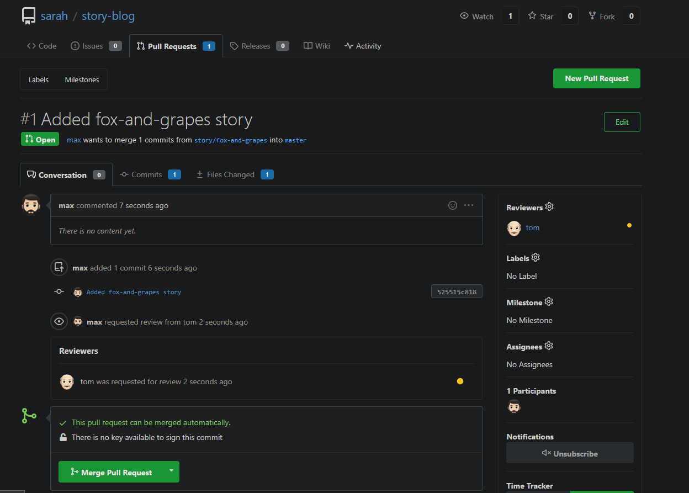
  <figcaption style="font-size:0.9rem; color:var(--text-muted,#666); margin-top:8px;">
    PR
  </figcaption>
</figure>

<figure style="max-width:720px; margin:0 auto; text-align:center;">
  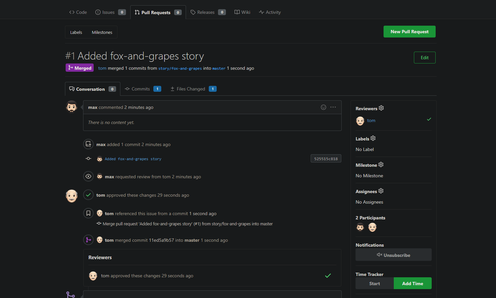
  <figcaption style="font-size:0.9rem; color:var(--text-muted,#666); margin-top:8px;">
    PR REVIEW & MERGING
  </figcaption>
</figure>


## **Day 30: Git hard reset**

The Nautilus application development team was working on a git repository `/usr/src/kodekloudrepos/official` present on `Storage server` in `Stratos DC`. This was just a test repository and one of the developers just pushed a couple of changes for testing, but now they want to clean this repository along with the commit history/work tree, so they want to point back the `HEAD` and the branch itself to a commit with message `add data.txt file`. Find below more details:  

1. In `/usr/src/kodekloudrepos/official` git repository, reset the git commit history so that there are only two commits in the commit history i.e `initial commit` and `add data.txt file`.  
2. Also make sure to push your changes.


### Navigate to repository directory

```bash
cd /usr/src/kodekloudrepos/official
```

### Check repository status

```bash
git status
```

### View commit history (one line format)

```bash
git log --oneline
```

### Reset branch to specific commit (remove newer commits)

*This is will remove all the commits till a34829d and move the HEAD to a34829d commit*
```bash
git reset --hard a34829d
```

### Verify commit history after reset

```bash
git log --oneline
```

### Force push changes to remote repository

```bash
git push origin master --force
```

## **Day 31: Git Stash**

The Nautilus application development team was working on a git repository `/usr/src/kodekloudrepos/blog` present on `Storage server` in `Stratos DC`. One of the developers stashed some in-progress changes in this repository, but now they want to restore some of the stashed changes. Find below more details to accomplish this task:  
  
Look for the stashed changes under `/usr/src/kodekloudrepos/blog` git repository, and restore the stash with `stash@{1}` identifier. Further, commit and push your changes to the origin.

### Git Stash Theory

<figure style="max-width:720px; margin:0 auto; text-align:center;">
  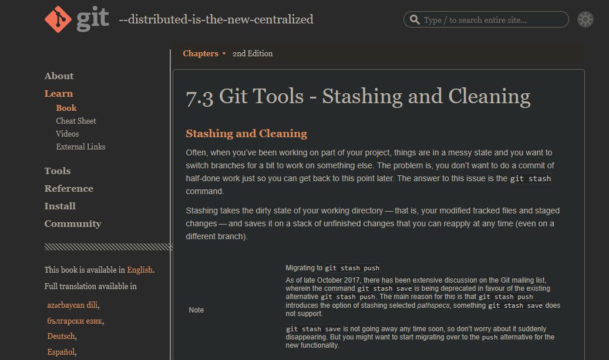
  <figcaption style="font-size:0.9rem; color:var(--text-muted,#666); margin-top:8px;">
    Git Stash 
  </figcaption>
</figure>


### Check repository status

```bash
git status
```

### Check current branch

```bash
git branch
```

### View commit history

```bash
git log --oneline
```

### List available stashes

```bash
git stash list
```

**Example output:**

```text
stash@{0}: WIP on master: ba196f3 initial commit
stash@{1}: WIP on master: ba196f3 initial commit
```

### Apply a specific stash (stash@{1})

```bash
git stash apply stash@{1}
```

### Verify restored changes

```bash
git status
```

### Stage all changes

```bash
git add .
```

### Commit restored stash changes

```bash
git commit -m "added welcome.txt from stash@{1}"
```

### Push changes to remote (correct branch)

```bash
git push origin master
```

## **Day 32: Git Rebase**

The Nautilus application development team has been working on a project repository `/opt/beta.git`. This repo is cloned at `/usr/src/kodekloudrepos` on `storage server` in `Stratos DC`. They recently shared the following requirements with DevOps team:  

One of the developers is working on `feature` branch and their work is still in progress, however there are some changes which have been pushed into the `master` branch, the developer now wants to `rebase` the `feature` branch with the `master` branch without loosing any data from the `feature` branch, also they don't want to add any `merge commit` by simply merging the `master` branch into the `feature` branch. Accomplish this task as per requirements mentioned.  
Also remember to push your changes once done.

<figure style="max-width:720px; margin:0 auto; text-align:center;">
  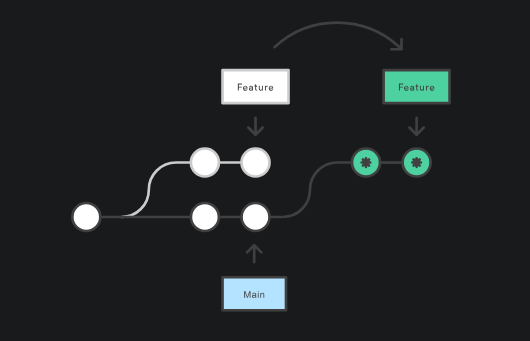
  <figcaption style="font-size:0.9rem; color:var(--text-muted,#666); margin-top:8px;">
    Git Rebase
  </figcaption>
</figure>

### Check repository status

```bash
git status
```

### View commit history

```bash
git log --oneline
```

### List all branches

```bash
git branch
```

### Switch to master branch

```bash
git checkout master
```

### Fetch latest changes from remote

```bash
git fetch origin
```

### Switch to feature branch

```bash
git checkout feature
```

### Rebase feature branch onto master

```bash
git rebase origin/master
```

### Resolve conflicts (if any)

```bash
git add .
git rebase --continue
```

### Push rebased feature branch to remote (history rewritten)

```bash
git push origin feature --force
```

### View commit graph for verification

```bash
git log --oneline --graph --decorate --all
```

## **Day 33: Resolve Git Merge Conflicts**

Sarah and Max were working on writting some stories which they have pushed to the repository. Max has recently added some new changes and is trying to push them to the repository but he is facing some issues. Below you can find more details:

SSH into `storage server` using user `max` and password `Max_pass123`. Under `/home/max` you will find the `story-blog` repository. Try to push the changes to the origin repo and fix the issues. The `story-index.txt` must have titles for all 4 stories. Additionally, there is a typo in `The Lion and the Mooose` line where `Mooose` should be `Mouse`.  
  
Click on the `Gitea UI` button on the top bar. You should be able to access the `Gitea` page. You can login to `Gitea` server from UI using username `sarah` and password `Sarah_pass123` or username `max` and password `Max_pass123`.  
  
`Note:` For these kind of scenarios requiring changes to be done in a web UI, please take screenshots so that you can share it with us for review in case your task is marked incomplete. You may also consider using a screen recording software such as loom.com to record and share your work.

### 1. Repository Access

* Logged into the storage server as user `max`
* Navigated to: `/home/max/story-blog`

### 2. Pulled Latest Changes

```bash
git pull origin master
```

### 3. Fixed Issues

#### Corrected Typo

Updated the story file:

> The Lion and the **Mooose** → The Lion and the **Mouse**

#### Remove the merge conflicts as well!

### 4. Configured Git Identity

```bash
git config user.name max
git config user.email max@ststor01.stratos.xfusioncorp.com
```

### 5. Committed Changes

```bash
git add .
git commit -m "fix: change spelling moose to mouse"
```

### 6. Pushed to Remote Repository

```bash
git push origin master
```

## Git Log Verification (Logs Answer)

Output of `git log` after successful operations:

```text
commit b8b703b0b4359617e43a1183c547f7308affe825
Merge: 0d395c7 75817c8
Author: Linux User <max@ststor01.stratos.xfusioncorp.com>
Date:   Fri Jan 16 10:07:56 2026 +0000

    fix: change spelling moose to mouse

commit 0d395c7d2a03d571e49bae826788e33642ad613f
Author: Linux User <max@ststor01.stratos.xfusioncorp.com>
Date:   Fri Jan 16 10:02:29 2026 +0000

    fix: change spelling moose to mouse

commit 909511f4f2c0ad20cfcc4db3e021eb071e7a30aa
Author: Linux User <max@ststor01.stratos.xfusioncorp.com>
Date:   Fri Jan 16 09:57:43 2026 +0000

    Added the fox and grapes story

commit 75817c899d762226d3481a1c68a9fdaafda9c77f
Author: sarah <sarah@stratos.xfusioncorp.com>
Date:   Fri Jan 16 09:57:42 2026 +0000

    Added Index

commit a15185df863df6826ec9e1009e8c4fdcd9605738
Merge: 8a9a036 bb0aee5
Author: sarah <sarah@stratos.xfusioncorp.com>
Date:   Fri Jan 16 09:57:41 2026 +0000

    Merge branch 'story/frogs-and-ox'

commit 8a9a03604b24f08560601b4f7d83013ff8e87689
Author: sarah <sarah@stratos.xfusioncorp.com>
Date:   Fri Jan 16 09:57:41 2026 +0000

    Fix typo in story title
```

## **Day 34: Git Hook**

The Nautilus application development team was working on a git repository `/opt/news.git` which is cloned under `/usr/src/kodekloudrepos` directory present on `Storage server` in `Stratos DC`. The team want to setup a hook on this repository, please find below more details:  

- Merge the `feature` branch into the `master` branch, but before pushing your changes complete below point.  
- Create a `post-update` hook in this git repository so that whenever any changes are pushed to the `master` branch, it creates a release tag with name `release-2023-06-15`, where `2023-06-15` is supposed to be the current date. For example if today is `20th June, 2023` then the release tag must be `release-2023-06-20`. Make sure you test the hook at least once and create a release tag for today's release.  
- Finally remember to push your changes.  
    `Note:` Perform this task using the `natasha` user, and ensure the repository or existing directory permissions are not altered.

<figure style="max-width:720px; margin:0 auto; text-align:center;">
  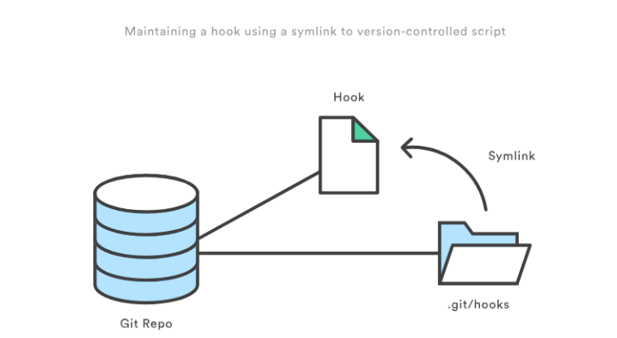
  <figcaption style="font-size:0.9rem; color:var(--text-muted,#666); margin-top:8px;">
    Git Hook
  </figcaption>
</figure>

### 1. Navigate to working repository

```bash
cd /usr/src/kodekloudrepos/news
```

Checked repository status and branches:

```bash
git status
git branch
```

### 2. Merge feature branch into master

```bash
git checkout master
git merge feature
```

### 3. Create post-update hook in bare repository

Navigate to hooks directory:

```bash
cd /opt/news.git/hooks
ls
```

Create hook file:

```bash
vi post-update
```

Hook content:

```bash
#!/bin/bash

refname="$1"

if [[ "$refname" == "refs/heads/master" ]]; then
    DATE=$(date +%Y-%m-%d)
    TAG="release-$DATE"
    git tag -f "$TAG"
fi
```

Make executable:

```bash
chmod +x post-update
```

---

### 4. Push changes to trigger hook

```bash
cd /usr/src/kodekloudrepos/news
git push origin master
```

Push output:

```text
To /opt/news.git
   38f6832..279d796  master -> master
```

---

### 5. Verify release tag creation

```bash
cd /opt/news.git
git tag
```

Result:

```text
release-2026-01-16
```

(The date reflects the current system date.)

<figure style="max-width:720px; margin:0 auto; text-align:center;">
  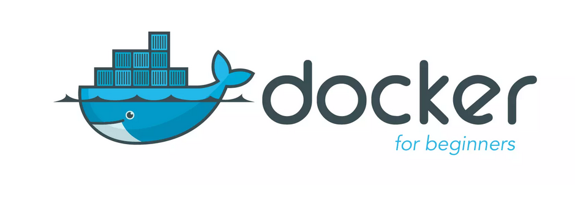
  <figcaption style="font-size:0.9rem; color:var(--text-muted,#666); margin-top:8px;">
    Docker
  </figcaption>
</figure>

## **Day 35: Install Docker Packages and Start Docker Service**

The Nautilus DevOps team aims to containerize various applications following a recent meeting with the application development team. They intend to conduct testing with the following steps:
1. Install `docker-ce` and `docker compose` packages on `App Server 1`.  
2. Initiate the `docker` service.

### System Information

The operating system details were verified using:

```bash
cat /etc/os-release
```

### 1. Install required dependencies

```bash
sudo yum install -y yum-utils device-mapper-persistent-data lvm2
```
### 2. Add Docker official repository

```bash
sudo yum-config-manager --add-repo https://download.docker.com/linux/centos/docker-ce.repo
```

### 3. Install Docker CE and Docker Compose packages

```bash
sudo yum install docker-ce docker-ce-cli containerd.io docker-buildx-plugin docker-compose-plugin -y
```

Installed components:

* docker-ce
* docker-ce-cli
* containerd.io
* docker-buildx-plugin
* docker-compose-plugin

### 4. Enable and start Docker service

```bash
sudo systemctl enable --now docker
```

### 5. Verify Docker installation

```bash
sudo docker run hello-world
```

## **Day 36: Deploy Nginx Container on Application Server**

The Nautilus DevOps team is conducting application deployment tests on selected application servers. They require a nginx container deployment on `Application Server 3`. Complete the task with the following instructions:
1. On `Application Server 3` create a container named `nginx_3` using the `nginx` image with the `alpine` tag. Ensure container is in a `running` state.

### Steps Performed

1. Ran the Docker container with the required name and image:

   ```bash
   docker run -d --name nginx_3 nginx:alpine
   ```

2. Verified the container status:

   ```bash
   docker ps
   ```

## **Day 37: Copy File to Docker Container**

The Nautilus DevOps team possesses confidential data on `App Server 3` in the `Stratos Datacenter`. A container named `ubuntu_latest` is running on the same server.  
Copy an encrypted file `/tmp/nautilus.txt.gpg` from the docker host to the `ubuntu_latest` container located at `/opt/`. Ensure the file is not modified during this operation.


### Steps Performed

#### Checking Docker Name

```sh
docker ps
```

1. Copy the encrypted file from the host to the container:

   ```bash
   docker cp /tmp/nautilus.txt.gpg ubuntu_latest:/opt/
   ```

2. Access the container to verify the file:

   ```bash
   docker exec -it ubuntu_latest bash
   ```

3. Navigate to the destination directory and confirm the file exists:

   ```bash
   cd /opt
   ls
   ```

## **Day 38: Pull Docker Image**

Nautilus project developers are planning to start testing on a new project. As per their meeting with the DevOps team, they want to test containerized environment application features. As per details shared with DevOps team, we need to accomplish the following task:
a. Pull `busybox:musl` image on `App Server 2` in Stratos DC and re-tag (create new tag) this image as `busybox:blog`.

### Steps Performed

1. Pulled the BusyBox image with the `musl` tag:

```sh
docker pull busybox:musl
```

2. Created a new tag named `busybox:blog` from the pulled image:

```sh
docker tag busybox:musl busybox:blog
```

3. Verified the images:

```sh
docker images | grep busybox
```

## **Day 39: Create a Docker Image From Container**

One of the Nautilus developer was working to test new changes on a container. He wants to keep a backup of his changes to the container. A new request has been raised for the DevOps team to create a new image from this container. Below are more details about it:
a. Create an image `beta:devops` on `Application Server 2` from a container `ubuntu_latest` that is running on same server.

### Steps Performed

1. Verified that the container is running:

```sh
docker ps | grep ubuntu_latest
```

2. Created a new image from the running container:

```sh
docker commit ubuntu_latest beta:devops
```

3. Verified the new image:

```sh
docker images | grep beta
```

## **Day 40: Docker EXEC Operations**

One of the Nautilus DevOps team members was working to configure services on a `kkloud` container that is running on `App Server 3` in `Stratos Datacenter`. Due to some personal work he is on PTO for the rest of the week, but we need to finish his pending work ASAP. Please complete the remaining work as per details given below:

a. Install `apache2` in `kkloud` container using `apt` that is running on `App Server 3` in `Stratos Datacenter`.  
b. Configure Apache to listen on port `6200` instead of default `http` port. Do not bind it to listen on specific IP or hostname only, i.e it should listen on localhost, 127.0.0.1, container ip, etc.  
c. Make sure Apache service is up and running inside the container. Keep the container in running state at the end.
### Steps Performed

1. Accessed the running container:

```sh
docker exec -it kkloud bash
```

2. Updated the package index and installed Apache2:

```sh
apt install -y apache2
```

3. Configured Apache to listen on port 6200:

```sh
sed -i 's/Listen 80/Listen 6200/' /etc/apache2/ports.conf
```
- Vim is not downloaded 

4. Restarted Apache service to apply changes:

```sh
service apache2 restart
```

5. Verified that Apache is running and listening on the new port:

```sh
service apache2 status
```

6. Exited the container, keeping it in running state:

```sh
exit
docker ps 
```

## **Day 41: Write a Docker File**
As per recent requirements shared by the Nautilus application development team, they need custom images created for one of their projects. Several of the initial testing requirements are already been shared with DevOps team. Therefore, create a docker file `/opt/docker/Dockerfile` (please keep `D` capital of Dockerfile) on `App server 1` in `Stratos DC` and configure to build an image with the following requirements:  

a. Use `ubuntu:24.04` as the base image.  
b. Install `apache2` and configure it to work on `3003` port. (do not update any other Apache configuration settings like document root etc).

### Steps Performed

- Go to the directory `/opt/docker/`

```sh
vi Dockerfile
```

#### Paste the objects in the Dockerfile

```dockerfile
FROM ubuntu:24.04

ENV DEBIAN_FRONTEND=noninteractive

RUN apt-get update && apt-get install -y apache2 && apt-get clean

RUN sed -i 's/Listen 80/Listen 3003/' /etc/apache2/ports.conf

RUN sed -i 's/:80/:3003/' /etc/apache2/sites-available/000-default.conf

EXPOSE 3003

CMD ["apachectl", "-D", "FOREGROUND"]
```

#### Run the Command in the `/opt/docker/` folder

```sh
docker build -t nautilus-app-image:latest .
```

## **Day 42: Create a Docker Network**

The Nautilus DevOps team needs to set up several docker environments for different applications. One of the team members has been assigned a ticket where he has been asked to create some docker networks to be used later. Complete the task based on the following ticket description:

a. Create a docker network named as `media` on App Server `3` in `Stratos DC`.  
b. Configure it to use `bridge` drivers.  
c. Set it to use subnet `10.10.1.0/24` and iprange `10.10.1.0/24`.

### Steps Performed

```sh
[root@stapp03 banner]# docker network create --driver bridge --subnet 10.10.1.0/24 --ip-range 10.10.1.0/24 media       
1a0b4591d6d61da07c3dfgdf3454356732ff63d540bcb27fghtryt756765ea
[root@stapp03 banner]# docker network

Usage:  docker network COMMAND

Manage networks

Commands:
  connect     Connect a container to a network
  create      Create a network
  disconnect  Disconnect a container from a network
  inspect     Display detailed information on one or more networks
  ls          List networks
  prune       Remove all unused networks
  rm          Remove one or more networks

Run 'docker network COMMAND --help' for more information on a command.
[root@stapp03 banner]# docker network ls
NETWORK ID     NAME      DRIVER    SCOPE
0c0f46f7bc87   bridge    bridge    local
33d05cba4099   host      host      local
1a0b4591d6d6   media     bridge    local
6f6dc1599b7e   none      null      local
```

*I find docker documentation is the best guide for docker network*
- [Docker Docs for Networking](https://docs.docker.com/engine/network/)


## **Day 43: Docker Ports Mapping** 

The Nautilus DevOps team is planning to host an application on a nginx-based container. There are number of tickets already been created for similar tasks. One of the tickets has been assigned to set up a nginx container on `Application Server 3` in `Stratos Datacenter`. Please perform the task as per details mentioned below:

a. Pull `nginx:stable` docker image on `Application Server 3`.  
b. Create a container named `demo` using the image you pulled.  
c. Map host port `6300` to container port `80`. Please keep the container in running state.

### Step 1: Pull the NGINX Stable Image

```bash
docker pull nginx:stable
```

The `nginx:stable` image was pulled from Docker Hub to ensure a reliable and production-ready version of NGINX is available locally on the server.


### Step 2: Create and Run the Container

```bash
docker run -d --name demo -p 6300:80 nginx:stable
```

A container named **demo** was created and started in detached mode using the pulled image.
The host port **6300** was mapped to container port **80**, allowing external access to the NGINX web service.


### Step 3: Verify Container Status

```bash
docker ps
```
This command was used to confirm that the `demo` container is running successfully and that the port mapping is active.

```sh
CONTAINER ID   IMAGE          COMMAND                  CREATED         STATUS        PORTS                  NAMES
f738f0094168   nginx:stable   "/docker-entrypoint.…"   3 seconds ago   Up 1 second   0.0.0.0:6300->80/tcp   demo
```


### Step 4: Validate NGINX Service Accessibility

```bash
curl http://localhost:6300
```

The command returned the default **NGINX welcome page**, verifying that the web server is running correctly and accessible through the mapped port.

## **Day 44: Write a Docker Compose File**

The Nautilus application development team shared static website content that needs to be hosted on the `httpd` web server using a containerised platform. The team has shared details with the DevOps team, and we need to set up an environment according to those guidelines. Below are the details:  

a. On `App Server 1` in `Stratos DC` create a container named `httpd` using a docker compose file `/opt/docker/docker-compose.yml` (please use the exact name for file).  
b. Use `httpd` (preferably `latest` tag) image for container and make sure container is named as `httpd`; you can use any name for service.  
c. Map `80` number port of container with port `8085` of docker host.  
d. Map container's `/usr/local/apache2/htdocs` volume with `/opt/security` volume of docker host which is already there. (please do not modify any data within these locations).

### Docker Compose Configuration

The following Docker Compose file was created at the exact required path:

`/opt/docker/docker-compose.yml`

```yaml
version: "3.8"

services:
  web:
    image: httpd:latest
    container_name: httpd
    ports:
      - "8085:80"
    volumes:
      - /opt/security:/usr/local/apache2/htdocs
```

---

### Deployment Steps

1. Navigated to the Docker directory:

   ```bash
   cd /opt/docker/
   ```

2. Created and saved the `docker-compose.yml` file with the configuration shown above.

3. Started the container in detached mode:

   ```bash
   docker compose up -d
   ```

4. Verified that the container is running:

   ```bash
   docker ps
   ```

---

### Verification

The web service was tested using `curl`:

```bash
curl http://172.16.238.10:8085
```

The response confirmed that the static content from `/opt/security` is being served correctly:

```html
<!DOCTYPE HTML PUBLIC "-//W3C//DTD HTML 4.01//EN" "http://www.w3.org/TR/html4/strict.dtd">
<html>
 <head>
  <title>Index of /</title>
 </head>
 <body>
<h1>Index of /</h1>
<ul><li><a href="index1.html"> index1.html</a></li>
</ul>
</body></html>
```

## **Day 45: Resolve Dockerfile Issues**
The Nautilus DevOps team is working to create new images per requirements shared by the development team. One of the team members is working to create a `Dockerfile` on `App Server 2` in `Stratos DC`. While working on it she ran into issues in which the docker build is failing and displaying errors. Look into the issue and fix it to build an image as per details mentioned below:
a. The `Dockerfile` is placed on `App Server 2` under `/opt/docker` directory.  
b. Fix the issues with this file and make sure it is able to build the image.  
c. Do not change base image, any other valid configuration within Dockerfile, or any of the data been used — for example, index.html.  
`Note:` Please note that once you click on `FINISH` button all the existing containers will be destroyed and new image will be built from your `Dockerfile`.

### Problem found
```dockerfile
/usr/local/apache2/conf.d/httpd.conf  
```
- This is not the correct Path
- The correct path is `/usr/local/apache2/conf/httpd.conf`

### Fixed Dockerfile

```dockerfile
FROM httpd:2.4.43

RUN sed -i "s/Listen 80/Listen 8080/g" /usr/local/apache2/conf/httpd.conf

RUN sed -i '/LoadModule\ ssl_module modules\/mod_ssl.so/s/^#//g' /usr/local/apache2/conf/httpd.conf

RUN sed -i '/LoadModule\ socache_shmcb_module modules\/mod_socache_shmcb.so/s/^#//g' /usr/local/apache2/conf/httpd.conf

RUN sed -i '/Include\ conf\/extra\/httpd-ssl.conf/s/^#//g' /usr/local/apache2/conf/httpd.conf

COPY certs/server.crt /usr/local/apache2/conf/server.crt
COPY certs/server.key /usr/local/apache2/conf/server.key

COPY html/index.html /usr/local/apache2/htdocs/
```

### Build Command

```sh
docker build -t nautilus-httpd .
```

## **Day 46: Deploy an App on Docker Containers**

The Nautilus Application development team recently finished development of one of the apps that they want to deploy on a containerized platform. The Nautilus Application development and DevOps teams met to discuss some of the basic pre-requisites and requirements to complete the deployment. The team wants to test the deployment on one of the app servers before going live and set up a complete containerized stack using a docker compose fie. Below are the details of the task:  
  
1. On `App Server 1` in `Stratos Datacenter` create a docker compose file `/opt/dba/docker-compose.yml` (should be named exactly).  
2. The compose should deploy two services (web and DB), and each service should deploy a container as per details below:  

`For web service:`  
a. Container name must be `php_host`.  
b. Use image `php` with any `apache` tag. Check [here](https://hub.docker.com/_/php?tab=tags/) for more details. 
c. Map `php_host` container's port `80` with host port `6100`  
d. Map `php_host` container's `/var/www/html` volume with host volume `/var/www/html`.  

`For DB service:`  
a. Container name must be `mysql_host`.  
b. Use image `mariadb` with any tag (preferably `latest`). Check [here](https://hub.docker.com/_/mariadb?tab=tags/) for more details.  
c. Map `mysql_host` container's port `3306` with host port `3306`  
d. Map `mysql_host` container's `/var/lib/mysql` volume with host volume `/var/lib/mysql`.  
e. Set MYSQL_DATABASE=`database_host` and use any custom user ( except root ) with some complex password for DB connections.  

3. After running docker-compose up you can access the app with curl command `curl <server-ip or hostname>:6100/`  

For more details check [here](https://hub.docker.com/_/mariadb?tab=description/).  

`Note:` Once you click on `FINISH` button, all currently running/stopped containers will be destroyed and stack will be deployed again using your compose file.

Here’s a **complete write-up** for your Docker Compose deployment task, formatted with `##` for main title and `###` for subtitles:

### **Environment Setup**

1. **Directory for Compose File**
   The Docker Compose file was created at `/opt/dba/docker-compose.yml`.

### **Docker Compose File**

```yaml
version: "3.9"

services:
  web:
    container_name: php_host
    image: php:8.2-apache
    ports:
      - "6100:80"
    volumes:
      - "/var/www/html:/var/www/html"
    restart: unless-stopped

  db:
    container_name: mysql_host
    image: mariadb:latest
    ports:
      - "3306:3306"
    volumes:
      - "/var/lib/mysql:/var/lib/mysql"
    environment:
      MYSQL_DATABASE: database_host
      MYSQL_USER: nautilus_user
      MYSQL_PASSWORD: "password123#"
      MYSQL_ROOT_PASSWORD: "RootP@ssw0rd123"
    restart: unless-stopped
```

---

### **Deployment Steps**

1. Navigate to the deployment directory:

```bash
cd /opt/dba
```

2. Launch the stack in detached mode:

```bash
docker compose up -d
```

3. Verify running containers:

```bash
docker compose ps
```

**Expected Outcome:**

```bash
curl http://172.16.238.10:6100
```

**Sample Output:**

```html
<html>
    <head>
        <title>Welcome to xFusionCorp Industries!</title>
    </head>
    <body>
        Welcome to xFusionCorp Industries!
    </body>
</html>
```
## **Day 47: Docker Python App**

A python app needed to be Dockerized, and then it needs to be deployed on `App Server 1`. We have already copied a `requirements.txt` file (having the app dependencies) under `/python_app/src/` directory on `App Server 1`. Further complete this task as per details mentioned below:  

1. Create a `Dockerfile` under `/python_app` directory:
    - Use any `python` image as the base image.
    - Install the dependencies using `requirements.txt` file.
    - Expose the port `5004`.
    - Run the `server.py` script using `CMD`.  
2. Build an image named `nautilus/python-app` using this Dockerfile.  
3. Once image is built, create a container named `pythonapp_nautilus`
    - Map port `5004` of the container to the host port `8091`.  
4. Once deployed, you can test the app using `curl` command on `App Server 1`.  

```sh
curl http://localhost:8091/
```
###  Directory Structure

```
/python_app
├── Dockerfile
└── src
    ├── server.py
    └── requirements.txt
```

---

### Dockerfile (Python Flask App)

```dockerfile
FROM python:3.9-slim

WORKDIR /app

COPY src/requirements.txt .

RUN pip install --no-cache-dir -r requirements.txt

COPY src/ .

EXPOSE 5004

CMD ["python", "server.py"]
```
### Build Docker Image

```bash
docker build -t nautilus/python-app .
```

### Run Docker Container

```bash
docker run -d \
  --name pythonapp_nautilus \
  -p 8091:5004 \
  nautilus/python-app
```

**Port Mapping:**

* Host port → `8091`
* Container port → `5004`
### Verify Running Container

```bash
docker ps
```

### Test the Application

```bash
curl http://localhost:8091/
```

**Expected Output:**

```
Welcome to xFusionCorp Industries!
```


<figure style="max-width:720px; margin:0 auto; text-align:center;">
  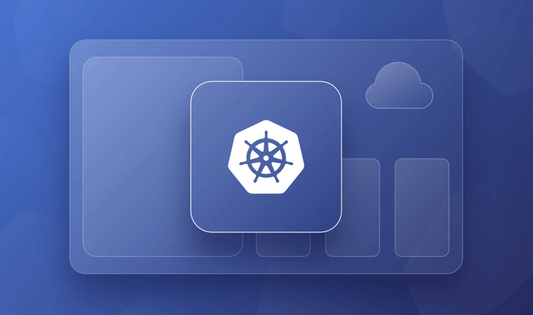
  <figcaption style="font-size:0.9rem; color:var(--text-muted,#666); margin-top:8px;">
    Kubernetes 
  </figcaption>
</figure>


## **Day 48: Deploy Pods in Kubernetes Cluster**

The Nautilus DevOps team is diving into Kubernetes for application management. One team member has a task to create a pod according to the details below:

    Create a pod named pod-nginx using the nginx image with the latest tag. Ensure to specify the tag as nginx:latest.

    Set the app label to nginx_app, and name the container as nginx-container.

Note: The kubectl utility on jump_host is configured to operate with the Kubernetes cluster.

### Copy POD Syntax

```sh
kubectl run nginx-pod --image=nginx --restart=Never --dry-run=client -o yaml > pod-nginx.yaml
```

### Pod Manifest (YAML)

The following YAML file was used to define and create the Pod:

```yaml
apiVersion: v1
kind: Pod
metadata:
  name: pod-nginx
  labels:
    app: nginx_app
spec:
  containers:
  - name: nginx-container
    image: nginx:latest
```

The Pod was created using the command:

```bash
kubectl apply -f pod-nginx.yaml
```
### Pod Verification

After deployment, the Pod was verified using `kubectl describe` to confirm its status, image, labels, and container details.

```bash
kubectl describe pod pod-nginx
```

#### Output Summary

```
Name:             pod-nginx
Namespace:        default
Node:             kodekloud-control-plane/172.17.0.2
Start Time:       Fri, 23 Jan 2026 08:41:15 +0000
Status:           Running
IP:               10.244.0.5

Labels:
  app=nginx_app

Containers:
  nginx-container:
    Image:          nginx:latest
    State:          Running
    Ready:          True
    Restart Count:  0

Conditions:
  Initialized       True
  Ready             True
  ContainersReady   True
  PodScheduled      True

Events:
  Successfully assigned pod-nginx to kodekloud-control-plane
  Pulling image "nginx:latest"
  Successfully pulled image "nginx:latest"
  Created container nginx-container
  Started container nginx-container
```
## **Day 49: Deploy Applications with Kubernetes Deployments**

The Nautilus DevOps team is delving into Kubernetes for app management. One team member needs to create a deployment following these details:
Create a deployment named `nginx` to deploy the application `nginx` using the image `nginx:latest` (ensure to specify the tag)
`Note:` The `kubectl` utility on `jump_host` is set up to interact with the Kubernetes cluster.
Since `kubectl` is already configured on **jump_host**, you can create the deployment directly from the command line.


Run:

```bash
kubectl create deployment nginx --image=nginx:latest
```

This will:

* Create a deployment named **nginx**
* Use the image **nginx:latest** (tag explicitly specified)

To verify it was created successfully:

```bash
kubectl get deployments
```

And to check the pods:

```bash
kubectl get pods
```

## **Day 50: Set Resource Limits in Kubernetes Pods**

The Nautilus DevOps team has noticed performance issues in some Kubernetes-hosted applications due to resource constraints. To address this, they plan to set limits on resource utilization. Here are the details:
Create a pod named `httpd-pod` with a container named `httpd-container`. Use the `httpd` image with the `latest` tag (specify as `httpd:latest`). Set the following resource limits:
Requests: Memory: `15Mi`, CPU: `100m`
Limits: Memory: `20Mi`, CPU: `100m`
`Note:` The `kubectl` utility on `jump_host` is configured to operate with the Kubernetes cluster.


### httpd-pod.yaml

```yaml
apiVersion: v1
kind: Pod
metadata:
  name: httpd-pod
spec:
  containers:
    - name: httpd-container
      image: httpd:latest
      resources:
        requests:
          memory: "15Mi"
          cpu: "100m"
        limits:
          memory: "20Mi"
          cpu: "100m"
```

### Apply and Verify

Create pod:

```bash
kubectl apply -f  httpd-pod.yaml
``` 


Check pod:

```bash
kubectl get pods
```

Detailed info:

```bash
kubectl describe pod httpd-pod.yaml
```

### Quick Create Without YAML

```bash
kubectl run httpd-pod --image=httpd:latest --restart=Never --requests='cpu=100m,memory=15Mi' --limits='cpu=100m,memory=20Mi'
```

## **Day 51: Execute Rolling Updates in Kubernetes**

An application currently running on the Kubernetes cluster employs the nginx web server. The Nautilus application development team has introduced some recent changes that need deployment. They've crafted an image `nginx:1.17` with the latest updates.
Execute a rolling update for this application, integrating the `nginx:1.17` image. The deployment is named `nginx-deployment`.
Ensure all pods are operational post-update.
`Note:` The `kubectl` utility on `jump_host` is set up to operate with the Kubernetes cluster

### Check Current Cluster State

```bash
kubectl get pods
kubectl get deployments
kubectl describe pods
```
### Inspect Deployment Details

```bash
kubectl get deployment nginx-deployment -o yaml | grep -i name:
```
### Perform Rolling Update (Update Image)

```bash
kubectl set image deployment/nginx-deployment nginx-container=nginx:1.17
```

### Monitor Rollout Status

```bash
kubectl rollout status deployment/nginx-deployment
```
### Verify Pods After Update

```bash
kubectl get pods
kubectl get deployments
```
### Confirm Updated Image

```bash
kubectl describe deployment nginx-deployment | grep Image
```

### Rollback (If Needed)

```bash
kubectl rollout undo deployment/nginx-deployment
```
### Reference Documentation

I found the Kubernetes documentation very helpful while performing this lab. The official documentation clearly explains deployments, rolling updates, and image updates with practical examples.

kubectl rollout Reference: 

> [You can find it here!](https://kubernetes.io/docs/tutorials/kubernetes-basics/update/update-intro/)

## **Day 52: Revert Deployment to Previous Version in Kubernetes**

Earlier today, the Nautilus DevOps team deployed a new release for an application. However, a customer has reported a bug related to this recent release. Consequently, the team aims to revert to the previous version.
There exists a deployment named `nginx-deployment`; initiate a rollback to the previous revision.
`Note:` The `kubectl` utility on `jump_host` is configured to interact with the Kubernetes cluster.

**List all deployments**

```bash
kubectl get deployments
```

**Check pods**

```bash
kubectl get pods
```

**Check detailed deployment info**

```bash
kubectl describe deployment nginx-deployment
```

### View Rollout History

**View rollout history of a specific deployment**

```bash
kubectl rollout history deployment nginx-deployment
```

Output example:

```
REVISION  CHANGE-CAUSE
1         <none>
2         kubectl set image deployment nginx-deployment nginx-container=nginx:stable --record=true
```

> `REVISION` shows deployment versions.
> `CHANGE-CAUSE` shows what command triggered the update (if `--record` was used).

### Rollback Deployment

**Rollback to previous revision**

```bash
kubectl rollout undo deployment nginx-deployment
```

**Rollback to a specific revision**

```bash
kubectl rollout undo deployment nginx-deployment --to-revision=1
```

### Verify Rollback

**Check rollout status**

```bash
kubectl rollout status deployment nginx-deployment
```

**Confirm running pods**

```bash
kubectl get pods
```

**Verify image version**

```bash
kubectl describe deployment nginx-deployment | grep -i image
```

## **Day 53: Resolve VolumeMounts Issue in Kubernetes**

We encountered an issue with our Nginx and PHP-FPM setup on the Kubernetes cluster this morning, which halted its functionality. Investigate and rectify the issue:  

The pod name is `nginx-phpfpm` and configmap name is `nginx-config`. Identify and fix the problem.  
Once resolved, copy `/home/thor/index.php` file from the `jump host` to the `nginx-container` within the nginx document root. After this, you should be able to access the website using `Website` button on the top bar.  
`Note:` The `kubectl` utility on `jump_host` is configured to operate with the Kubernetes cluster.

### 1. Initial Assessment

The issue occurred in the `nginx-phpfpm` pod consisting of:

* `nginx:latest`
* `php:7.2-fpm-alpine`
* A shared `emptyDir` volume
* A ConfigMap named `nginx-config`

Initial verification confirmed the pod was in a **Running** state and both containers were marked **Ready**:

```bash
kubectl get pod
kubectl describe pod nginx-phpfpm
kubectl logs nginx-phpfpm -c nginx-container
```

Since the containers were healthy, the issue was isolated to configuration rather than container failure.

### 2. Identifying the Root Cause

Upon reviewing the pod specification and ConfigMap, a directory mismatch was identified.

The Nginx configuration defined the document root as:

```
root /var/www/html;
```

However, the PHP-FPM container was initially mounting the shared volume at:

```
/usr/share/nginx/html
```

This caused a mismatch between:

* The directory Nginx was serving from (`/var/www/html`)
* The directory where PHP files were expected
* The shared volume mount path between containers

As a result, Nginx could not properly locate and serve the PHP files.

### 3. Corrective Action

The fix involved standardizing the shared volume mount path across both containers.

The corrected pod configuration ensured both containers mounted the shared volume at:

```
/var/www/html
```

Relevant section of the pod spec:

```yaml
containers:
- image: php:7.2-fpm-alpine
  name: php-fpm-container
  volumeMounts:
  - mountPath: /var/www/html
    name: shared-files

- image: nginx:latest
  name: nginx-container
  volumeMounts:
  - mountPath: /var/www/html
    name: shared-files
  - mountPath: /etc/nginx/nginx.conf
    name: nginx-config-volume
    subPath: nginx.conf
```

The ConfigMap remained correctly configured:

```nginx
root /var/www/html;

location ~ \.php$ {
  include fastcgi_params;
  fastcgi_param SCRIPT_FILENAME $document_root$fastcgi_script_name;
  fastcgi_pass 127.0.0.1:9000;
}
```

This alignment ensured:

* Both containers accessed the same directory
* Nginx served files from the correct path
* PHP-FPM processed files from the same shared volume

### 4. Pod Recreation

After correcting the mount path, the pod was recreated to apply changes:

```bash
kubectl delete pod nginx-phpfpm
kubectl apply -f nginx-phpfpm.yml
```

The new pod initialized successfully with both containers ready.

### 5. Deploying the Application File

The required PHP file was copied from the jump host into the Nginx container:

```bash
kubectl cp /home/thor/index.php nginx-phpfpm:/var/www/html/index.php -c nginx-container
```

Verification confirmed successful placement:

```bash
kubectl exec -it nginx-phpfpm -c nginx-container -- ls /var/www/html
```
## **Day 54: Kubernetes Shared Volumes**

We are working on an application that will be deployed on multiple containers within a pod on Kubernetes cluster. There is a requirement to share a volume among the containers to save some temporary data. The Nautilus DevOps team is developing a similar template to replicate the scenario. Below you can find more details about it.  

1. Create a pod named `volume-share-datacenter`.  
2. For the first container, use image `debian` with `latest` tag only and remember to mention the tag i.e `debian:latest`, container should be named as `volume-container-datacenter-1`, and run a `sleep` command for it so that it remains in running state. Volume `volume-share` should be mounted at path `/tmp/official`.  
3. For the second container, use image `debian` with the `latest` tag only and remember to mention the tag i.e `debian:latest`, container should be named as `volume-container-datacenter-2`, and again run a `sleep` command for it so that it remains in running state. Volume `volume-share` should be mounted at path `/tmp/apps`.  
4. Volume name should be `volume-share` of type `emptyDir`.  
5. After creating the pod, exec into the first container i.e `volume-container-datacenter-1`, and just for testing create a file `official.txt` with any content under the mounted path of first container i.e `/tmp/official`.  
6. The file `official.txt` should be present under the mounted path `/tmp/apps` on the second container `volume-container-datacenter-2` as well, since they are using a shared volume.  
      
`Note:` The `kubectl` utility on `jump_host` has been configured to work with the kubernetes cluster.

## Step 1: Create the Pod Manifest

I define a pod named `volume-share-datacenter` with **two containers**, each mounting the same volume at different paths.

```yaml
apiVersion: v1
kind: Pod
metadata:
  name: volume-share-datacenter
spec:
  containers:
    - name: volume-container-datacenter-1
      image: debian:latest
      command: ["sleep", "infinity"]
      volumeMounts:
        - name: volume-share
          mountPath: /tmp/official
    - name: volume-container-datacenter-2
      image: debian:latest
      command: ["sleep", "infinity"]
      volumeMounts:
        - name: volume-share
          mountPath: /tmp/apps
  volumes:
    - name: volume-share
      emptyDir: {}
```

## Step 2: Apply the Pod Manifest

Create the pod using the following command:

```bash
kubectl apply -f volume-share-pod.yaml
```

Check the pod status:

```bash
kubectl get pods volume-share-datacenter
```

Expected output:

```
NAME                      READY   STATUS    RESTARTS   AGE
volume-share-datacenter   2/2     Running   0          <time>
```

## Step 3: Exec into the First Container and Create a File

Exec into the first container:

```bash
kubectl exec -it volume-share-datacenter -c volume-container-datacenter-1 -- bash
```

Inside the container, create a test file in the shared volume:

```bash
echo "This is a test file" > /tmp/official/official.txt
exit
```


## Step 4: Verify the File in the Second Container

Exec into the second container:

```bash
kubectl exec -it volume-share-datacenter -c volume-container-datacenter-2 -- bash
```

Check that the file exists in the mounted path of the second container:

```bash
cat /tmp/apps/official.txt
```

Expected output:

```
This is a test file
```

This confirms that **the shared `emptyDir` volume is accessible by both containers**, and any changes made in one container are visible to the other.

## Step 5: Optional — Generate YAML from CLI

If you want to generate a pod YAML skeleton directly from the terminal:

```bash
kubectl run volume-container-datacenter-1 \
  --image=debian:latest \
  --restart=Never \
  --dry-run=client -o yaml > volume-share-pod.yaml
```

* This generates a basic pod YAML for **single-container**.
* You can then edit it to add additional containers and shared volumes as needed.

## **Day 55: Kubernetes Sidecar Containers**

We have a web server container running the **nginx** image. The access and error logs generated by the web server are not critical enough to be placed on a persistent volume. However, Nautilus developers need access to the last 24 hours of logs so that they can trace issues and bugs. Therefore, we need to ship the access and error logs for the web server to a log-aggregation service.  

Following the separation of concerns principle, we implement the **Sidecar pattern** by deploying a second container that ships the error and access logs from nginx. Nginx does one thing, and it does it well—serving web pages. The second container also specializes in its task—shipping logs. Since containers are running on the same Pod, we can use a shared **emptyDir** volume to read and write logs.  

### Requirements

- Create a pod named **webserver**.  
- Create an **emptyDir** volume `shared-logs`.  
- Create two containers from `nginx:latest` and `ubuntu:latest` images (remember to mention tag).  
- Nginx container name should be `nginx-container`.  
- Ubuntu container name should be `sidecar-container` on webserver pod.  
- Add command on `sidecar-container`:  

```

"sh","-c","while true; do cat /var/log/nginx/access.log /var/log/nginx/error.log; sleep 30; done"

```

- Mount the volume `shared-logs` on both containers at location `/var/log/nginx`.  
- All containers should be up and running.  

> **Note:** The `kubectl` utility on `jump_host` has been configured to work with the kubernetes cluster.


### Step 1: Create the Pod Manifest

Create a file named:

```bash
vi webserver.yaml
```

Add the following content:

```yaml
apiVersion: v1
kind: Pod
metadata:
  name: webserver
spec:
  volumes:
    - name: shared-logs
      emptyDir: {}

  containers:
    - name: nginx-container
      image: nginx:latest
      volumeMounts:
        - name: shared-logs
          mountPath: /var/log/nginx

    - name: sidecar-container
      image: ubuntu:latest
      command: ["sh", "-c", "while true; do cat /var/log/nginx/access.log /var/log/nginx/error.log; sleep 30; done"]
      volumeMounts:
        - name: shared-logs
          mountPath: /var/log/nginx
```

Save and exit.


### Step 2: Deploy the Pod

Apply the manifest:

```bash
kubectl apply -f webserver.yaml
```

Expected output:

```
pod/webserver created
```


### Step 3: Verify Pod Status

Check whether the Pod is running:

```bash
kubectl get pods
```

Expected result:

```
NAME        READY   STATUS    RESTARTS   AGE
webserver   2/2     Running   0          10s
```

`2/2` means both containers are running.

## **Day 56: Deploy Nginx Web Server on Kubernetes Cluster**

Some of the Nautilus team developers are developing a static website and they want to deploy it on Kubernetes cluster. They want it to be highly available and scalable. Therefore, based on the requirements, the DevOps team has decided to create a deployment for it with multiple replicas. Below you can find more details about it:

1. Create a deployment using `nginx` image with `latest` tag only and remember to mention the tag i.e `nginx:latest`. Name it as `nginx-deployment`. The container should be named as `nginx-container`, also make sure replica counts are `3`.
2. Create a `NodePort` type service named `nginx-service`. The nodePort should be `30011`.
`Note:` The `kubectl` utility on `jump_host` has been configured to work with the kubernetes cluster.


### Method 1: Imperative Approach 

This method uses direct CLI commands. It is useful for quick setups, labs, and troubleshooting.

#### Step 1: Create Deployment

```bash
kubectl create deployment nginx-deployment \
  --image=nginx:latest \
  --replicas=3
```

Verify:

```bash
kubectl get deployments
kubectl get pods
```

Ensure 3 pods are running.

Edit:

Now set the container name properly (since kubectl create deployment auto-generates it):

```sh
kubectl edit deployment nginx-deployment
```
Change the container name under `spec.template.spec.containers` to:

```yaml
name: nginx-container
```

Save and exit.
#### Step 2: Expose Deployment as NodePort Service

```bash
kubectl expose deployment nginx-deployment \
  --name=nginx-service \
  --type=NodePort \
  --port=80 \
  --target-port=80
```

---

#### Step 3: Set NodePort to 30011

```bash
kubectl patch svc nginx-service -p '{
  "spec": {
    "ports": [{
      "port": 80,
      "targetPort": 80,
      "nodePort": 30011
    }]
  }
}'
```

---

#### Step 4: Verify Service

```bash
kubectl get svc
```

Expected output:

```
nginx-service   NodePort   80:30011/TCP
```

---

### Method 2: Declarative Approach 

This is the production-style approach. Infrastructure is defined as code and can be version controlled.

---

#### Step 1: Create YAML File

```bash
vi nginx.yaml
```

Paste the following configuration:

```yaml
apiVersion: apps/v1
kind: Deployment
metadata:
  name: nginx-deployment
spec:
  replicas: 3
  selector:
    matchLabels:
      app: nginx-app
  template:
    metadata:
      labels:
        app: nginx-app
    spec:
      containers:
        - name: nginx-container
          image: nginx:latest
          ports:
            - containerPort: 80

---
apiVersion: v1
kind: Service
metadata:
  name: nginx-service
spec:
  type: NodePort
  selector:
    app: nginx-app
  ports:
    - port: 80
      targetPort: 80
      nodePort: 30011
```

#### Step 2: Apply Configuration

```bash
kubectl apply -f nginx.yaml
```

---

#### Step 3: Verify Deployment and Service

```bash
kubectl get deployments
kubectl get pods
kubectl get svc
```

## **Day 57: Print Environment Variables**

The Nautilus DevOps team is working on to setup some pre-requisites for an application that will send the greetings to different users. There is a sample deployment, that needs to be tested. Below is a scenario which needs to be configured on Kubernetes cluster. Please find below more details about it.

1. Create a `pod` named `print-envars-greeting`.
2. Configure spec as, the container name should be `print-env-container` and use `bash` image
3. Create three environment variables:

a. `GREETING` and its value should be `Welcome to`
b. `COMPANY` and its value should be `DevOps`
c. `GROUP` and its value should be `Industries`
4. Use command `["/bin/sh", "-c", 'echo "$(GREETING) $(COMPANY) $(GROUP)"']` (please use this exact command), also set its `restartPolicy` policy to `Never` to avoid crash loop back.
5. You can check the output using `kubectl logs -f print-envars-greeting` command.  
`Note:` The `kubectl` utility on `jump_host` has been configured to work with the kubernetes cluster.

### Manifest File

```yaml
apiVersion: v1
kind: Pod
metadata:
  name: print-envars-greeting
spec:
  restartPolicy: Never
  containers:
    - name: print-env-container
      image: bash
      command: ["/bin/sh", "-c", 'echo "$(GREETING) $(COMPANY) $(GROUP)"']
      env:
        - name: GREETING
          value: "Welcome to"
        - name: COMPANY
          value: "DevOps"
        - name: GROUP
          value: "Industries"
```

---

### Deployment Steps

Apply the configuration:

```bash
kubectl apply -f pod.yaml
```

Verify that the Pod is created:

```bash
kubectl get pods
```

Check the logs to view the output:

```bash
kubectl logs -f print-envars-greeting
```

---

### Expected Output

```text
Welcome to DevOps Industries
```

## **Day 58: Deploy Grafana on Kubernetes Cluster**

The Nautilus DevOps teams is planning to set up a Grafana tool to collect and analyze analytics from some applications. They are planning to deploy it on Kubernetes cluster. Below you can find more details.  
1.) Create a deployment named `grafana-deployment-devops` using any grafana image for Grafana app. Set other parameters as per your choice.  
2.) Create `NodePort` type service with nodePort `32000` to expose the app.  

`You need not to make any configuration changes inside the Grafana app once deployed, just make sure you are able to access the Grafana login page.`  
`Note:` The `kubectl` on `jump_host` has been configured to work with kubernetes cluster.

### Manifest file
- This file holds the deployment and the service scripts
- Save this into `grafana.yaml` 

```yaml
apiVersion: apps/v1
kind: Deployment
metadata:
  labels:
    app: grafana
  name: grafana-deployment-devops
spec:
  selector:
    matchLabels:
      app: grafana
  template:
    metadata:
      labels:
        app: grafana
    spec:
      securityContext:
        fsGroup: 472
        supplementalGroups:
          - 0
      containers:
        - name: grafana
          image: grafana/grafana:latest
          imagePullPolicy: IfNotPresent
          ports:
            - containerPort: 3000
              name: http-grafana
              protocol: TCP
          readinessProbe:
            failureThreshold: 3
            httpGet:
              path: /robots.txt
              port: 3000
              scheme: HTTP
            
---

apiVersion: v1
kind: Service
metadata:
  name: grafana-service
spec:
  type: NodePort
  selector:
    app: grafana
  ports:
    - protocol: TCP
      port: 3000
      targetPort: 3000
      nodePort: 32000

```

### Deploying to NodePort
```sh
kubectl apply -f grafana.yaml

kubectl get all
```

- Wait for some time and check the `http://NodeIp:nodepord` but for this lab just hit the `Grafana` button.

for details check the official documentation: [Grafana Documentation](https://grafana.com/docs/grafana/latest/setup-grafana/installation/kubernetes/)


## **Day 59: Troubleshoot Deployment issues in Kubernetes**

Last week, the Nautilus DevOps team deployed a redis app on Kubernetes cluster, which was working fine so far. This morning one of the team members was making some changes in this existing setup, but he made some mistakes and the app went down. We need to fix this as soon as possible. Please take a look.  
  
The deployment name is `redis-deployment`. The pods are not in running state right now, so please look into the issue and fix the same.  
`Note:` The `kubectl` utility on `jump_host` has been configured to work with the kubernetes cluster.


### Step 1 — Check the overall state

```bash
kubectl get all
```

Output showed:

```sh
NAME                                    READY   STATUS              RESTARTS   AGE
pod/redis-deployment-54cdf4f76d-4vqmv   0/1     ContainerCreating   0          58s

NAME                 TYPE        CLUSTER-IP   EXTERNAL-IP   PORT(S)   AGE
service/kubernetes   ClusterIP   10.96.0.1    <none>        443/TCP   4m56s

NAME                               READY   UP-TO-DATE   AVAILABLE   AGE
deployment.apps/redis-deployment   0/1     1            0           58s

NAME                                          DESIRED   CURRENT   READY   AGE
replicaset.apps/redis-deployment-54cdf4f76d   1         1         0       58s
```

So the issue is at **pod startup**, not at service or deployment level.


### Step 2 — Go directly to the pod

```bash
kubectl describe pod redis-deployment-54cdf4f76d-4vqmv
```


#### Events (most important)

```dockerfile
Events:
  Type     Reason       Age                From               Message
  ----     ------       ----               ----               -------
  Normal   Scheduled    12m                default-scheduler  Successfully assigned default/redis-deployment-54cdf4f76d-4vqmv to kodekloud-control-plane
  Warning  FailedMount  83s (x5 over 10m)  kubelet            Unable to attach or mount volumes: unmounted volumes=[config], unattached volumes=[], failed to process volumes=[]: timed out waiting for the condition
  Warning  FailedMount  8s (x14 over 12m)  kubelet            MountVolume.SetUp failed for volume "config" : configmap "redis-conig" not found
```

""redis-conig" not found, this line gives the **first root cause**.


### Step 3 — Validate the referenced resource

```bash
kubectl get configmap
```

Output:

```sh
NAME               DATA   AGE
kube-root-ca.crt   1      16m
redis-config       2      12m

```

Mismatch found:

```
redis-conig → wrong
redis-config → correct
```


### Step 4 — Fix the deployment

```bash
kubectl edit deployment redis-deployment
```

Correct the ConfigMap name.


### Step 5 — Observe rollout

```bash
kubectl get all
```

Now a **new pod** appears with:

```sh
NAME                                    READY   STATUS         RESTARTS   AGE
pod/redis-deployment-5bcd4c7d64-fllmc   0/1     ErrImagePull   0          15s
pod/redis-deployment-7c8d4f6ddf-tpvck   1/1     Running        0          7m26s

NAME                 TYPE        CLUSTER-IP   EXTERNAL-IP   PORT(S)   AGE
service/kubernetes   ClusterIP   10.96.0.1    <none>        443/TCP   32m

NAME                               READY   UP-TO-DATE   AVAILABLE   AGE
deployment.apps/redis-deployment   1/1     1            1           28m

NAME                                          DESIRED   CURRENT   READY   AGE
replicaset.apps/redis-deployment-54cdf4f76d   0         0         0       28m
replicaset.apps/redis-deployment-5bcd4c7d64   1         1         0       11m
replicaset.apps/redis-deployment-7c8d4f6ddf   1         1         1       7m26s
```

This means:

Volume issue is fixed
Image phase is now failing


### Step 6 — Describe the new pod

```bash
kubectl describe pod redis-deployment-5bcd4c7d64-fllmc
```

#### Containers section

```
Image: redis:alpin
State: Waiting (ImagePullBackOff)
```

#### Events section

```dockerfile
Events:
  Type     Reason     Age                From               Message
  ----     ------     ----               ----               -------
  Normal   Scheduled  35s                default-scheduler  Successfully assigned default/redis-deployment-5bcd4c7d64-fllmc to kodekloud-control-plane
  Normal   Pulling    19s (x2 over 34s)  kubelet            Pulling image "redis:alpin"
  Warning  Failed     18s (x2 over 34s)  kubelet            Failed to pull image "redis:alpin": rpc error: code = NotFound desc = failed to pull and unpack image "docker.io/library/redis:alpin": failed to resolve reference "docker.io/library/redis:alpin": docker.io/library/redis:alpin: not found
  Warning  Failed     18s (x2 over 34s)  kubelet            Error: ErrImagePull
  Normal   BackOff    7s (x2 over 34s)   kubelet            Back-off pulling image "redis:alpin"
  Warning  Failed     7s (x2 over 34s)   kubelet            Error: ImagePullBackOff
```

Second root cause identified.


### Step 7 — Fix the image

```bash
kubectl edit deployment redis-deployment
```

Change:

```
redis:alpin → redis:alpine
```


### Step 8 — Final rollout state

```bash
kubectl get all
```

You will see:

```sh
NAME                                    READY   STATUS    RESTARTS   AGE
pod/redis-deployment-7c8d4f6ddf-tpvck   1/1     Running   0          12m

NAME                 TYPE        CLUSTER-IP   EXTERNAL-IP   PORT(S)   AGE
service/kubernetes   ClusterIP   10.96.0.1    <none>        443/TCP   37m

NAME                               READY   UP-TO-DATE   AVAILABLE   AGE
deployment.apps/redis-deployment   1/1     1            1           33m

NAME                                          DESIRED   CURRENT   READY   AGE
replicaset.apps/redis-deployment-54cdf4f76d   0         0         0       33m
replicaset.apps/redis-deployment-5bcd4c7d64   0         0         0       15m
replicaset.apps/redis-deployment-7c8d4f6ddf   1         1         1       12m
```


### Minimal Debugging Logic (what to think when you see a state)

#### Pod stuck in `ContainerCreating`

Run:

```bash
kubectl describe pod <pod>
```

If Events show **FailedMount**, think only about:

* ConfigMap
* Secret
* PVC
* Volume name mismatch


#### Pod in `ImagePullBackOff` or `ErrImagePull`

Check in `kubectl describe pod`:

```
Containers → Image
Events → pull error
```

Think only about:

* Wrong image name
* Wrong tag
* Registry access

## **Day 60: Persistent Volumes in Kubernetes**

The Nautilus DevOps team is working on a Kubernetes template to deploy a web application on the cluster. There are some requirements to create/use persistent volumes to store the application code, and the template needs to be designed accordingly. Please find more details below:

1. Create a `PersistentVolume` named as `pv-devops`. Configure the `spec` as storage class should be `manual`, set capacity to `4Gi`, set access mode to `ReadWriteOnce`, volume type should be `hostPath` and set path to `/mnt/dba` (this directory is already created, you might not be able to access it directly, so you need not to worry about it).
2. Create a `PersistentVolumeClaim` named as `pvc-devops`. Configure the `spec` as storage class should be `manual`, request `1Gi` of the storage, set access mode to `ReadWriteOnce`.
3. Create a `pod` named as `pod-devops`, mount the persistent volume you created with claim name `pvc-devops` at document root of the web server, the container within the pod should be named as `container-devops` using image `httpd` with `latest` tag only (remember to mention the tag i.e `httpd:latest`).
4. Create a node port type service named `web-devops` using node port `30008` to expose the web server running within the pod.
`Note:` The `kubectl` utility on `jump_host` has been configured to work with the kubernetes cluster.


### Step 1 - Create the PersistentVolume

#### Create the file

```bash
vi pv-devops.yaml
```

#### Add configuration

```yaml
apiVersion: v1
kind: PersistentVolume
metadata:
  name: pv-devops
spec:
  capacity:
    storage: 4Gi
  accessModes:
    - ReadWriteOnce
  storageClassName: manual
  hostPath:
    path: /mnt/dba
```

#### Apply the configuration

```bash
kubectl apply -f pv-devops.yaml
```

#### Verify

```bash
kubectl get pv
```


### Step 2 — Create the PersistentVolumeClaim

#### Create the file

```bash
vi pvc-devops.yaml
```

#### Add configuration

```yaml
apiVersion: v1
kind: PersistentVolumeClaim
metadata:
  name: pvc-devops
spec:
  accessModes:
    - ReadWriteOnce
  storageClassName: manual
  resources:
    requests:
      storage: 1Gi
```

#### Apply the configuration

```bash
kubectl apply -f pvc-devops.yaml
```

#### Verify binding

```bash
kubectl get pvc
kubectl get pv
```


### Step 3 — Create the Pod and Service

#### Create the file

```bash
vi pod-svc.yaml
```

#### Add configuration

```yaml
apiVersion: v1
kind: Pod
metadata:
  name: pod-devops
  labels:
    app: web-devops
spec:
  containers:
    - name: container-devops
      image: httpd:latest
      volumeMounts:
        - name: devops-storage
          mountPath: /usr/local/apache2/htdocs
  volumes:
    - name: devops-storage
      persistentVolumeClaim:
        claimName: pvc-devops
---
apiVersion: v1
kind: Service
metadata:
  name: web-devops
spec:
  type: NodePort
  selector:
    app: web-devops
  ports:
    - port: 80
      targetPort: 80
      nodePort: 30008
```

#### Apply the configuration

```bash
kubectl apply -f pod-svc.yaml
```

---

### Step 4 — Verify All Resources

```bash
kubectl get all
```


### Step 5 — Check if the pod is running or not

```bash
kubectl get all

thor@jumphost ~$ kubectl get all
NAME             READY   STATUS    RESTARTS   AGE
pod/pod-devops   1/1     Running   0          7m48s

NAME                 TYPE        CLUSTER-IP      EXTERNAL-IP   PORT(S)        AGE
service/kubernetes   ClusterIP   10.96.0.1       <none>        443/TCP        44m
service/web-devops   NodePort    10.96.217.198   <none>        80:30008/TCP   7m48s
```


## **Day 61: Init Containers in Kubernetes**

There are some applications that need to be deployed on Kubernetes cluster and these apps have some pre-requisites where some configurations need to be changed before deploying the app container. Some of these changes cannot be made inside the images so the DevOps team has come up with a solution to use init containers to perform these tasks during deployment. Below is a sample scenario that the team is going to test first.  
  
1. Create a `Deployment` named as `ic-deploy-nautilus`.  
2. Configure `spec` as replicas should be `1`, labels `app` should be `ic-nautilus`, template's metadata lables `app` should be the same `ic-nautilus`.  
3. The `initContainers` should be named as `ic-msg-nautilus`, use image `fedora` with `latest` tag and use command `'/bin/bash'`, `'-c'` and `'echo Init Done - Welcome to xFusionCorp Industries > /ic/official'`. The volume mount should be named as `ic-volume-nautilus` and mount path should be `/ic`.  
4. Main container should be named as `ic-main-nautilus`, use image `fedora` with `latest` tag and use command `'/bin/bash'`, `'-c'` and `'while true; do cat /ic/official; sleep 5; done'`. The volume mount should be named as `ic-volume-nautilus` and mount path should be `/ic`.  
5. Volume to be named as `ic-volume-nautilus` and it should be an emptyDir type.  

`Note:` The `kubectl` utility on `jump_host` has been configured to work with the kubernetes cluster.

### Creating Manifest File

#### Step 1 — Create the Deployment manifest

On the jump host, create the YAML:

```bash
vi ic-deploy-nautilus.yaml
```

Paste the configuration:

```yaml
apiVersion: apps/v1
kind: Deployment
metadata:
  labels:
    app: ic-deploy
  name: ic-deploy-nautilus
spec:
  replicas: 1
  selector:
    matchLabels:
      app: ic-nautilus
  template:
    metadata:
      labels:
        app: ic-nautilus
    spec:
      volumes:
        - name: ic-volume-nautilus
          emptyDir: {}

      initContainers:
        - name: ic-msg-nautilus
          image: fedora:latest
          imagePullPolicy: IfNotPresent
          command: ['/bin/bash', '-c', 'echo Init Done - Welcome to xFusionCorp Industries > /ic/official']
          volumeMounts:
            - name: ic-volume-nautilus
              mountPath: /ic
      containers:
        - name: ic-main-nautilus
          image: fedora:latest
          imagePullPolicy: IfNotPresent
          command: ['/bin/bash', '-c', 'while true; do cat /ic/official; sleep 5; done']
          volumeMounts:
            - name: ic-volume-nautilus
              mountPath: /ic
```

Save and exit.

---

#### Step 2 — Apply the Deployment

```bash
kubectl apply -f ic-deploy-nautilus.yaml
```

Deployment gets created.

---

#### Step 3 — Verify all resources

```bash
kubectl get all
```

This confirms:

* Deployment created
* ReplicaSet created
* Pod running

---

#### Step 4 — Verify the Pod using label selector

```bash
kubectl get pods -l app=ic-nautilus
```

Output:

```
ic-deploy-nautilus-54dcb78c6c-2sttn   1/1   Running
```

This proves:

* Selector and template labels match
* Pod is successfully managed by the Deployment

---

#### Step 5 — Check application logs

```bash
kubectl logs ic-deploy-nautilus-54dcb78c6c-2sttn
```

Output:

```
Defaulted container "ic-main-nautilus" out of: ic-main-nautilus, ic-msg-nautilus (init)
Init Done - Welcome to xFusionCorp Industries
```

repeating every 5 seconds.

Explanation:

* Init container already completed
* Main container is running and reading the file from the shared volume


## **Day 62: Manage Secrets in Kubernetes**

The Nautilus DevOps team is working to deploy some tools in Kubernetes cluster. Some of the tools are licence based so that licence information needs to be stored securely within Kubernetes cluster. Therefore, the team wants to utilize Kubernetes secrets to store those secrets. Below you can find more details about the requirements:  

1. We already have a secret key file `ecommerce.txt` under `/opt` location on `jump host`. Create a `generic secret` named `ecommerce`, it should contain the password/license-number present in `ecommerce.txt` file.  
2. Also create a `pod` named `secret-devops`.  
3. Configure pod's `spec` as container name should be `secret-container-devops`, image should be `debian` with `latest` tag (remember to mention the tag with image). Use `sleep` command for container so that it remains in running state. Consume the created secret and mount it under `/opt/apps` within the container.  
4. To verify you can exec into the container `secret-container-devops`, to check the secret key under the mounted path `/opt/apps`. Before hitting the `Check` button please make sure pod/pods are in running state, also validation can take some time to complete so keep patience.  

`Note:` The `kubectl` utility on `jump_host` has been configured to work with the kubernetes cluster.


### Declarative Approach (Using Manifest File)

This approach uses YAML manifests and is preferred for **reproducibility, version control, and automation**.

#### Step 1: Prepare the Manifest File

Create a file named `secret.yaml` with the following content:

```yaml
apiVersion: v1
kind: Secret
metadata:
  name: ecommerce
type: Opaque
data:
  ecommerce.txt: NWVjdXIz
---
apiVersion: v1
kind: Pod
metadata:
  name: secret-devops
spec:
  volumes:
    - name: ecommerce-secret
      secret:
        secretName: ecommerce
  containers:
    - name: secret-container-devops
      image: debian:latest
      command: ["sleep", "3600"]
      volumeMounts:
        - name: ecommerce-secret
          readOnly: true
          mountPath: "/opt/apps"
```

Explanation:

* `NWVjdXIz` is the base64-encoded value of `5ecur3`
```sh
echo -n "5ecur3" | base64
```
* The secret key name `ecommerce.txt` becomes a file inside the container
* The secret is mounted at `/opt/apps`

#### Step 2: Apply the Manifest

```bash
kubectl apply -f secret.yaml
```

Expected output:

* Secret `ecommerce` created or unchanged
* Pod `secret-devops` created

#### Step 3: Verify Pod Status

```bash
kubectl get pods
```

Ensure the pod status is `Running`.

#### Step 4: Verify Secret Inside the Container

```bash
kubectl exec -it secret-devops -c secret-container-devops -- /bin/bash
```

Inside the container:

```bash
cd /opt/apps
ls
cat ecommerce.txt
```

Expected output:

```text
5ecur3
```

Exit the container:

```bash
exit
```


### Imperative Approach (Using kubectl Commands)

This approach creates resources directly from the command line and is useful for **quick tasks and troubleshooting**.

#### Step 1: Create the Secret Imperatively

```bash
kubectl create secret generic ecommerce --from-file=/opt/ecommerce.txt
```

Verify:

```bash
kubectl get secret ecommerce
```

#### Step 2: Create the Pod Imperatively

```bash
kubectl run secret-devops \
  --image=debian:latest \
  --restart=Never \
  --command -- sleep 3600
```

#### Step 3: Patch the Pod to Mount the Secret

Create a small patch file `patch.yaml`:

```yaml
spec:
  volumes:
    - name: ecommerce-secret
      secret:
        secretName: ecommerce
  containers:
    - name: secret-devops
      volumeMounts:
        - name: ecommerce-secret
          mountPath: /opt/apps
          readOnly: true
```

Apply the patch:

```bash
kubectl patch pod secret-devops --patch-file patch.yaml
```

#### Step 4: Verify the Secret

```bash
kubectl exec -it secret-devops -- /bin/bash
cd /opt/apps
cat ecommerce.txt
```

## **Day 63: Deploy Iron Gallery App on Kubernetes**

There is an iron gallery app that the Nautilus DevOps team was developing. They have recently customized the app and are going to deploy the same on the Kubernetes cluster. Below you can find more details:  

1. Create a namespace `iron-namespace-nautilus`
2. Create a deployment `iron-gallery-deployment-nautilus` for `iron gallery` under the same namespace you created.
    :- Labels `run` should be `iron-gallery`.
    :- Replicas count should be `1`.
    :- Selector's matchLabels `run` should be `iron-gallery`.
    :- Template labels `run` should be `iron-gallery` under metadata.
    :- The container should be named as `iron-gallery-container-nautilus`, use `kodekloud/irongallery:2.0` image ( use exact image name / tag ).
    :- Resources limits for memory should be `100Mi` and for CPU should be `50m`.
    :- First volumeMount name should be `config`, its mountPath should be `/usr/share/nginx/html/data`.
    :- Second volumeMount name should be `images`, its mountPath should be `/usr/share/nginx/html/uploads`.
    :- First volume name should be `config` and give it `emptyDir` and second volume name should be `images`, also give it `emptyDir`.
    
3. Create a deployment `iron-db-deployment-nautilus` for `iron db` under the same namespace.
    :- Labels `db` should be `mariadb`.
    :- Replicas count should be `1`.
    :- Selector's matchLabels `db` should be `mariadb`.
    :- Template labels `db` should be `mariadb` under metadata.
    :- The container name should be `iron-db-container-nautilus`, use `kodekloud/irondb:2.0` image ( use exact image name / tag ).
    :- Define environment, set `MYSQL_DATABASE` its value should be `database_host`, set `MYSQL_ROOT_PASSWORD` and `MYSQL_PASSWORD` value should be with some complex passwords for DB connections, and `MYSQL_USER` value should be any custom user ( except root ).
    :- Volume mount name should be `db` and its mountPath should be `/var/lib/mysql`. Volume name should be `db` and give it an `emptyDir`.
    
4. Create a service for `iron db` which should be named `iron-db-service-nautilus` under the same namespace. Configure spec as selector's db should be `mariadb`. Protocol should be `TCP`, port and targetPort should be `3306` and its type should be `ClusterIP`.
5. Create a service for `iron gallery` which should be named `iron-gallery-service-nautilus` under the same namespace. Configure spec as selector's run should be `iron-gallery`. Protocol should be `TCP`, port and targetPort should be `80`, nodePort should be `32678` and its type should be `NodePort`.  

`Note:`  
6. We don't need to make connection b/w database and front-end now, if the installation page is coming up it should be enough for now.
7. The `kubectl` on `jump_host` has been configured to work with the kubernetes cluster.

### Declarative Approach (Using Manifest File)

This approach uses YAML manifests and is preferred for **reproducibility, version control, and automation**.

#### Step 1: Prepare the Manifest File

Create a file named `deployment-iron-app.yaml` with the following content:

```yaml
apiVersion: apps/v1
kind: Deployment
metadata:
  name: iron-gallery-deployment-nautilus
  namespace: iron-namespace-nautilus
spec:
  replicas: 1
  selector:
    matchLabels:
      run: iron-gallery
  template:
    metadata:
      labels:
        run: iron-gallery
    spec:
      containers:
        - name: iron-gallery-container-nautilus
          image: kodekloud/irongallery:2.0
          imagePullPolicy: IfNotPresent
          resources:
            limits:
              memory: "100Mi"
              cpu: "50m"
          volumeMounts:
            - name: config
              mountPath: /usr/share/nginx/html/data
            - name: images
              mountPath: /usr/share/nginx/html/uploads
      volumes:
        - name: config
          emptyDir: {}
        - name: images
          emptyDir: {}

---
apiVersion: apps/v1
kind: Deployment
metadata:
  name: iron-db-deployment-nautilus
  namespace: iron-namespace-nautilus
spec:
  replicas: 1
  selector:
    matchLabels:
      db: mariadb
  template:
    metadata:
      labels:
        db: mariadb
    spec:
      containers:
        - name: iron-db-container-nautilus
          image: kodekloud/irondb:2.0
          imagePullPolicy: IfNotPresent
          env:
            - name: MYSQL_DATABASE
              value: database_host
            - name: MYSQL_ROOT_PASSWORD
              value: password@password
            - name: MYSQL_PASSWORD
              value: password@password
            - name: MYSQL_USER
              value: gallerydb
          volumeMounts:
            - name: db
              mountPath: /var/lib/mysql
      volumes:
        - name: db
          emptyDir: {}

---
apiVersion: v1
kind: Service
metadata:
  name: iron-db-service-nautilus
  namespace: iron-namespace-nautilus
spec:
  type: ClusterIP
  selector:
    db: mariadb
  ports:
    - protocol: TCP
      port: 3306
      targetPort: 3306

---
apiVersion: v1
kind: Service
metadata:
  name: iron-gallery-service-nautilus
  namespace: iron-namespace-nautilus
spec:
  type: NodePort
  selector:
    run: iron-gallery
  ports:
    - protocol: TCP
      port: 80
      targetPort: 80
      nodePort: 32678
```


#### Step 2: Create the Namespace

```bash
kubectl create ns iron-namespace-nautilus
```

#### Step 3: Apply the Manifest

```bash
kubectl apply -f deployment-iron-app.yaml
```


#### Step 4: Verify Resources

```bash
kubectl get all -n iron-namespace-nautilus
```

> As per requirement, seeing the **installation page** is sufficient.


### Imperative Approach (Using kubectl Commands)

This approach creates resources directly from the command line and is useful for **quick tasks and troubleshooting**.


#### Step 1: Create Namespace Imperatively

```bash
kubectl create namespace iron-namespace-nautilus
```


#### Step 2: Create Iron Gallery Deployment Imperatively

```bash
kubectl create deployment iron-gallery-deployment-nautilus \
  --image=kodekloud/irongallery:2.0 \
  -n iron-namespace-nautilus
```

Scale replicas to 1 (explicit):

```bash
kubectl scale deployment iron-gallery-deployment-nautilus \
  --replicas=1 -n iron-namespace-nautilus
```

Add labels:

```bash
kubectl label deployment iron-gallery-deployment-nautilus \
  run=iron-gallery -n iron-namespace-nautilus
```

> Volume mounts, resources, and emptyDir volumes **cannot be fully configured imperatively** and usually require `kubectl edit` or YAML.


#### Step 3: Create Iron DB Deployment Imperatively

```bash
kubectl create deployment iron-db-deployment-nautilus \
  --image=kodekloud/irondb:2.0 \
  -n iron-namespace-nautilus
```

Add label:

```bash
kubectl label deployment iron-db-deployment-nautilus \
  db=mariadb -n iron-namespace-nautilus
```

Add environment variables:

```bash
kubectl set env deployment/iron-db-deployment-nautilus \
  MYSQL_DATABASE=database_host \
  MYSQL_ROOT_PASSWORD=password@password \
  MYSQL_PASSWORD=password@password \
  MYSQL_USER=gallerydb \
  -n iron-namespace-nautilus
```

---

#### Step 4: Create Services Imperatively

**Iron DB Service (ClusterIP)**

```bash
kubectl expose deployment iron-db-deployment-nautilus \
  --name=iron-db-service-nautilus \
  --port=3306 \
  --target-port=3306 \
  --type=ClusterIP \
  -n iron-namespace-nautilus
```

**Iron Gallery Service (NodePort)**

```bash
kubectl expose deployment iron-gallery-deployment-nautilus \
  --name=iron-gallery-service-nautilus \
  --port=80 \
  --target-port=80 \
  --type=NodePort \
  -n iron-namespace-nautilus
```

Set NodePort explicitly:

```bash
kubectl patch svc iron-gallery-service-nautilus \
  -n iron-namespace-nautilus \
  -p '{"spec":{"ports":[{"port":80,"targetPort":80,"nodePort":32678}]}}'
```

---

#### Step 5: Verify Imperative Setup

```bash
kubectl get all -n iron-namespace-nautilus
```

## **Day 64: Fix Python App Deployed on Kubernetes Cluster**

One of the DevOps engineers was trying to deploy a python app on Kubernetes cluster. Unfortunately, due to some mis-configuration, the application is not coming up. Please take a look into it and fix the issues. Application should be accessible on the specified nodePort.  

1. The deployment name is `python-deployment-datacenter`, its using `poroko/flask-demo-app`image. The deployment and service of this app is already deployed.
2. nodePort should be `32345` and targetPort should be python flask app's default port.  

`Note:` The `kubectl` on `jump_host` has been configured to work with the kubernetes cluster.


### Step 0: Inspect Current Cluster State

```bash
kubectl get all
```

Observed output:

```text
pod/python-deployment-datacenter-6fdb496d59-g4pft   0/1   ImagePullBackOff   0   95s

service/python-service-datacenter   NodePort   10.96.68.190   <none>   8080:32345/TCP   95s

deployment.apps/python-deployment-datacenter   0/1   1   0   95s
replicaset.apps/python-deployment-datacenter-6fdb496d59   1   1   0   95s
```

Key observations:

* Pod status was **ImagePullBackOff**
* Deployment had **0 available replicas**
* Service existed, but the application was not reachable

At this point, the issue was clearly **not related to networking**, since the pod itself was failing to start.


### Step 0.1: Investigate the Pod Failure

To understand why the pod was failing, the pod was described in detail.

```bash
kubectl describe pod python-deployment-datacenter-6fdb496d59-g4pft
```

Relevant output:

```text
Failed to pull image "poroko/flask-app-demo"
repository does not exist or may require authorization
Error: ImagePullBackOff
```

Conclusion:

* `ImagePullBackOff` strongly indicates an **invalid image name, tag, or registry**
* The image `poroko/flask-app-demo` does **not exist or is inaccessible**
* This confirmed that the **root cause was the container image**

Once the image issue was identified, the next step was to fix the Deployment configuration.

---

### Step 1: Fix the Deployment Manifest

#### Issue Identified

* Image name was incorrect:

  ```
  poroko/flask-app-demo   ❌
  ```
* Correct image:

  ```
  poroko/flask-demo-app   ✅
  ```

#### Corrected Deployment Manifest

Create or update `deployment.yaml`:

```yaml
apiVersion: apps/v1
kind: Deployment
metadata:
  name: python-deployment-datacenter
spec:
  replicas: 1
  selector:
    matchLabels:
      app: python_app
  template:
    metadata:
      labels:
        app: python_app
    spec:
      containers:
        - name: python-container-datacenter
          image: poroko/flask-demo-app
          ports:
            - containerPort: 5000
```

Explanation:

* `poroko/flask-demo-app` is the valid and accessible image
* Flask application listens on **port 5000**
* `containerPort` is defined for clarity and service mapping

---

### Step 2: Fix the Service Manifest

#### Issue Identified

* Service was routing traffic to **8080**
* Flask app listens on **5000**

### Corrected Service Manifest

Create or update `service.yaml`:

```yaml
apiVersion: v1
kind: Service
metadata:
  name: python-service-datacenter
spec:
  type: NodePort
  selector:
    app: python_app
  ports:
    - port: 5000
      targetPort: 5000
      nodePort: 32345
```

Explanation:

* `targetPort: 5000` matches Flask’s default port
* `nodePort: 32345` exposes the app externally as required


### Step 3: Apply the Manifests

```bash
kubectl apply -f deployment.yaml
kubectl apply -f service.yaml
```

Expected output:

* Deployment updated
* Service updated

### Step 4: Verify Resources

```bash
kubectl get pods
kubectl get svc python-service-datacenter
```

Expected state:

* Pod status: `Running`
* Service: `NodePort 32345`

### Step 5: Verify Application Access

```bash
kubectl get nodes -o wide
```

## Troubleshooting  Summary

* `kubectl get all` identified a **pod startup issue**
* `ImagePullBackOff` immediately pointed to an **image misconfiguration**
* Fixing the image allowed the pod to reach `Running`
* Service `targetPort` mismatch prevented traffic from reaching the container
* Aligning Service and container ports completed the fix

## **Day 65: Deploy Redis Deployment on Kubernetes**

The Nautilus application development team observed some performance issues with one of the application that is deployed in Kubernetes cluster. After looking into number of factors, the team has suggested to use some in-memory caching utility for DB service. After number of discussions, they have decided to use Redis. Initially they would like to deploy Redis on kubernetes cluster for testing and later they will move it to production. Please find below more details about the task:

Create a redis deployment with following parameters:
1. Create a `config map` called `my-redis-config` having `maxmemory 2mb` in `redis-config`.
2. Name of the `deployment` should be `redis-deployment`, it should use  
    `redis:alpine` image and container name should be `redis-container`. Also make sure it has only `1` replica.
3. The container should request for `1` CPU.
4. Mount `2` volumes:
a. An Empty directory volume called `data` at path `/redis-master-data`.
b. A configmap volume called `redis-config` at path `/redis-master`.
c. The container should expose the port `6379`.

5. Finally, `redis-deployment` should be in an up and running state.
`Note:` The `kubectl` utility on `jump_host` has been configured to work with the kubernetes cluster.


### Step 1: Create the ConfigMap

Create a ConfigMap named **`my-redis-config`** with the key **`redis-config`** containing `maxmemory 2mb`.

```bash
kubectl create configmap my-redis-config \
  --from-literal=redis-config="maxmemory 2mb"
```

Verify:

```bash
kubectl describe configmap my-redis-config
```

### Step 2: Create the Redis Deployment

Create a file named **`redis-deployment.yaml`** with the following content:

```yaml
apiVersion: apps/v1
kind: Deployment
metadata:
  name: redis-deployment
spec:
  replicas: 1
  selector:
    matchLabels:
      app: redis
  template:
    metadata:
      labels:
        app: redis
    spec:
      containers:
      - name: redis-container
        image: redis:alpine
        ports:
        - containerPort: 6379
        resources:
          requests:
            cpu: "1"
        volumeMounts:
        - name: data
          mountPath: /redis-master-data
        - name: redis-config
          mountPath: /redis-master
      volumes:
      - name: data
        emptyDir: {}
      - name: redis-config
        configMap:
          name: my-redis-config
```

Apply the deployment:

```bash
kubectl apply -f redis-deployment.yaml
```

### Step 3: Verify Deployment Status

Check that the deployment is running:

```bash
kubectl get deployments
```


## **Day 66: Deploy MySQL on Kubernetes**

A new MySQL server needs to be deployed on Kubernetes cluster. The Nautilus DevOps team was working on to gather the requirements. Recently they were able to finalize the requirements and shared them with the team members to start working on it. Below you can find the details:  

1.) Create a PersistentVolume `mysql-pv`, its capacity should be `250Mi`, set other parameters as per your preference.  
2.) Create a PersistentVolumeClaim to request this PersistentVolume storage. Name it as `mysql-pv-claim` and request a `250Mi` of storage. Set other parameters as per your preference.  
3.) Create a deployment named `mysql-deployment`, use any mysql image as per your preference. Mount the PersistentVolume at mount path `/var/lib/mysql`.  
4.) Create a `NodePort` type service named `mysql` and set nodePort to `30007`.  
5.) Create a secret named `mysql-root-pass` having a key pair value, where key is `password` and its value is `YUIidhb667`, create another secret named `mysql-user-pass` having some key pair values, where frist key is `username` and its value is `kodekloud_cap`, second key is `password` and value is `dCV3szSGNA`, create one more secret named `mysql-db-url`, key name is `database` and value is `kodekloud_db5`  

6.) Define some Environment variables within the container:  
a) `name: MYSQL_ROOT_PASSWORD`, should pick value from secretKeyRef `name: mysql-root-pass` and `key: password`  
b) `name: MYSQL_DATABASE`, should pick value from secretKeyRef `name: mysql-db-url` and `key: database`  
c) `name: MYSQL_USER`, should pick value from secretKeyRef `name: mysql-user-pass` key `key: username`  
d) `name: MYSQL_PASSWORD`, should pick value from secretKeyRef `name: mysql-user-pass` and `key: password`  
  
`Note:` The `kubectl` utility on `jump_host` has been configured to work with the kubernetes cluster.


### Step 1: Create the PersistentVolume

Create a PersistentVolume named **`mysql-pv`** with **250Mi** capacity using `hostPath`.

Create a file named **`mysql-pv.yaml`**:

```yaml
apiVersion: v1
kind: PersistentVolume
metadata:
  name: mysql-pv
spec:
  capacity:
    storage: 250Mi
  accessModes:
    - ReadWriteOnce
  storageClassName: manual
  hostPath:
    path: /var/lib/mysql
```

Apply the PersistentVolume:

```bash
kubectl apply -f mysql-pv.yaml
```

Verify:

```bash
kubectl get pv mysql-pv
```


### Step 2: Create the PersistentVolumeClaim

Create a PersistentVolumeClaim named **`mysql-pv-claim`** requesting **250Mi** of storage.

Create a file named **`mysql-pv-claim.yaml`**:

```yaml
apiVersion: v1
kind: PersistentVolumeClaim
metadata:
  name: mysql-pv-claim
spec:
  accessModes:
    - ReadWriteOnce
  storageClassName: manual
  resources:
    requests:
      storage: 250Mi
```

Apply the PVC:

```bash
kubectl apply -f mysql-pv-claim.yaml
```

Verify:

```bash
kubectl get pvc mysql-pv-claim
```


### Step 3: Create Secrets for MySQL Credentials

#### Create `mysql-root-pass` Secret

```yaml
apiVersion: v1
kind: Secret
metadata:
  name: mysql-root-pass
type: Opaque
stringData:
  password: YUIidhb667
```

#### Create `mysql-user-pass` Secret

```yaml
apiVersion: v1
kind: Secret
metadata:
  name: mysql-user-pass
type: Opaque
stringData:
  username: kodekloud_cap
  password: dCV3szSGNA
```

#### Create `mysql-db-url` Secret

```yaml
apiVersion: v1
kind: Secret
metadata:
  name: mysql-db-url
type: Opaque
stringData:
  database: kodekloud_db5
```

Apply all secrets:

```bash
kubectl apply -f secrets.yaml
```

Verify:

```bash
kubectl get secrets
```

---

### Step 4: Create the MySQL Deployment

Create a deployment named **`mysql-deployment`** using the MySQL image and mount the PVC at `/var/lib/mysql`.

Create a file named **`mysql-deployment.yaml`**:

```yaml
apiVersion: apps/v1
kind: Deployment
metadata:
  name: mysql-deployment
spec:
  replicas: 1
  selector:
    matchLabels:
      db: mysql
  template:
    metadata:
      labels:
        db: mysql
    spec:
      containers:
      - name: mysql
        image: mysql
        imagePullPolicy: IfNotPresent
        ports:
        - containerPort: 3306
        env:
        - name: MYSQL_ROOT_PASSWORD
          valueFrom:
            secretKeyRef:
              name: mysql-root-pass
              key: password
        - name: MYSQL_DATABASE
          valueFrom:
            secretKeyRef:
              name: mysql-db-url
              key: database
        - name: MYSQL_USER
          valueFrom:
            secretKeyRef:
              name: mysql-user-pass
              key: username
        - name: MYSQL_PASSWORD
          valueFrom:
            secretKeyRef:
              name: mysql-user-pass
              key: password
        volumeMounts:
        - mountPath: /var/lib/mysql
          name: mysql-storage
      volumes:
      - name: mysql-storage
        persistentVolumeClaim:
          claimName: mysql-pv-claim
```

Apply the deployment:

```bash
kubectl apply -f mysql-deployment.yaml
```

Verify deployment and pod:

```bash
kubectl get deployments
kubectl get pods
```


### Step 5: Create NodePort Service

Expose MySQL using a **NodePort service** named **`mysql`** on port **30007**.

Create a file named **`mysql-service.yaml`**:

```yaml
apiVersion: v1
kind: Service
metadata:
  name: mysql
spec:
  type: NodePort
  selector:
    db: mysql
  ports:
  - port: 3306
    targetPort: 3306
    nodePort: 30007
```

Apply the service:

```bash
kubectl apply -f mysql-service.yaml
```

Verify:

```bash
kubectl get svc mysql
```


### Step 6: Verify All Resources

Check the overall status of all resources:

```bash
kubectl get all
```

## **Day 67: Deploy Guest Book App on Kubernetes**


The Nautilus Application development team has finished development of one of the applications and it is ready for deployment. It is a guestbook application that will be used to manage entries for guests/visitors. As per discussion with the DevOps team, they have finalized the infrastructure that will be deployed on Kubernetes cluster. Below you can find more details about it.

`BACK-END TIER`

1. Create a deployment named `redis-master` for Redis master.
    a.) Replicas count should be `1`.
    b.) Container name should be `master-redis-devops` and it should use image `redis`.
    c.) Request resources as `CPU` should be `100m` and `Memory` should be `100Mi`.
    d.) Container port should be redis default port i.e `6379`.
    
2. Create a service named `redis-master` for Redis master. Port and targetPort should be Redis default port i.e `6379`.
3. Create another deployment named `redis-slave` for Redis slave.
    a.) Replicas count should be `2`.
    b.) Container name should be `slave-redis-devops` and it should use `gcr.io/google_samples/gb-redisslave:v3` image.
    c.) Requests resources as `CPU` should be `100m` and `Memory` should be `100Mi`.
    d.) Define an environment variable named `GET_HOSTS_FROM` and its value should be `dns`.
    e.) Container port should be Redis default port i.e `6379`.
4. Create another service named `redis-slave`. It should use Redis default port i.e `6379`.
    
`FRONT END TIER`
1. Create a deployment named `frontend`.
    a.) Replicas count should be `3`.
    b.) Container name should be `php-redis-devops` and it should use `gcr.io/google-samples/gb-frontend@sha256:a908df8486ff66f2c4daa0d3d8a2fa09846a1fc8efd65649c0109695c7c5cbff` image.
    c.) Request resources as `CPU` should be `100m` and `Memory` should be `100Mi`.
    d.) Define an environment variable named as `GET_HOSTS_FROM` and its value should be `dns`.
    e.) Container port should be `80`.
2. Create a service named `frontend`. Its `type` should be `NodePort`, port should be `80` and its `nodePort` should be `30009`.
    
Finally, you can check the `guestbook app` by clicking on `App` button.  
`You can use any labels as per your choice.`
`Note:` The `kubectl` utility on `jump_host` has been configured to work with the kubernetes cluster.


### Step 1: Create Redis Master Deployment and Service

Create a Deployment named **`redis-master`** with a single replica to act as the Redis master.

Create a file named **`backend.yaml`** (Redis master section):

```yaml
apiVersion: apps/v1
kind: Deployment
metadata:
  name: redis-master
  labels:
    app: redis-master
spec:
  replicas: 1
  selector:
    matchLabels:
      app: redis-master
  template:
    metadata:
      labels:
        app: redis-master
    spec:
      containers:
      - name: master-redis-devops
        image: redis
        ports:
        - containerPort: 6379
        resources:
          requests:
            cpu: 100m
            memory: 100Mi
---
apiVersion: v1
kind: Service
metadata:
  name: redis-master
spec:
  type: ClusterIP
  selector:
    app: redis-master
  ports:
  - port: 6379
    targetPort: 6379
```

Apply the configuration:

```bash
kubectl apply -f backend.yaml
```

Verify:

```bash
kubectl get deployment redis-master
kubectl get svc redis-master
```


### Step 2: Create Redis Slave Deployment and Service

Create a Deployment named **`redis-slave`** with **2 replicas** to act as Redis slaves.

Append the following to **`backend.yaml`**:

```yaml
apiVersion: apps/v1
kind: Deployment
metadata:
  name: redis-slave
  labels:
    app: redis-slave
spec:
  replicas: 2
  selector:
    matchLabels:
      app: redis-slave
  template:
    metadata:
      labels:
        app: redis-slave
    spec:
      containers:
      - name: slave-redis-devops
        image: gcr.io/google_samples/gb-redisslave:v3
        ports:
        - containerPort: 6379
        env:
        - name: GET_HOSTS_FROM
          value: dns
        resources:
          requests:
            cpu: 100m
            memory: 100Mi
---
apiVersion: v1
kind: Service
metadata:
  name: redis-slave
spec:
  type: ClusterIP
  selector:
    app: redis-slave
  ports:
  - port: 6379
    targetPort: 6379
```

Apply and verify:

```bash
kubectl apply -f backend.yaml
kubectl get deployment redis-slave
kubectl get svc redis-slave
```


### Step 3: Create Frontend Deployment

Create a Deployment named **`frontend`** with **3 replicas** to serve the Guestbook UI.

Create a file named **`frontend.yaml`**:

```yaml
apiVersion: apps/v1
kind: Deployment
metadata:
  name: frontend
  labels:
    app: frontend
spec:
  replicas: 3
  selector:
    matchLabels:
      app: frontend
  template:
    metadata:
      labels:
        app: frontend
    spec:
      containers:
      - name: php-redis-devops
        image: gcr.io/google-samples/gb-frontend@sha256:a908df8486ff66f2c4daa0d3d8a2fa09846a1fc8efd65649c0109695c7c5cbff
        ports:
        - containerPort: 80
        env:
        - name: GET_HOSTS_FROM
          value: dns
        resources:
          requests:
            cpu: 100m
            memory: 100Mi
```

Apply and verify:

```bash
kubectl apply -f frontend.yaml
kubectl get deployment frontend
```


### Step 4: Create Frontend NodePort Service

Expose the frontend using a **NodePort Service** on port **30009**.

Append to **`frontend.yaml`**:

```yaml
apiVersion: v1
kind: Service
metadata:
  name: frontend
spec:
  type: NodePort
  selector:
    app: frontend
  ports:
  - port: 80
    targetPort: 80
    nodePort: 30009
```

Apply and verify:

```bash
kubectl apply -f frontend.yaml
kubectl get svc frontend
```


### Step 5: Verify All Resources

Verify that all Pods, Deployments, and Services are running correctly:

```bash
kubectl get all
```

Check service endpoints:

```bash
kubectl get endpoints redis-master redis-slave frontend
```

---

<figure style="max-width:720px; margin:0 auto; text-align:center;">
  
  <figcaption style="font-size:0.9rem; color:var(--text-muted,#666); margin-top:8px;">
    Jenkins
  </figcaption>
</figure>

## **Day 68: Set Up Jenkins Server**

The DevOps team at xFusionCorp Industries is initiating the setup of CI/CD pipelines and has decided to utilize Jenkins as their server. Execute the task according to the provided requirements:  

1. Install `Jenkins` on the jenkins server using the `yum` utility only, and start its service.
- If you face a timeout issue while starting the Jenkins service, refer to [this](https://www.jenkins.io/doc/book/system-administration/systemd-services/#starting-services).
1. Jenkin's admin user name should be `theadmin`, password should be `Adm!n321`, full name should be `Javed` and email should be `javed@jenkins.stratos.xfusioncorp.com`.  

`Note:`
1. To access the `jenkins` server, connect from the jump host using the `root` user with the password `S3curePass`
2. After Jenkins server installation, click the `Jenkins` button on the top bar to access the Jenkins UI and follow on-screen instructions to create an admin user.


### Step 1: Install Java 11 

Install Java 11:

```bash
yum install java-11-openjdk
```

Verify Java installation:

```bash
java -version
```

Check Java binary location:

```bash
which java
```

### Step 2: Prepare Jenkins Repository

Install `wget` to download the Jenkins repository configuration:

```bash
sudo yum install wget
```

Add the Jenkins stable repository:

```bash
wget -O /etc/yum.repos.d/jenkins.repo http://pkg.jenkins-ci.org/redhat-stable/jenkins.repo
```

Verify repository file:

```bash
cat /etc/yum.repos.d/jenkins.repo
```

Import Jenkins GPG key to allow package verification:

```bash
rpm --import https://pkg.jenkins.io/redhat-stable/jenkins.io-2023.key
```


### Step 3: Install Jenkins Using yum

Install Jenkins from the configured repository:

```bash
yum -y install jenkins
```

Verify Jenkins installation:

```bash
sudo jenkins --version
```

At this stage, Jenkins is installed but **cannot start yet**.


### Step 4: Attempt to Start Jenkins (Failure with Java 11)

Start the Jenkins service:

```bash
systemctl start jenkins
```

Check Jenkins service status:

```bash
systemctl status jenkins.service
```

View detailed error logs:

```bash
journalctl -xeu jenkins.service
```

#### Issue Identified

Jenkins fails with the error:

> *Running with Java 11, which is older than the minimum required version (Java 17)*

**ReInstall Java:**
Jenkins version **2.541.x** requires **Java 17 or newer**. Java 11 is no longer supported.


### Step 5: Install Java 17 (Required Fix)

To resolve the compatibility issue, Java 17 is installed.

```bash
yum -y install java-17-openjdk java-17-openjdk-devel
```

Verify Java version:

```bash
java -version
```

Expected output shows Java 17.

Verify Jenkins binary again:

```bash
jenkins -version
```

Jenkins now detects a supported Java version

### Step 6: Start and Enable Jenkins Successfully

Start Jenkins service again:

```bash
systemctl start jenkins
```

Enable Jenkins to start on boot:

```bash
systemctl enable jenkins
```

Verify service status:

```bash
systemctl status jenkins
```

Jenkins is now **active and running**


### Step 7: Retrieve Initial Admin Password

To unlock Jenkins for first-time setup, retrieve the initial admin password:

```bash
cat /var/lib/jenkins/secrets/initialAdminPassword
```

This password is required on the Jenkins web UI **Unlock Jenkins** screen.


<figure style="max-width:720px; margin:0 auto; text-align:center;">
  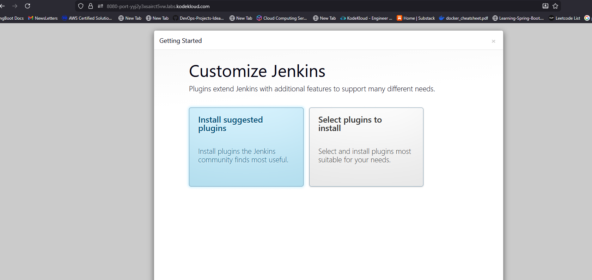
  <figcaption style="font-size:0.9rem; color:var(--text-muted,#666); margin-top:8px;">
    Jenkins
  </figcaption>
</figure>


### Step 8: Create Jenkins Admin User (UI Step)

After unlocking Jenkins and installing suggested plugins, create the admin user with **exact required values**:

| Field     | Value                                   |
| --------- | --------------------------------------- |
| Username  | `theadmin`                              |
| Password  | `Adm!n321`                              |
| Full Name | `Javed`                                 |
| Email     | `javed@jenkins.stratos.xfusioncorp.com` |

Save and finish setup.

<figure style="max-width:720px; margin:0 auto; text-align:center;">
  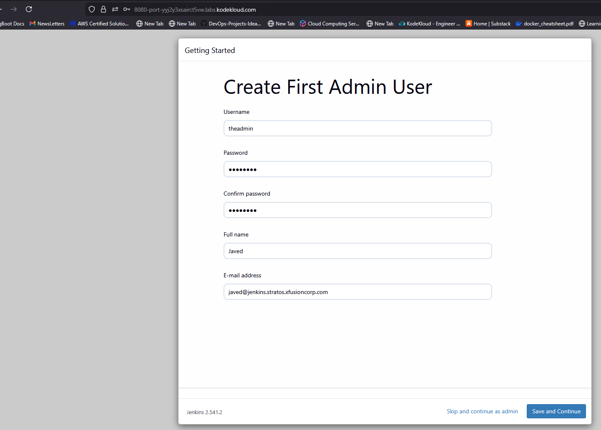
  <figcaption style="font-size:0.9rem; color:var(--text-muted,#666); margin-top:8px;">
    Jenkins
  </figcaption>
</figure>


Now you will be redirected to jenkins Dashboard

<figure style="max-width:720px; margin:0 auto; text-align:center;">
  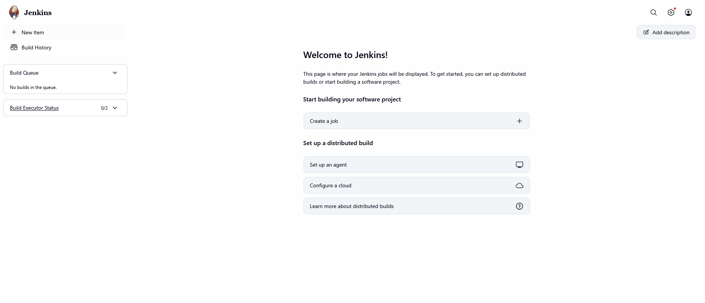
  <figcaption style="font-size:0.9rem; color:var(--text-muted,#666); margin-top:8px;">
    Jenkins
  </figcaption>
</figure>


## **Day 69: Install Jenkins Plugins**

The Nautilus DevOps team has recently setup a Jenkins server, which they want to use for some CI/CD jobs. Before that they want to install some plugins which will be used in most of the jobs. Please find below more details about the task  

1. Click on the Jenkins button on the top bar to access the Jenkins UI. Login using username `admin` and `Adm!n321` password.  
2. Once logged in, install the `Git` and `GitLab` plugins. Note that you may need to restart Jenkins service to complete the plugins installation, If required, opt to `Restart Jenkins when installation is complete and no jobs are running` on plugin installation/update page i.e `update centre`.  
`Note:`  
3. After restarting the Jenkins service, wait for the Jenkins login page to reappear before proceeding.  
4. For tasks involving web UI changes, capture screenshots to share for review or consider using screen recording software like loom.com for documentation and sharing.


### Step 1: Access Jenkins UI

1. Click the **Jenkins** button from the top navigation bar.
2. The Jenkins login page opens.
3. Log in using the following credentials:

   * Username: `admin`
   * Password: `Adm!n321`

<figure style="max-width:720px; margin:0 auto; text-align:center;">
  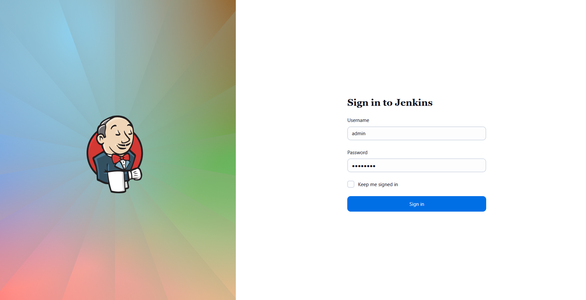
  <figcaption style="font-size:0.9rem; color:var(--text-muted,#666); margin-top:8px;">
    Jenkins Login Page
  </figcaption>
</figure>


### Step 2: Jenkins Dashboard

1. After successful login, the Jenkins dashboard is displayed.
2. Confirm that the dashboard loads without errors.

<figure style="max-width:720px; margin:0 auto; text-align:center;">
  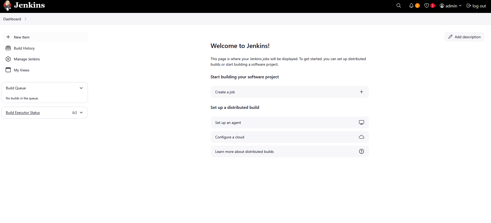
  <figcaption style="font-size:0.9rem; color:var(--text-muted,#666); margin-top:8px;">
    Jenkins Dashboard
  </figcaption>
</figure>


## Step 3: Navigate to Manage Jenkins

1. From the left-hand menu, click **Manage Jenkins**.

<figure style="max-width:720px; margin:0 auto; text-align:center;">
  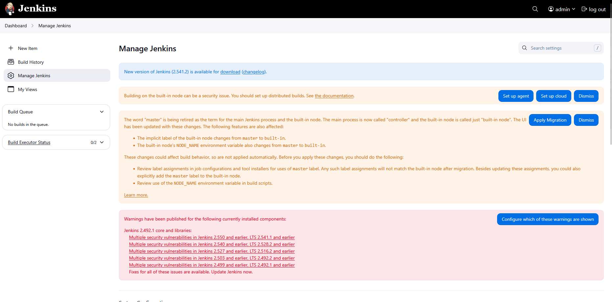
  <figcaption style="font-size:0.9rem; color:var(--text-muted,#666); margin-top:8px;">
    Jenkins Manage
  </figcaption>
</figure>


## Step 4: Open Plugin Manager

1. On the Manage Jenkins page, click **Manage Plugins**.


## Step 5: Open Available Plugins Tab

1. Scroll down and find pluggins
2. Click the Avialable pluggins button


<figure style="max-width:720px; margin:0 auto; text-align:center;">
  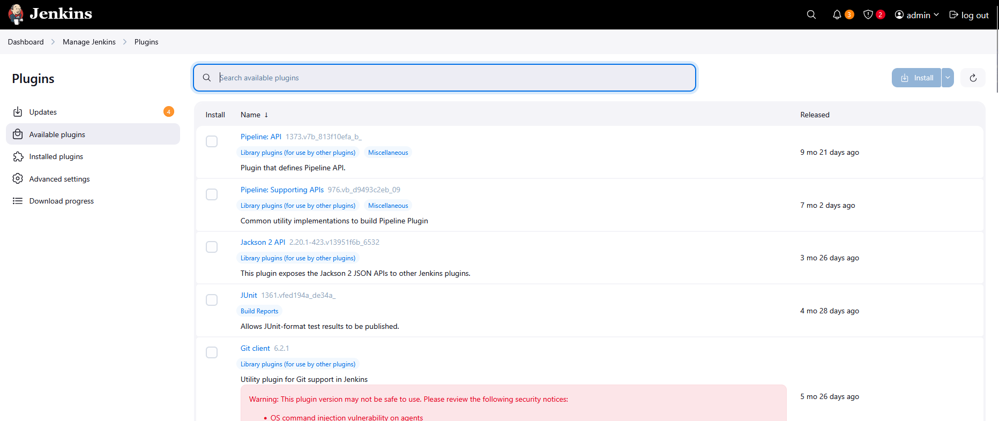
  <figcaption style="font-size:0.9rem; color:var(--text-muted,#666); margin-top:8px;">
    Jenkins Pluggins Available
  </figcaption>
</figure>


## Step 6: Search and Select Git Plugin

1. In the search field, type `Git`.
2. Select the checkbox for **Git Plugin**.


## Step 7: Search and Select GitLab Plugin

1. Clear the search field and type `GitLab`.
2. Select the checkbox for **GitLab Plugin**.


<figure style="max-width:720px; margin:0 auto; text-align:center;">
  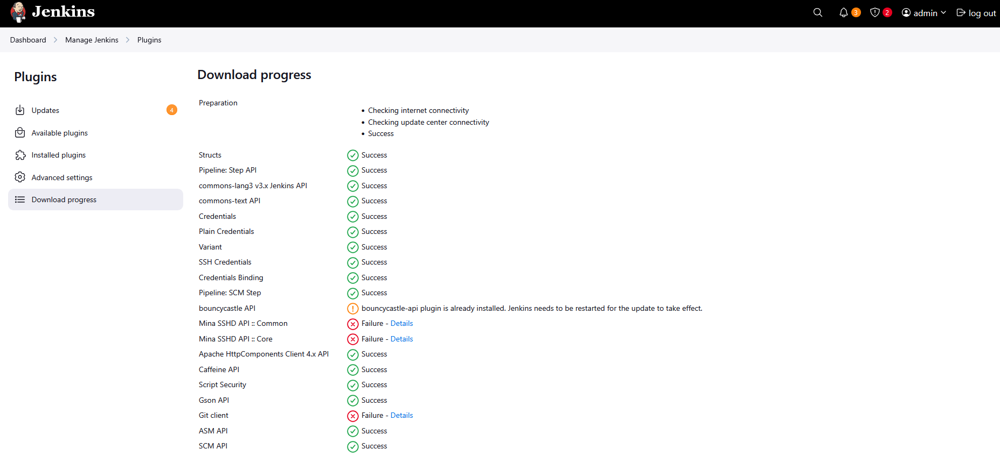
  <figcaption style="font-size:0.9rem; color:var(--text-muted,#666); margin-top:8px;">
    Jenkins Install Pluggins
  </figcaption>
</figure>


## Step 8: Install Plugins

1. Click **Install without restart** or **Download now and install after restart**.
2. If prompted, select **Restart Jenkins when installation is complete and no jobs are running**.


## Step 9: Jenkins Restart

1. Jenkins restarts automatically.
2. Wait for the Jenkins login page to reappear before proceeding.


<figure style="max-width:720px; margin:0 auto; text-align:center;">
  
  <figcaption style="font-size:0.9rem; color:var(--text-muted,#666); margin-top:8px;">
    Jenkins Restart
  </figcaption>
</figure>


## Step 10: Verify Plugin Installation

1. Log in again using `admin / Adm!n321`.
2. Navigate to **Manage Jenkins → Manage Plugins → Installed**.
3. Verify that the following plugins are listed:

   * Git Plugin
   * GitLab Plugin


