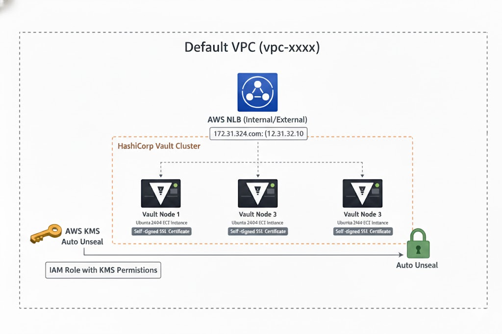
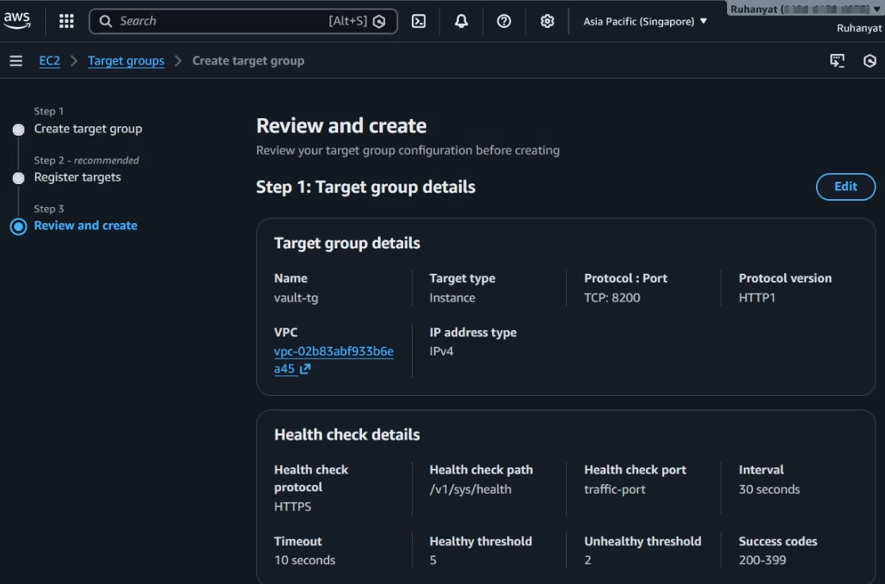
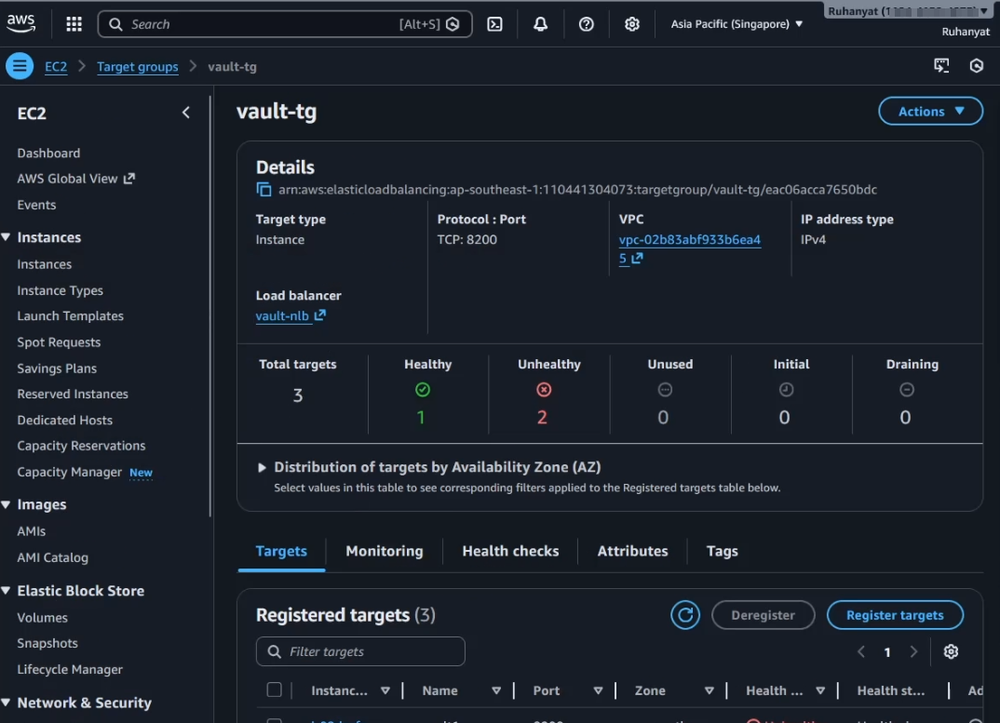

<figure style="max-width:720px; margin:0 auto; text-align:center;">
  
  <figcaption style="font-size:0.9rem; color:var(--text-muted,#666); margin-top:8px;">
    Hashicorp Vault
  </figcaption>
</figure>

# Contents

- [1. Introduction](#1-introduction)
  - [What is HashiCorp Vault?](#what-is-hashicorp-vault)
- [Architecture Overview](#architecture-overview)
  - [Components Used](#components-used)
- [2. AWS Configuration](#2-aws-configuration)
  - [Step 1: Create AWS KMS Key (Auto-Unseal)](#step-1-create-aws-kms-key-auto-unseal)
  - [Step 2: Create IAM Policy for KMS](#step-2-create-iam-policy-for-kms)
  - [Step 3: Create IAM Role for EC2](#step-3-create-iam-role-for-ec2)
  - [Step 4: Launch 3 EC2 Instances](#step-4-launch-3-ec2-instances)
  - [Step 5: Security Group Configuration](#step-5-security-group-configuration)
  - [Step 6: Vault Installation (Automated via EC2 User Data)](#step-6-vault-installation-automated-via-ec2-user-data)
  - [Step 7: Create Network Load Balancer](#step-7-create-network-load-balancer)
  - [Step 8: Generate TLS Certificate on Vault 1 and Moving it to Every Vault](#step8)
  - [Step 9: Vault Configuration (vault.hcl)](#step-9-vault-configuration-vaulthcl)
  - [Step 10: Start Vault](#step-10-start-vault)
  - [Step 11: Initialize Cluster Only Vault1](#step11)
  - [Step 12: Verify Cluster](#step-12-verify-cluster)
  - [Step 13: Troubleshooting](#step-13-troubleshooting)
  - [Step 14: How To Confirm Everything Is Working](#step-14-how-to-confirm-everything-is-working)
- [Conclusion](#conclusion)
   


# 1. Introduction

### What is HashiCorp Vault?

HashiCorp Vault is a secrets management system used to securely store and control access to sensitive data such as:

* API keys
* Database credentials
* Tokens
* Certificates
* Encryption keys

Vault provides:

* Secure secret storage
* Dynamic secret generation
* Encryption as a service
* Audit logging
* Access control via policies

In this project, we deploy a **production-ready High Availability Vault cluster** on AWS using:

* 3 EC2 Instances
* Integrated Storage (Raft)
* AWS KMS Auto-Unseal
* Self-Signed TLS
* Network Load Balancer


# Architecture Overview

<figure style="max-width:720px; margin:0 auto; text-align:center;">
  
  <figcaption style="font-size:0.9rem; color:var(--text-muted,#666); margin-top:8px;">
    Hashicorp Vault
  </figcaption>
</figure>

### Components Used

* 3× Ubuntu 24.04 EC2 instances
* AWS KMS key (for auto-unseal)
* IAM Role with KMS permissions
* Network Load Balancer (TCP 8200)
* Private IP (Same VPC)
* Self-signed SSL certificate
* Raft integrated storage

# 2. AWS Configuration


## Step 1: Create AWS KMS Key (Auto-Unseal)

1. Go to **AWS Console**
2. Search for **KMS**
3. Click **Create Key**
4. Choose:

   * Key Type: Symmetric
   * Usage: Encrypt and Decrypt
5. Enable automatic rotation
6. Create key
7. Copy:

   * Key ID
   * Key ARN
   * Region

Example:

```
913e09f9-5487e-495d-9f82-5764dsa23ww3
Region: ap-southeast-1
```


## Step 2: Create IAM Policy for KMS

Go to:

IAM → Policies → Create Policy → JSON

```json
{
  "Version": "2012-10-17",
  "Statement": [
    {
      "Sid": "VaultKMSUnseal",
      "Effect": "Allow",
      "Action": [
        "kms:Encrypt",
        "kms:Decrypt",
        "kms:DescribeKey"
      ],
      "Resource": "arn:aws:kms:ap-southeast-1:ACCOUNT_ID:key/913e09f9-5487e-495d-9f82-5764dsafdww3"
    }
  ]
}
```

Save as:

```
vault-kms-policy
```


## Step 3: Create IAM Role for EC2

IAM → Roles → Create Role

1. Trusted entity: EC2
2. Attach:

   * vault-kms-policy
3. Create role:

```
vault-iam-role
```


## Step 4: Launch 3 EC2 Instances


<figure style="max-width:720px; margin:0 auto; text-align:center;">
  
  <figcaption style="font-size:0.9rem; color:var(--text-muted,#666); margin-top:8px;">
    Hashicorp Vault
  </figcaption>
</figure>

Create:

| Node | Private IP |
|------|------------|
| vault1 | 172.31.46.251 |
| vault2 | 172.31.41.123 |
| vault3 | 172.31.35.171 |

### Requirements:
- Ubuntu 24.04
- Same VPC
- Same subnet (recommended)
- Attach IAM Role: `vault-iam-role`
- Please change the IP with your Private Ip of EC2


## Step 5: Security Group Configuration

Allow:

| Port | Purpose |
|------|----------|
| 8200 | Vault API |
| 8201 | Raft Cluster |
| 22 | SSH |


## Step 6:. Vault Installation (Automated via EC2 User Data)

Instead of manually switching to root and installing packages, this configuration is executed automatically during EC2 launch using User Data.

Add the following script in the **User Data** section while creating the EC2 instance:

```bash
#!/bin/bash
set -e

# Log output for debugging
exec > >(tee /var/log/user-data.log | logger -t user-data ) 2>&1

echo "===== Starting Vault Installation ====="

# Update system
apt update -y
apt upgrade -y

# Install required packages
apt install -y \
    wget \
    gpg \
    lsb-release \
    unzip \
    curl \
    zip \
    openssl \
    ca-certificates \
    gnupg \
    software-properties-common

echo "===== Required packages installed ====="

# Add HashiCorp GPG key
wget -O- https://apt.releases.hashicorp.com/gpg | \
gpg --dearmor -o /usr/share/keyrings/hashicorp-archive-keyring.gpg

# Add HashiCorp repository
echo "deb [arch=$(dpkg --print-architecture) \
signed-by=/usr/share/keyrings/hashicorp-archive-keyring.gpg] \
https://apt.releases.hashicorp.com $(lsb_release -cs) main" \
> /etc/apt/sources.list.d/hashicorp.list

# Update repository and install Vault
apt update -y
apt install -y vault

echo "===== Vault Installed ====="

# Verify installation
vault version

echo "===== Vault Installation Completed ====="

# Prepare Raft storage
mkdir -p /data/raft
chown -R vault:vault /data
chmod -R 750 /data

echo "===== Raft Storage Prepared ====="
```

---

### What Changed Compared to Manual Steps

Instead of:

* `sudo su`
* Running commands manually
* Preparing storage manually

Everything now:

* Runs automatically at first boot
* Logs to `/var/log/user-data.log`
* Installs Vault consistently across all 3 nodes
* Prepares Raft storage automatically


## Step 6: Create Target Group


<figure style="max-width:720px; margin:0 auto; text-align:center;">
  
  <figcaption style="font-size:0.9rem; color:var(--text-muted,#666); margin-top:8px;">
    Hashicorp Vault
  </figcaption>
</figure>


EC2 → Target Groups → Create Target Group

- Target Type: Instance
- Protocol: TCP
- Port: 8200

Health Check:
- Protocol: HTTPS
- Path: `/v1/sys/health`

Register all 3 instances.


## Step 7: Create Network Load Balancer

EC2 → Load Balancers → Create Load Balancer

- Type: Network Load Balancer
- Listener: TCP 8200
- Target Group: Vault TG

This creates one stable endpoint for Vault clients.

<a id="step8"></a>
## Step 8: Generate TLS Certificate on Vault 1 and Moving it to Every Vault

```bash
openssl req -x509 -nodes -days 3650 -newkey rsa:4096 \
-keyout vault.key -out vault.crt \
-subj "/CN=172.31.46.251" \
-addext "subjectAltName = IP:172.31.46.251,IP:172.31.41.123,IP:172.31.35.171"
```

Zip and copy to other nodes:

```bash
zip vault-tls.zip vault.crt vault.key
```

### Moving To Multiple EC2


1. On **Vault-2** (open a separate Instance Connect session):

   * Create the directory where the TLS file will go:

   ```bash
   mkdir -p /home/ubuntu
   ```

2. On **Vault-1** session:

   * Use `cat` + `copy-paste` to transfer the zip contents:

   ```bash
   base64 vault-tls.zip
   ```

   * This outputs a long Base64 string.
   * Copy that entire string.

3. On **Vault-2**:

   * Create a file and paste the Base64 string into it:

   ```bash
   cat > vault-tls.b64
   ```

   * Paste the string, then press `Ctrl+D`.

   * Decode it:

   ```bash
   base64 -d vault-tls.b64 > vault-tls.zip
   ```

   * Now `vault-tls.zip` is on Vault-2.

4. Repeat the same for **Vault-3**.

5. On each node, unzip:

```bash
unzip vault-tls.zip -d /etc/vault.d/tls
```

Move certs: Do it for Every Vaults

```bash
mkdir -p /etc/vault.d/tls
mv vault.crt vault.key /etc/vault.d/tls/
chown -R vault:vault /etc/vault.d/tls
chmod 600 /etc/vault.d/tls/vault.key
chmod 644 /etc/vault.d/tls/vault.crt
```

Trust certificate:

```bash
cp /etc/vault.d/tls/vault.crt /usr/local/share/ca-certificates/vault.crt
update-ca-certificates
```

---

## Step 9: Vault Configuration (vault.hcl)

Example for vault1:

```hcl
storage "raft" {
  path    = "/data/raft"
  node_id = "vault1"

  retry_join {
    leader_api_addr     = "https://172.31.46.251:8200"
    leader_ca_cert_file = "/etc/vault.d/tls/vault.crt"
  }
  retry_join {
    leader_api_addr     = "https://172.31.41.123:8200"
    leader_ca_cert_file = "/etc/vault.d/tls/vault.crt"
  }
  retry_join {
    leader_api_addr     = "https://172.31.35.171:8200"
    leader_ca_cert_file = "/etc/vault.d/tls/vault.crt"
  }
}

listener "tcp" {
  address         = "0.0.0.0:8200"
  cluster_address = "0.0.0.0:8201"
  tls_cert_file   = "/etc/vault.d/tls/vault.crt"
  tls_key_file    = "/etc/vault.d/tls/vault.key"
}

seal "awskms" {
  region     = "ap-southeast-1"
  kms_key_id = "913eds49f9-175e-495d-9f82-df4sa2sdfw3559"
}

api_addr      = "https://172.31.46.251:8200"
cluster_addr  = "https://172.31.46.251:8201"
disable_mlock = true
ui            = true
```

Vault2:
```hcl
storage "raft" {
  path    = "/data/raft"
  node_id = "vault2"

  retry_join {
    leader_api_addr     = "https://172.31.46.251:8200"
    leader_ca_cert_file = "/etc/vault.d/tls/vault.crt"
  }
  retry_join {
    leader_api_addr     = "https://172.31.41.123:8200"
    leader_ca_cert_file = "/etc/vault.d/tls/vault.crt"
  }
  retry_join {
    leader_api_addr     = "https://172.31.35.171:8200"
    leader_ca_cert_file = "/etc/vault.d/tls/vault.crt"
  }
}

listener "tcp" {
  address         = "0.0.0.0:8200"
  cluster_address = "0.0.0.0:8201"
  tls_cert_file   = "/etc/vault.d/tls/vault.crt"
  tls_key_file    = "/etc/vault.d/tls/vault.key"
}

seal "awskms" {
  region     = "ap-southeast-1"
  kms_key_id = "913eds49f9-175e-495d-9f82-df4sa2sdfw3559"
}

api_addr      = "https://172.31.41.123:8200"
cluster_addr  = "https://172.31.41.123:8201"
disable_mlock = true
ui            = true
```

vault3 :

```hcl
storage "raft" {
  path    = "/data/raft"
  node_id = "vault3"

  retry_join {
    leader_api_addr     = "https://172.31.46.251:8200"
    leader_ca_cert_file = "/etc/vault.d/tls/vault.crt"
  }
  retry_join {
    leader_api_addr     = "https://172.31.41.123:8200"
    leader_ca_cert_file = "/etc/vault.d/tls/vault.crt"
  }
  retry_join {
    leader_api_addr     = "https://172.31.35.171:8200"
    leader_ca_cert_file = "/etc/vault.d/tls/vault.crt"
  }
}

listener "tcp" {
  address         = "0.0.0.0:8200"
  cluster_address = "0.0.0.0:8201"
  tls_cert_file   = "/etc/vault.d/tls/vault.crt"
  tls_key_file    = "/etc/vault.d/tls/vault.key"
}

seal "awskms" {
  region     = "ap-southeast-1"
  kms_key_id = "913eds49f9-175e-495d-9f82-df4sa2sdfw3559"
}

api_addr      = "https://172.31.35.171:8200"
cluster_addr  = "https://172.31.35.171:8201"
disable_mlock = true
ui            = true

```


## Step 10: Start Vault

```bash
systemctl enable vault
systemctl start vault
systemctl status vault
```
- Do it On each vault

<a id="step11"></a>
## Step 11:  Initialize Cluster - Only vault1

```bash
export VAULT_ADDR="https://172.31.46.251:8200"
export VAULT_SKIP_VERIFY=true

vault operator init
```

Save:

* Root Token
* Recovery Keys


## Step 12: Verify Cluster

Check status:

```bash
vault status
```

Expected:

```
Seal Type: awskms
Sealed: false
Storage Type: raft
HA Enabled: true
```

---

Check raft peers:

```bash
vault login <ROOT_TOKEN>
vault operator raft list-peers
```

Expected:

```
vault1 leader
vault2 follower
vault3 follower
```

---

## Step 13: Troubleshooting

If nodes do not join:

```bash
vault operator raft join https://172.31.46.251:8200
```

Check logs:

```bash
journalctl -xeu vault -f
```

---

## Step 14: How To Confirm Everything Is Working

<figure style="max-width:720px; margin:0 auto; text-align:center;">
  
  <figcaption style="font-size:0.9rem; color:var(--text-muted,#666); margin-top:8px;">
    Hashicorp Vault
  </figcaption>
</figure>


### 1. Service Running

```bash
systemctl status vault
```

### 2. KMS Auto-Unseal Working

```bash
vault status
```

Should show:

```
Sealed: false
Seal Type: awskms
```

### 3. Raft Cluster Healthy

```bash
vault operator raft list-peers
```

Must show 3 nodes and 1 leader.

### 4. Kill Leader Test

```bash
vault operator step-down
```

Another node should become leader.

# Conclusion

<figure style="max-width:720px; margin:0 auto; text-align:center;">
  
  <figcaption style="font-size:0.9rem; color:var(--text-muted,#666); margin-top:8px;">
    CNCF BD
  </figcaption>
</figure>


This project was inspired by and based on the **CNCBD 2026 workshop** organized by the **CNCF Bangladesh (CNCF BD) community**. The workshop provided an excellent hands-on learning experience for deploying a **production-ready HashiCorp Vault cluster** on AWS with **Raft storage** and **AWS KMS auto-unseal**.  

After attending the workshop, I implemented this project myself, applying the concepts learned and exploring additional configurations for a high-availability setup.  

The CNCF BD community also shared a **comprehensive resource** that guided the workshop. You can check it out [here](https://github.com/cloudnativebd/hashicorp-vault/blob/main/vault-install-ssl-kms.md).  

I highly recommend participating in such workshops organized by CNCF BD—they are very well-structured and provide practical insights into cloud-native technologies.
