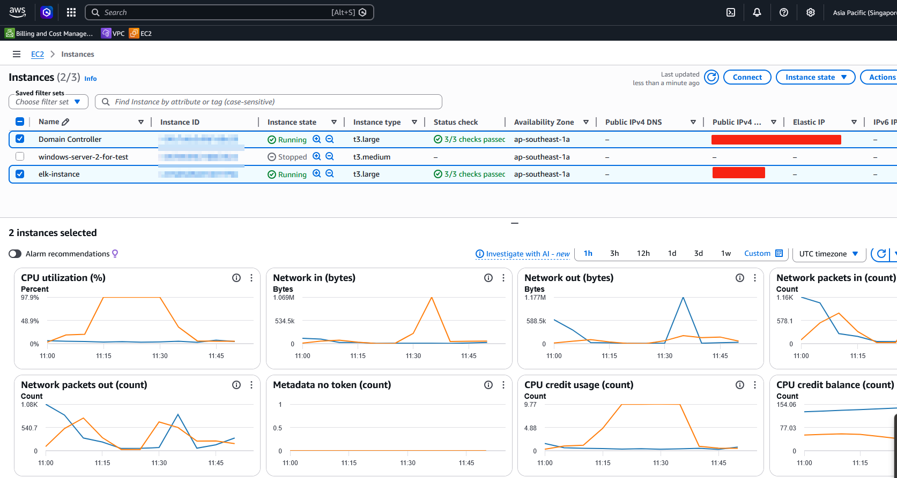
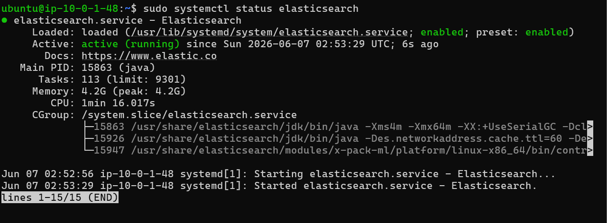
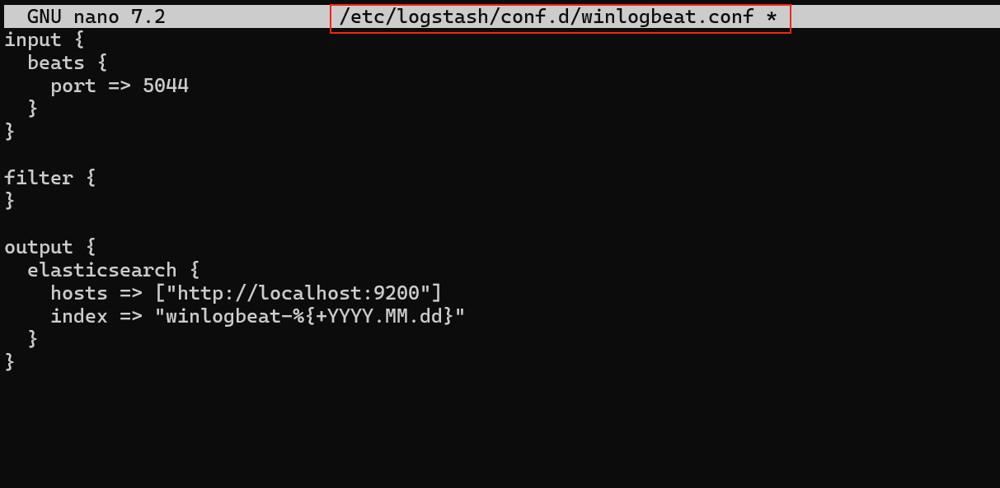
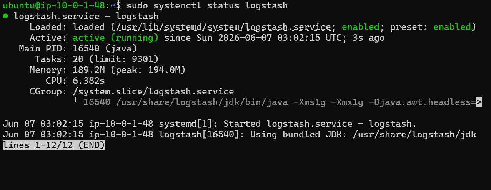
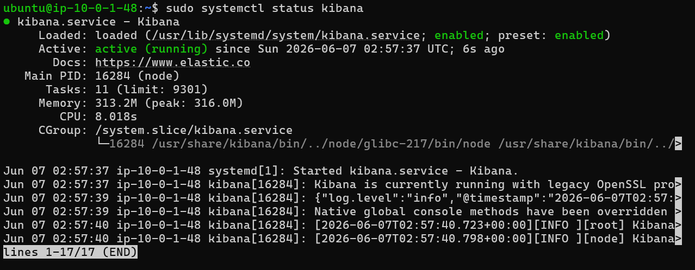
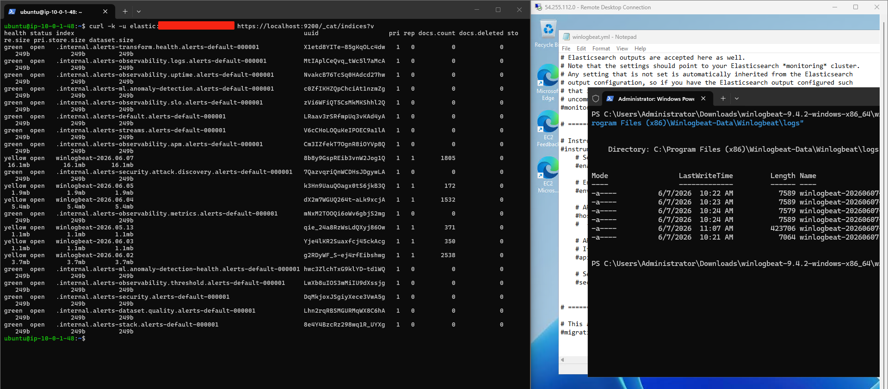

# Building a Centralized Windows Log Monitoring Lab with ELK Stack on AWS

## Table of Contents

1. [Architecture Overview](#architecture-overview)
2. [AWS Infrastructure Setup](#aws-infrastructure-setup)
3. [Step 1 — Launch the ELK Ubuntu Instance](#step-1--launch-the-elk-ubuntu-instance)
4. [Step 2 — Install Elasticsearch](#step-2--install-elasticsearch)
5. [Step 3 — Install Logstash and Configure the Pipeline](#step-3--install-logstash-and-configure-the-pipeline)
6. [Step 4 — Install Kibana](#step-4--install-kibana)
7. [Step 5 — Install Winlogbeat on the Domain Controller](#step-5--install-winlogbeat-on-the-domain-controller)
8. [Step 6 — Verify Logs Are Reaching Elasticsearch](#step-6--verify-logs-are-reaching-elasticsearch)
9. [Step 7 — Set Up Kibana Dashboards](#step-7--set-up-kibana-dashboards)
10. [Mistakes to Avoid](#mistakes-to-avoid)
11. [Key Active Directory Event Codes](#key-active-directory-event-codes)
12. [Final Result](#final-result)

---

## Architecture Overview

The entire lab runs inside a private VPC on AWS (ap-southeast-1, Singapore region). There are three EC2 instances:

| Instance | OS | Role | Type |
|---|---|---|---|
| Domain Controller | Windows Server 2025 | Active Directory DC | t3.large |
| windows-server-2-for-test | Windows Server | Domain-joined client | t3.medium |
| elk-instance | Ubuntu 24.04 | ELK Stack (SIEM) | t3.large |

**Log flow:**

```
Windows DC (DC01)          Windows Client
      |                          |
  Winlogbeat                Winlogbeat
      |                          |
      +----------+---------------+
                 |
         Logstash :5044
                 |
          Elasticsearch
                 |
             Kibana
```

Winlogbeat runs on both Windows machines and ships Windows event logs over port 5044 to Logstash on the Ubuntu ELK server. Logstash parses and forwards them into Elasticsearch. Kibana then provides the dashboard and visualization layer.

---

## AWS Infrastructure Setup

The lab starts with three EC2 instances running in the same VPC and subnet (`10.0.1.0/24`, `ap-southeast-1a`).

<figure style="max-width:720px; margin:0 auto; text-align:center;">
  
  <figcaption style="font-size:0.9rem; color:var(--text-muted,#666); margin-top:8px;">
    AWS EC2 Console — Domain Controller and ELK instance running in ap-southeast-1a
  </figcaption>
</figure>


### Security Group Rules for the ELK Instance

This is one of the most important parts. Configure the ELK server's security group inbound rules as follows:

| Type | Port | Source | Purpose |
|---|---|---|---|
| SSH | 22 | Your public IP | Admin access |
| Custom TCP | 5044 | `10.0.1.0/24` | Winlogbeat → Logstash |
| Custom TCP | 9200 | `10.0.1.0/24` | Elasticsearch API (internal) |
| Custom TCP | 5601 | Your public IP | Kibana web UI |

> **Note:** For the Windows instances, no new inbound rules are needed. The default outbound rule (all traffic) is sufficient because they are sending logs out, not receiving them.

---

## Step 1 — Launch the ELK Ubuntu Instance

Launch a **Ubuntu 22.04 or 24.04** EC2 instance in the same VPC and subnet as your Windows machines.

**Recommended spec:** `t3.large` minimum. Elasticsearch is memory-intensive — running it on `t3.micro` or `t3.small` will result in constant OOM kills.

**Important settings:**
- Place it in the **private subnet**, same as your Windows instances
- Assign an **Elastic IP** so the public IP doesn't change on stop/start
- Enable **hibernation** on the instance — this saves you from reconfiguring everything if the instance is accidentally stopped

---

## Step 2 — Install Elasticsearch

Add the Elastic APT repository and install:

```bash
wget -qO - https://artifacts.elastic.co/GPG-KEY-elasticsearch | \
  sudo gpg --dearmor -o /usr/share/keyrings/elasticsearch-keyring.gpg

echo "deb [signed-by=/usr/share/keyrings/elasticsearch-keyring.gpg] \
  https://artifacts.elastic.co/packages/8.x/apt stable main" | \
  sudo tee /etc/apt/sources.list.d/elastic-8.x.list

sudo apt update && sudo apt install elasticsearch -y
```

> ⚠️ **Critical:** When Elasticsearch installs for the first time, it prints the auto-generated `elastic` superuser password to the terminal. **Copy and save it immediately** — it is shown only once. If you miss it, you will need to reset it manually.

Enable and start the service:

```bash
sudo systemctl enable elasticsearch
sudo systemctl start elasticsearch
sudo systemctl status elasticsearch
```

<figure style="max-width:720px; margin:0 auto; text-align:center;">
  
  <figcaption style="font-size:0.9rem; color:var(--text-muted,#666); margin-top:8px;">
    Elasticsearch — active (running) on the Ubuntu ELK instance
  </figcaption>
</figure>


## Step 3 — Install Logstash and Configure the Pipeline

```bash
sudo apt install logstash -y
```

Create the pipeline configuration file:

```bash
sudo nano /etc/logstash/conf.d/winlogbeat.conf
```

Paste the following configuration:

```
input {
  beats {
    port => 5044
  }
}

filter {
}

output {
  elasticsearch {
    hosts => ["http://localhost:9200"]
    index => "winlogbeat-%{+YYYY.MM.dd}"
  }
}
```

<figure style="max-width:720px; margin:0 auto; text-align:center;">
  
  <figcaption style="font-size:0.9rem; color:var(--text-muted,#666); margin-top:8px;">
    Logstash pipeline config — /etc/logstash/conf.d/winlogbeat.conf
  </figcaption>
</figure>


Enable and start Logstash:

```bash
sudo systemctl enable logstash
sudo systemctl start logstash
sudo systemctl status logstash
```

<figure style="max-width:720px; margin:0 auto; text-align:center;">
  
  <figcaption style="font-size:0.9rem; color:var(--text-muted,#666); margin-top:8px;">
    Logstash — active (running) on the Ubuntu ELK instance
  </figcaption>
</figure>


## Step 4 — Install Kibana

```bash
sudo apt install kibana -y
```

Edit the Kibana configuration:

```bash
sudo nano /etc/kibana/kibana.yml
```

Find the `server.host` line and change it to:

```yaml
server.host: "0.0.0.0"
```

> **Common question:** Do you need to uncomment `server.port: 5601`? **No.** Kibana uses port 5601 by default even when that line is commented out. The only change required is `server.host`.

Save and restart:

```bash
sudo systemctl enable kibana
sudo systemctl restart kibana
sudo systemctl status kibana
```

<figure style="max-width:720px; margin:0 auto; text-align:center;">
  
  <figcaption style="font-size:0.9rem; color:var(--text-muted,#666); margin-top:8px;">
    Kibana — active (running) on the Ubuntu ELK instance
  </figcaption>
</figure>


Verify it is listening on port 5601:

```bash
sudo ss -tulpn | grep 5601
```

Then access Kibana in your browser:

```
http://<ELK_PUBLIC_IP>:5601
```

---

## Step 5 — Install Winlogbeat on the Domain Controller

On the Windows Server (DC01), download Winlogbeat from the [Elastic downloads page](https://www.elastic.co/downloads/beats/winlogbeat) and extract it.

Edit `winlogbeat.yml`:

```yaml
winlogbeat.event_logs:
  - name: Security
  - name: System
  - name: Application
  - name: Microsoft-Windows-PowerShell/Operational
  - name: Microsoft-Windows-Sysmon/Operational

output.logstash:
  hosts: ["<ELK_PRIVATE_IP>:5044"]

setup.kibana:
  host: "http://<ELK_PRIVATE_IP>:5601"
```

> ⚠️ **Critical:** Comment out the `output.elasticsearch` block entirely. Winlogbeat only supports **one active output**. Leaving both `output.logstash` and `output.elasticsearch` uncommented will cause Winlogbeat to fail at startup with a configuration error.

Install and start Winlogbeat as a Windows service (run PowerShell as Administrator):

```powershell
.\install-service-winlogbeat.ps1
Start-Service winlogbeat
Get-Service winlogbeat
```

Repeat the same steps on the second Windows machine (the domain-joined client) using the identical `winlogbeat.yml` configuration, pointing to the same Logstash endpoint.

---

## Step 6 — Verify Logs Are Reaching Elasticsearch

On the Ubuntu ELK server, query the Elasticsearch indices:

```bash
curl -k -u elastic:<YOUR_PASSWORD> https://localhost:9200/_cat/indices?v
```

<figure style="max-width:720px; margin:0 auto; text-align:center;">
  
  <figcaption style="font-size:0.9rem; color:var(--text-muted,#666); margin-top:8px;">
    Elasticsearch indices showing winlogbeat-* data — logs confirmed flowing end to end
  </figcaption>
</figure>

> The screenshot shows the Elasticsearch index list alongside the Winlogbeat log directory on the Windows DC. The key indices are visible:
>
> | Index | Docs | Size |
> |---|---|---|
> | winlogbeat-2026.06.07 | 1805 | 16.1mb |
> | winlogbeat-2026.06.05 | 172 | 1.9mb |
> | winlogbeat-2026.06.04 | 1532 | 5.4mb |
> | winlogbeat-2026.06.02 | 2538 | 3.7mb |
>
> The Winlogbeat log files on the Windows side (visible in the PowerShell window on the right) confirm Winlogbeat is writing logs locally before shipping them. The pipeline is working end to end.


## Step 7 — Set Up Kibana Dashboards

Open Kibana in your browser and log in with `elastic` and the password saved during Elasticsearch install.

### Create a Data View

1. Go to **☰ Menu → Stack Management → Data Views → Create data view**
2. Set **Name:** `Winlogbeat`
3. Set **Index pattern:** `winlogbeat-*`
4. Kibana will immediately confirm "Matching sources found"
5. Set **Timestamp field:** `@timestamp`
6. Click **Save data view**

### Verify Logs in Discover

Go to **Analytics → Discover**, select the `Winlogbeat` data view from the dropdown. You should see Windows events streaming in with fields like `event.code`, `host.name`, `winlog.channel`, `message`, and `@timestamp`.

### Useful KQL Searches

```
# Filter by host (Domain Controller)
host.name : "DC01"

# Security channel only
winlog.channel : "Security"

# Failed logins
event.code : 4625

# Successful logons
event.code : 4624

# PowerShell activity
winlog.channel : "Microsoft-Windows-PowerShell/Operational"

# Sysmon events
winlog.channel : "Microsoft-Windows-Sysmon/Operational"
```

### Build a Dashboard

Go to **Analytics → Dashboard → Create Dashboard**, then add visualizations:

| Panel | KQL Filter | Visualization Type |
|---|---|---|
| Failed Logins | `event.code : 4625` | Bar Chart |
| Successful Logons | `event.code : 4624` | Metric |
| Log Sources | `host.name` | Pie Chart |
| Top Event IDs | `event.code` | Pie Chart |
| PowerShell Activity | `winlog.channel : "Microsoft-Windows-PowerShell/Operational"` | Bar Chart |

### Import Pre-built Winlogbeat Dashboards

Because the pipeline routes through Logstash (not directly to Elasticsearch), Winlogbeat's built-in dashboards are not auto-imported. To import them:

1. Temporarily switch `winlogbeat.yml` to `output.elasticsearch` (comment out `output.logstash`)
2. On the Windows machine, run: `.\winlogbeat.exe setup`
3. This imports dashboards, visualizations, saved searches, and index templates
4. Switch `winlogbeat.yml` back to `output.logstash`

---

## Mistakes to Avoid

### 1. Never touch the NIC settings on a Windows EC2 instance without a fallback

Setting a static IP directly on the NIC without also configuring the correct gateway will lock you out of RDP immediately. Always set up **AWS Systems Manager Session Manager** as a fallback before touching any network configuration on a Windows instance.

### 2. Never leave both outputs active in winlogbeat.yml

Winlogbeat supports exactly one active output. Having both `output.logstash` and `output.elasticsearch` uncommented causes a fatal startup error. Comment out whichever one you are not using.

### 3. Elastic 8.x uses HTTPS by default

If Logstash is connecting to Elasticsearch over plain HTTP and Elasticsearch is configured for HTTPS, the connection will fail silently. Check your Logstash output block and ensure the protocol matches what Elasticsearch is listening on.

### 4. Winlogbeat dashboards do not auto-import when routing through Logstash

The `winlogbeat.exe setup` command that imports dashboards talks directly to Elasticsearch — it does not go through Logstash. If you want the pre-built dashboards, you must temporarily enable `output.elasticsearch`, run setup, then switch back.

### 5. ELK Stack needs proper memory

Running Elasticsearch on a `t3.micro` or `t3.small` will result in the Java process being killed by the OS. Use at least a `t3.large` (2 vCPU, 8GB RAM) for a lab environment with real log ingestion.

---

## Key Active Directory Event Codes

These are the most important Windows Security event codes for AD monitoring and threat detection:

| Event Code | Description | Use Case |
|---|---|---|
| 4624 | Successful logon | Baseline and lateral movement |
| 4625 | Failed logon | Brute force detection |
| 4720 | User account created | Persistence detection |
| 4726 | User account deleted | Destructive action |
| 4723 | Password change attempt | Credential change tracking |
| 4728 | Member added to security group | Privilege escalation |
| 4740 | Account locked out | Brute force confirmation |
| 4768 | Kerberos TGT requested | Kerberoasting baseline |
| 4769 | Kerberos service ticket requested | Kerberoasting detection |
| 4776 | NTLM authentication attempt | Pass-the-hash detection |

---

## Final Result

The complete pipeline is now live:

```
Windows Server DC01 (10.0.1.205)
          |
      Winlogbeat 9.4.2
          |
          ↓
Windows Client (10.0.1.85)
          |
      Winlogbeat 9.4.2
          |
          ↓
     Logstash :5044
    (ip-10-0-1-48)
          |
          ↓
   Elasticsearch 8.x
    (localhost:9200)
          |
          ↓
    Kibana :5601
   (ELK Public IP)
```

**What is being collected:**
- Windows Security logs (authentication, account management, policy changes)
- Windows System logs
- Windows Application logs
- PowerShell Operational logs
- Sysmon logs (process creation, network connections, registry changes)

**Kibana is showing:**
- Real-time event streams from both the Domain Controller and the client machine
- Thousands of indexed documents across multiple daily indices
- Searchable AD event codes for security analysis

This SIEM foundation will be used in our UIU research to study Active Directory attack patterns, detection logic, and blue-team response workflows.

