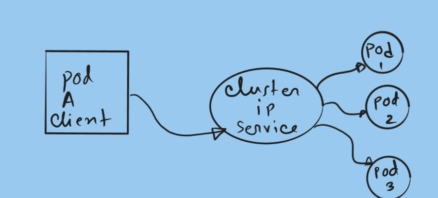
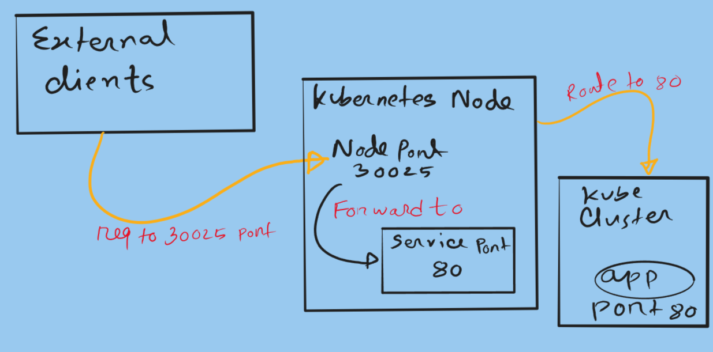
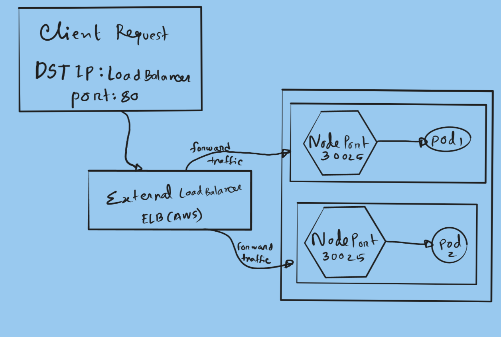

# Contents

- [1. Introduction](#1-introduction)
  - [What is a Kubernetes Service?](#what-is-a-kubernetes-service)
- [2. Kubernetes Service Types](#2-kubernetes-service-types)
  - [ClusterIP Service](#clusterip-service)
  - [NodePort Service](#nodeport-service)
  - [LoadBalancer Service](#loadbalancer-service)
- [Conclusion](#conclusion)


# 1. Introduction

### What is a Kubernetes Service?

In Kubernetes, applications usually run inside **Pods**. Every Pod receives its own IP address when it starts running inside the cluster.

However, there is an important challenge: **Pod IP addresses are temporary**. If a Pod crashes, is deleted, or recreated during scaling, Kubernetes assigns a **new IP address** to the new Pod instance.

This creates a problem for applications trying to communicate with Pods. If the IP keeps changing, clients would constantly need to update the address they connect to.

Think of it like trying to contact someone whose phone number changes every day. It would be almost impossible to maintain reliable communication.

To solve this issue, Kubernetes introduces **Services**.

A **Kubernetes Service** acts as a **stable networking endpoint** that allows applications to communicate with a group of Pods. Instead of connecting directly to Pods, clients connect to the **Service**, and Kubernetes automatically forwards the request to the appropriate Pod.

A Service provides:

* Stable IP address
* DNS name inside the cluster
* Traffic distribution between Pods
* Abstraction over dynamic Pods

This makes application communication **reliable, scalable, and manageable**.


# 2. Kubernetes Service Types

Kubernetes provides several Service types, but the most commonly used ones are:

* ClusterIP
* NodePort
* LoadBalancer

Each one is designed for a different networking scenario.


## ClusterIP Service

The **ClusterIP** Service is the **default service type in Kubernetes**.

It exposes the application **only within the cluster**, allowing communication between Pods and internal services.

External users on the internet cannot access a ClusterIP Service directly.

When a ClusterIP Service is created, Kubernetes assigns it a **virtual IP address** that remains constant for the lifetime of the Service. Any request sent to this IP address is automatically routed to one of the Pods associated with the Service.

If multiple Pods are behind the Service, Kubernetes distributes requests among them, helping balance internal traffic.

Example scenario:

Imagine a microservices application where:

* A **frontend service** needs to communicate with a **backend API**
* The backend API runs in several Pods

Instead of the frontend tracking the IP address of each backend Pod, it simply connects to the **backend Service**, and Kubernetes handles the routing.

<figure style="max-width:720px; margin:0 auto; text-align:center;">
  
  <figcaption style="font-size:0.9rem; color:var(--text-muted,#666); margin-top:8px;">
    ClusterIP Service routing traffic to backend pods
  </figcaption>
</figure>


## NodePort Service

The **NodePort Service** allows external users to access an application running inside the cluster.

When this Service type is created, Kubernetes opens a **specific port on every worker node** in the cluster. This port usually falls within the range:

```

30000 – 32767

```

External clients can connect to the application using:

```

NodeIP:NodePort

```

For example:

```

192.168.1.20:30020

```


It is important to understand that **NodePort builds on top of ClusterIP**. When you create a NodePort Service, Kubernetes automatically creates a ClusterIP Service internally.

Example scenario:

Suppose you are running a small Kubernetes cluster in a lab environment and want to quickly expose a web application. Instead of setting up a full load balancer, you can use a NodePort Service and connect to any worker node on the configured port.

However, NodePort has some limitations:

* Traffic is not evenly distributed across nodes
* Users must know the node IP address
* Port numbers are not standard web ports

Because of these limitations, NodePort is usually used for **development or testing environments**.

<figure style="max-width:720px; margin:0 auto; text-align:center;">
  
  <figcaption style="font-size:0.9rem; color:var(--text-muted,#666); margin-top:8px;">
    NodePort exposing application through worker nodes
  </figcaption>
</figure>


## LoadBalancer Service

The **LoadBalancer Service** is commonly used in **cloud environments** such as AWS, Azure, or Google Cloud.

When you create this Service type, Kubernetes communicates with the cloud provider and automatically provisions a **cloud load balancer**.

This load balancer receives a **public IP address** that external clients can use to reach your application.

For example, in a cluster running on AWS, creating a LoadBalancer Service will automatically create an **external load balancer** that routes traffic to the Kubernetes nodes.


The main advantage is that the load balancer distributes traffic **across multiple nodes**, improving reliability and scalability.

Example scenario:

Suppose you deploy a production web application on Kubernetes running in AWS. By creating a LoadBalancer Service, AWS automatically creates a load balancer that distributes incoming user traffic across the worker nodes hosting your application Pods.

This approach ensures:

* High availability
* Fault tolerance
* Even traffic distribution

<figure style="max-width:720px; margin:0 auto; text-align:center;">
  
  <figcaption style="font-size:0.9rem; color:var(--text-muted,#666); margin-top:8px;">
    LoadBalancer distributing traffic across cluster nodes
  </figcaption>
</figure>


# Conclusion

Kubernetes Services provide a **reliable networking layer** that allows applications to communicate with Pods even when those Pods change dynamically.

The three main Service types serve different purposes:

* **ClusterIP** – Internal communication between services inside the cluster  
* **NodePort** – Exposes applications through node ports for external access  
* **LoadBalancer** – Integrates with cloud providers to create external load balancers

Understanding these Service types is essential when designing scalable Kubernetes architectures. Choosing the correct Service type ensures your applications remain **accessible, reliable, and scalable** as your infrastructure grows.

