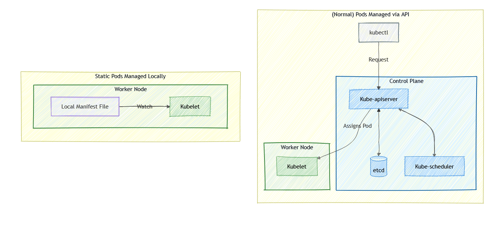
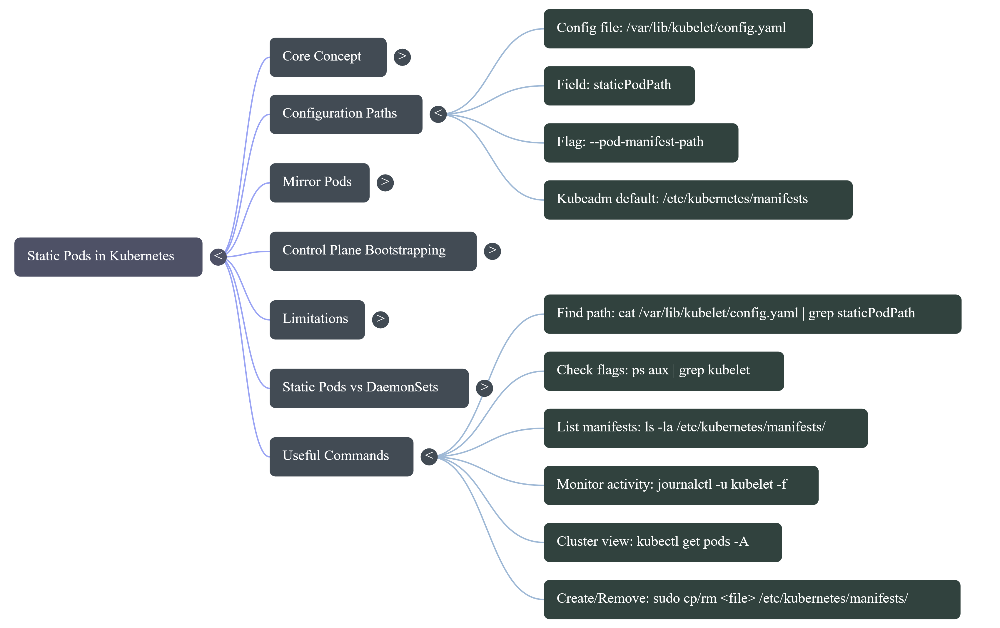
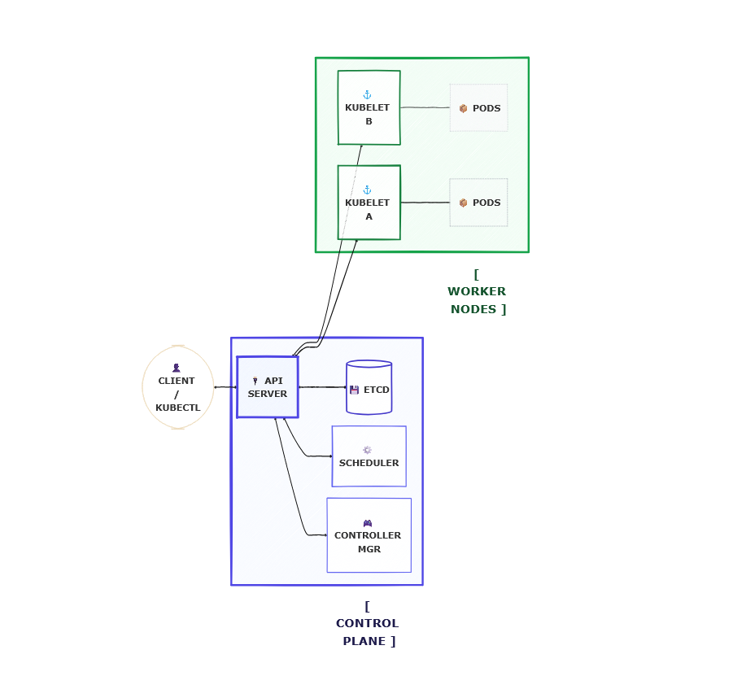
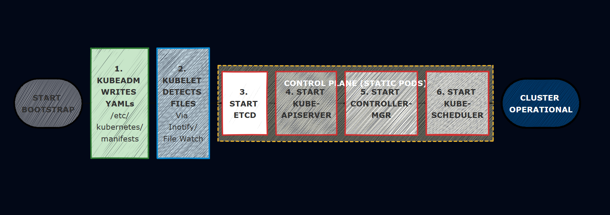

## Before We Start — A Mental Model

When most people think about how pods get created in Kubernetes, they picture this flow:

```
You (kubectl apply) → API Server → etcd → Scheduler → kubelet → Pod runs
```

Every component plays a role. The API server stores the intent, the scheduler picks the node, and the kubelet executes.

But here is a question worth sitting with:

**If the kubelet is the one actually running containers, does it always need the API server to tell it what to do?**

The answer is no. And that is exactly where Static Pods come in.

---

## What is a Static Pod?


<figure style="max-width:720px; margin:0 auto; text-align:center;">
  
  <figcaption style="font-size:0.9rem; color:var(--text-muted,#666); margin-top:8px;">
    Static Pod Architecture
  </figcaption>
</figure>

A Static Pod is a pod that the **kubelet manages directly** — without any involvement from the API server, the scheduler, or etcd.

Instead of receiving instructions from the control plane, the kubelet watches a specific local directory on the node. Any pod manifest file (a YAML file defining a pod) placed in that directory gets picked up and run automatically.

This means:

- No `kubectl apply` needed
- No API server needed
- No scheduler needed
- No etcd needed

Just the kubelet and a YAML file on disk.

---

## Where Does the kubelet Read From?

This is the first practical question. The kubelet is configured with a path it watches constantly. That path is called the **staticPodPath**.

<figure style="max-width:720px; margin:0 auto; text-align:center;">
  
  <figcaption style="font-size:0.9rem; color:var(--text-muted,#666); margin-top:8px;">
    Static Pods
  </figcaption>
</figure>

### Option 1 — Pass it directly as a kubelet flag

```bash
--pod-manifest-path=/etc/kubernetes/manifests
```

### Option 2 — Set it in the kubelet config file (more common in modern setups)

The kubelet config file is usually located at:

```bash
/var/lib/kubelet/config.yaml
```

Inside it, you will find (or can add):

```yaml
staticPodPath: /etc/kubernetes/manifests
```

### Verifying the path on your node

To check what path your kubelet is currently watching, run:

```bash
ps aux | grep kubelet
```

Look for `--pod-manifest-path` or `--config` in the output. If you see `--config`, follow up with:

```bash
cat /var/lib/kubelet/config.yaml | grep staticPodPath
```

On most kubeadm-based clusters, the path will be:

```
/etc/kubernetes/manifests
```

---

## How to Create a Static Pod — Step by Step

Let's walk through creating a static pod from scratch on a node.

### Step 1 — SSH into the node

```bash
ssh user@<node-ip>
```

### Step 2 — Navigate to the manifests directory

```bash
cd /etc/kubernetes/manifests
```

If the directory does not exist yet, create it:

```bash
sudo mkdir -p /etc/kubernetes/manifests
```

### Step 3 — Write a pod manifest file

```bash
sudo vi /etc/kubernetes/manifests/my-static-pod.yaml
```

Paste in a basic pod definition:

```yaml
apiVersion: v1
kind: Pod
metadata:
  name: my-static-pod
  labels:
    app: static-demo
spec:
  containers:
    - name: nginx
      image: nginx:latest
      ports:
        - containerPort: 80
```

Save and exit. That is it.

### Step 4 — Watch the kubelet pick it up

Within a few seconds, the kubelet will detect the file and create the pod. You do not need to run any kubectl command on the node itself.

To verify from the control plane (if the node is part of a cluster):

```bash
kubectl get pods -A
```

You will see the pod listed with the node name appended to it:

```
NAMESPACE   NAME                        READY   STATUS    RESTARTS
default     my-static-pod-node01        1/1     Running   0
```

---

## What Happens When You Modify or Delete the File?

The kubelet continuously watches the directory. Its behavior is straightforward:

| Action | kubelet Response |
|---|---|
| File added | Pod is created |
| File modified | Pod is deleted and recreated with new config |
| File deleted | Pod is terminated |
| Container crashes | Pod is restarted automatically |

This makes static pods **self-healing by design**. As long as the kubelet is running and the file exists on disk, the pod will keep running.

---

## Static Pods Inside a Cluster — The Mirror Pod

When a node running static pods is also part of a Kubernetes cluster, something interesting happens.

The kubelet creates the pod locally, but then it also notifies the API server by creating a **mirror pod object**. This is a read-only representation of the static pod that shows up when you run:

```bash
kubectl get pods -A
```

The mirror pod looks and behaves like a regular pod in most ways, but:

- You **cannot delete it** using `kubectl delete pod`
- You **cannot edit it** using `kubectl edit pod`
- If you try, Kubernetes will immediately recreate the mirror object

To actually modify or remove a static pod, you must go directly to the node and edit or delete the manifest file:

```bash
sudo vi /etc/kubernetes/manifests/my-static-pod.yaml
# or
sudo rm /etc/kubernetes/manifests/my-static-pod.yaml
```

---

## The Real-World Use Case: How kubeadm Uses Static Pods

<figure style="max-width:720px; margin:0 auto; text-align:center;">
  
  <figcaption style="font-size:0.9rem; color:var(--text-muted,#666); margin-top:8px;">
    kubeadm static pod
  </figcaption>
</figure>


This is the part that makes everything click.

When you run `kubeadm init` to bootstrap a new Kubernetes cluster, one of the first things kubeadm does is write manifest files into `/etc/kubernetes/manifests` for the four core control plane components:

```
/etc/kubernetes/manifests/
├── etcd.yaml
├── kube-apiserver.yaml
├── kube-controller-manager.yaml
└── kube-scheduler.yaml
```

You can inspect these yourself on any kubeadm-based master node:

```bash
ls /etc/kubernetes/manifests/
```

```bash
cat /etc/kubernetes/manifests/kube-apiserver.yaml
```

The kubelet on the master node watches this directory and starts all four components as static pods.

### Why Not Use Deployments?

This is the key insight. Deployments are a higher-level Kubernetes object. To create a Deployment, you need the API server running. To run the API server, you need... a working cluster.

That is a chicken-and-egg problem.

Static Pods are the solution. The kubelet can start the API server as a static pod **before the cluster exists**, because it only needs a YAML file on disk — not an operational API server.

The bootstrap sequence looks like this:

<figure style="max-width:720px; margin:0 auto; text-align:center;">
  
  <figcaption style="font-size:0.9rem; color:var(--text-muted,#666); margin-top:8px;">
    static pod cluster
  </figcaption>
</figure>

### Self-Healing Control Plane

Because these are static pods, the kubelet is responsible for keeping them alive — not the Kubernetes controllers.

If the API server crashes:

```bash
# The API server process dies
# kubelet detects the failure immediately
# kubelet restarts the container from the same manifest
# API server is back up — no human intervention needed
```

The cluster heals itself. This is why static pods are considered **critical infrastructure** in Kubernetes.

---

## Identifying Static Pods

Static pod names always follow this pattern:

```
<pod-name>-<node-name>
```

For example, on a master node named `master01`:

```bash
kubectl get pods -n kube-system

NAME                                READY   STATUS    RESTARTS
etcd-master01                       1/1     Running   0
kube-apiserver-master01             1/1     Running   0
kube-controller-manager-master01    1/1     Running   0
kube-scheduler-master01             1/1     Running   0
```

The node name suffix is the telltale sign. If you see it, you are looking at a static pod.

---

## Important Limitations

Static pods are powerful but scoped intentionally:

- They can **only create Pods** — not Deployments, DaemonSets, Services, or any other resource
- They are **not scheduled** — the scheduler plays no role; the kubelet places them on the node where the manifest file lives
- They **cannot be managed via kubectl** — all changes go through the manifest file on disk
- They are **node-specific** — a manifest on node A will not create a pod on node B

---

## Static Pods vs DaemonSets — A Quick Comparison

Both run a pod on every node, but they are fundamentally different in how they work:

| | Static Pods | DaemonSets |
|---|---|---|
| Managed by | kubelet directly | DaemonSet controller |
| Requires API server | No | Yes |
| Scheduled by Kubernetes | No | Yes |
| Can be edited via kubectl | No | Yes |
| Common use case | Control plane components | Log agents, monitoring agents |
| Example | kube-apiserver, etcd | Fluentd, Prometheus node-exporter |

The rule of thumb: use DaemonSets when you want Kubernetes to manage the lifecycle. Use Static Pods when the pod needs to exist **regardless of whether Kubernetes itself is working**.

---

## Quick Reference — Useful Commands

```bash
# Check what staticPodPath your kubelet is using
cat /var/lib/kubelet/config.yaml | grep staticPodPath

# List files in the manifests directory
ls -la /etc/kubernetes/manifests/

# View a control plane static pod manifest
cat /etc/kubernetes/manifests/kube-apiserver.yaml

# Create a static pod (just drop a file in the directory)
sudo cp my-pod.yaml /etc/kubernetes/manifests/

# Remove a static pod
sudo rm /etc/kubernetes/manifests/my-pod.yaml

# Verify the mirror pod shows up in the cluster
kubectl get pods -A | grep <pod-name>

# Check kubelet logs to see static pod activity
journalctl -u kubelet -f
```

